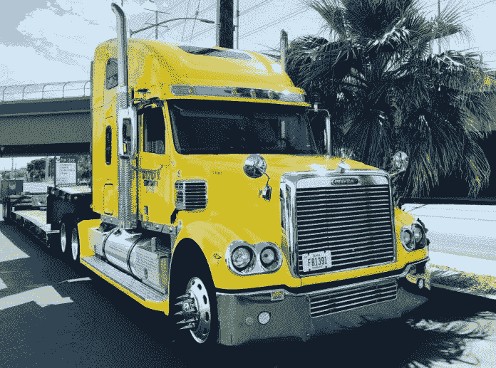
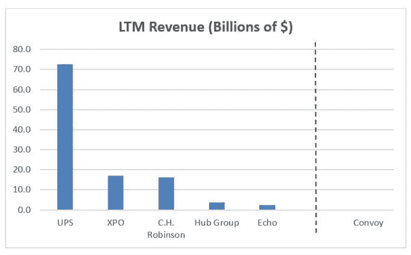

# 数字货运

> 原文：<https://medium.datadriveninvestor.com/digital-freight-b1ec13c61589?source=collection_archive---------12----------------------->

## 卡车经纪自动化竞赛|数据驱动的投资者

在卡车经纪市场数字化的竞赛中，获胜者是现任者还是挑战者？

好处是巨大的。卡车运输是一个 7340 亿美元的市场。整车和零担收入接近 4000 亿美元。如果这个市场的 20%是外包的，那么卡车经纪支出总计 800 亿美元。这个庞大而分散的市场是许多人将卡车经纪业称为“自动化的下一个前沿”的原因。

 [## 数据驱动投资的兴起|数据驱动投资者

### 当 JCPenney 报告其 2015 年 2Q 的财务结果时，市场感到非常震惊。美国零售巨头…

www.datadriveninvestor.com](https://www.datadriveninvestor.com/2019/02/28/the-rise-of-data-driven-investing/) 

现任者是卡车经纪业的主要公司。它们包括 XPO、Echo 全球物流、CH Robinson 和 UPS。挑战者是风险投资支持的数字货运经纪人。它们包括优步货运公司、Loadsmart 公司、车队公司、Transfix 公司和其他公司。谁会赢？

势头似乎在挑战者一边。去年 9 月，Convoy 以 10 亿美元的估值筹集了 1.85 亿美元，据说现在正在融资，这将使该公司的估值超过 30 亿美元。对于一个 2015 年成立的公司来说，这是很大的进步。自那以后，该公司雇佣了 900 多名员工，筹集了超过 2.6 亿美元，并招募了公司投资者、风险投资公司和共同基金，如 T. Rowe Price。

更广泛地说，物流技术初创公司已经吸引了超过 20 亿美元的资本。这似乎是一笔惊人的投资。这不应该给创业公司无与伦比的资源吗？

然而，现任者有几个优势。

首先，它们更大。XPO 的企业价值已达 140 亿美元。凭借 170 亿美元的收入、16 亿美元的 EBITDA 和每年超过 5 亿美元的技术支出，XPO 拥有巨大的资源。同样，C.H. Robinson 身价 120 亿美元，收入 160 亿美元，息税折旧及摊销前利润(EBITDA)超过 10 亿美元。Echo Global Logistics 的价值为 7.7 亿美元，收入为 23 亿美元，EBITDA 为 7400 万美元。收购了 Coyote Logistics 以扩大卡车经纪业务的 UPS 是其中最大的一家，拥有 1220 亿美元的企业价值、730 亿美元的收入和 80 亿美元的 EBITDA。

就收入而言，将现任者与挑战者进行比较。如下图所示，上榜的五家公司的收入都超过了 20 亿美元。相比之下，最大的数字货运经纪公司 Convoy 目前的市值还不到 1 亿美元。

顺便说一句，我应该指出，私营公司一般不公布他们的财务数据。 [Cambridge Capital](https://cambridgecapital.com/team/benjamin-gordon/) 是物流和科技公司的投资者，看到了大量数据，但出于对我们经常与之交谈的公司的尊重，对私人数据保密。因此，对于这篇文章，我严格依赖于公开报道，在像[这样的地方。在任何情况下，精确的数据点可能会改变，但总的区别应该是清楚的。](https://www.owler.com/company/convoy)

第二，券商巨头都在投资技术。C.H. Robinson 首席执行官 Bob Biesterfeld 最近宣布，T4 计划在未来五年内投入 10 亿美元进行技术投资。从这个角度来看，C.H. Robinson 已经部署了超过 1，000 名工程师和开发人员，例如超过了 Convoy 的全部员工人数(包括非工程师)。这是他们公司 15，000 名员工的一个子集。因此，C.H. Robinson 认为他们比所谓的数字货运经纪人拥有更多的数字能力，这是否不合理？

第三，现任者拥有几十年的实际客户运营经验，以及一个反馈回路，使他们能够根据客户的意见进行创新。C.H. Robinson 历史悠久，可以追溯到 1905 年。Echo 成立于整整一个世纪后的 2005 年。其根源是经纪业务和技术的融合。UPS、Coyote、J.B. Hunt 和 XPO 都拥有丰富的经纪和技术客户经验。如果早期采用者对科技公司至关重要，那么还有什么比这种体验更有价值呢？

如果在位者如此强大，为什么挑战者会吸引如此多的资本？

最大的原因:[物流是一个结构上有吸引力的市场](https://medium.com/supply-chains/introducing-supply-chains-a-new-medium-publication-3bb09be192bf)。它很大，不断增长，而且支离破碎。全球供应链是一个 1 万亿美元的市场。利基市场正以 15-20%的速度增长。排名前 50 的公司控制了超过 50%的潜在市场。总之，这些正是投资者寻求的标准。

此外，这是一个众所周知难以自动化的行业。20 多年来，初创公司一直宣称他们打算利用互联网在物流领域“消除中间商”。然而，第三方物流行业不仅生存了下来，事实上，它还蓬勃发展。20 年前，第三方物流市场估计为 400 亿美元。今天，在美国超过 2000 亿美元。此外，全球第三方物流市场今天已经接近 1 万亿美元。

于是，资本不断涌入这个领域。今天物流至少有 [28 只独角兽。这不仅包括数字货运经纪人，还包括以下领域的公司](https://www.cbinsights.com/research-unicorn-companies)

*   客运—优步、Lyft、滴滴出行
*   最后一英里递送——door dash、Postmates、InstaCart
*   全球货运代理— [Flexport](http://www.flexport.com/)

在 1992 年的总统选举中，候选人保罗·聪格斯说:“冷战已经结束。日本赢了！真正的赢家会是别人吗？

我认为，在一个像卡车经纪这样庞大而分散的市场中，可能会有多个赢家。现有的经纪人可以提高他们的自动化程度，获得更多的份额。新的数字经纪人将利用新技术和营销赢得新客户。这两个类别都可以实现价值创造。随着越来越多的公司竞相以更低的价格提供更好的解决方案，最终的赢家将是客户。

[本杰明·戈登](https://medium.com/supply-chains/benjamin-gordon-biography-7e4cad893dac)是运输、物流和[供应链技术](https://medium.com/supply-chains/introducing-supply-chains-a-new-medium-publication-3bb09be192bf)公司的企业家、顾问和投资者。本杰明是[剑桥资本](http://www.cambridgecapital.com/)和 [BGSA](http://www.bgstrategicadvisors.com/) 的 CEO。他是[出版作者](https://medium.com/@benjamingordon30)在[数据驱动投资人](https://www.datadriveninvestor.com/author/benjamin-gordon/)、[财富](https://fortune.com/author/benjamin-gordon/)、[现代分销管理](https://www.mdm.com/authors/180-benjamin-gordon)、[供应链大脑](https://www.supplychainbrain.com/search?q=benjamin+gordon)、[美国消费者新闻与商业频道](https://www.cnbc.com/video/2014/12/10/transportation-a-window-into-the-economy-pro.html)。他主持 [BGSA 供应链](http://www.bgsaconference.com/)会议，这是供应链所有领域的行业首席执行官级会议。本杰明毕业于哈佛商学院和耶鲁学院。

*原载于 2019 年 10 月 15 日*[*https://www.datadriveninvestor.com*](https://www.datadriveninvestor.com/2019/10/15/digital-freight-the-race-to-automate-truck-brokerage/)*。*