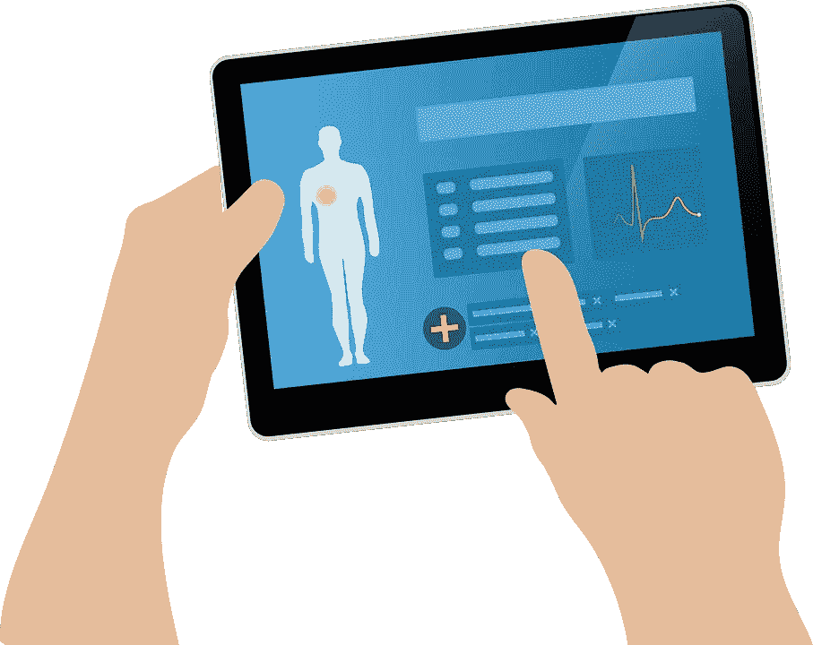
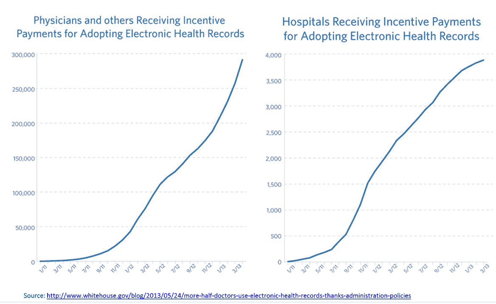

# 数字健康记录——挑战与机遇

> 原文：<https://medium.datadriveninvestor.com/digital-health-records-challenges-and-opportunities-51fc3256bc50?source=collection_archive---------2----------------------->

你想建立下一代区块链驱动的数字医疗记录，让每个病人都能控制对自己数据的访问吗？在你着手未来之前——有很多技术专家正在研究这个想法——确保了解过去和现在。这是一个关注非专家的帖子，是一个起点，说明发生了什么以及为什么现在有一个机会。

**定义**

电子病历(EMR)和电子健康记录(EHR)之间有很多混淆。简单来说，电子病历是医生办公室纸质图表的数字版本。EHRs 走得更远，它将数据整合到了临床医生办公室之外的地方，其理念是查看照顾病人所涉及的一切。

EMR 已经存在了几十年，但至少在美国，在政府强制执行后，它们才获得 90%以上的采用率。

**挑战**

出于多种原因，政府指令是必需的——可以说现在仍然如此:

*   从历史上看，患者并没有要求访问他们的数据。归咎于我们的整体文化，认为不知情和看自己的医疗保健数据实际上弊大于利。
*   医生抵制电子病历，部分是出于对任何创新的自然怀疑，但主要是因为最初它增加了他们的工作量，而不是减少。只有随着 UI / UX 的改进，强制采用才真正带来了高参与度。
*   EMR 既是一个整合的空间，也是一个分散的空间。就大型医院系统而言，三家公司基本上控制了 80%的市场，他们经常被要求进行定制安装，但不一定会相互交流。当谈到较小的诊所和实验室时，有太多的供应商，但他们也没有互相交谈过。

**机遇**

现在已经有法律规定:( I)激励医院采用电子病历，如果不采用则进行处罚;( ii)要求患者有权访问他们的电子病历。具体来说,[21 世纪医疗法案](https://en.wikipedia.org/wiki/21st_Century_Cures_Act)要求消费者有权访问他们的数据，组织不能限制轻松访问。商业模式的机会在于患者与他人分享这些数据，尤其是提供者。

大型科技公司越来越多地向医疗记录开放。苹果已经与一家初创公司合作，开始让你可以在你的 iPhone 上访问你的健康记录。谷歌一直在进行研究，最近向[显示，对电子病历的分析有助于更好地预测](https://ehrintelligence.com/news/google-study-uses-entire-patient-ehr-for-predictive-analytics)，从而降低成本，获得更好的结果。[亚马逊与排名第二的 EHR 公司 Cerner 达成协议，托管他们的数据。](https://www.healthdatamanagement.com/news/cerner-aims-to-expand-its-reach-with-use-of-amazon-web-services)

那是什么意思？现在，初创公司普遍特别关注:

*   EHR 之间的互操作性——在一个巨头不愿意互相合作的世界里，通常有中立的集成商的空间
*   用其他视图，如患者的生活方式数据来扩充 EHRs 再一次，创业公司更适合整合大型生态系统，这些生态系统不一定要相互合作。

也许有一天我们有一个通用的蓝色按钮不再遥远。你认为 EHR 还有哪些创业公司的定位比现有公司更好的想法？

*这篇文章的灵感来自与三星首席医疗官 Dave Rhew* *博士的一次谈话。这些都是专注于实践见解的有目的的短文(我称之为 GL；dr —良好的长度；确实读过)。如果它们能让人们对某个话题产生足够的兴趣，从而进行更深入的探索，我会感到非常兴奋。我在三星的创新部门*[*NEXT*](http://samsungnext.com/)*工作，专注于 deep tech 中软件和服务的早期风险投资，这里表达的所有观点都是我自己的。*