# 数字爱情:与先进技术形成关系真的是禁忌吗？

> 原文：<https://medium.datadriveninvestor.com/digital-love-is-forming-a-relationship-with-advanced-technology-really-taboo-6d9b37fd1125?source=collection_archive---------10----------------------->

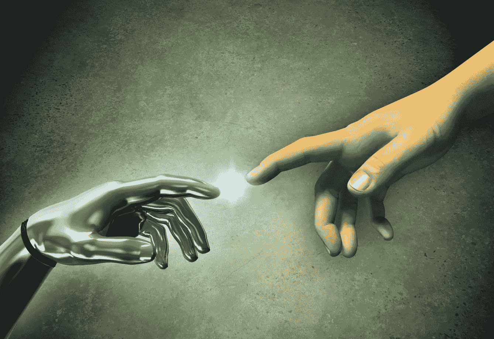

“你所需要的只是爱”，这是甲壳虫乐队在他们 1967 年的著名歌曲中宣称的。如果爱真的是你所需要的全部，那么你爱的主题采取什么形式又有什么关系呢？现在，在我深入探讨这个问题之前，我只想说我指的是成年人之间自愿的爱；我们先说清楚。

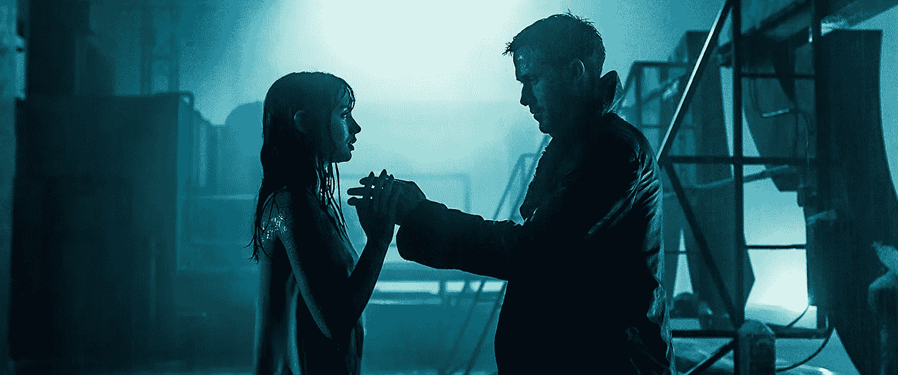

Joi (Ana De Armas) and K (Ryan Gosling) have moment on the roof of his apartment building.

我提出的问题是这样的:有没有可能爱上半动画高级技术？随着人工智能、虚拟现实环境和交互式 3D 的兴起，似乎先进技术正变得越来越人性化。好像先进的技术正在进入我们的世界，所以我们深入他们的世界是不是很疯狂？真正让我产生这种想法的是我第一次看《银翼杀手 2049》。扮演 K 的瑞恩·高斯林拥有一个名为 Joi 的全息人工智能，由安娜·德·阿马斯扮演，并和他住在一起。在电影的整个过程中，我们看到他们的关系不仅仅是陪伴，因为我们听到 Joi 承认当他们单独在一起时她最快乐，甚至为了与 K“身体上的亲密”而与一个复制妓女同步。虽然她的场景非常稀少，她真的只是用来建立 K 的角色并在他的旅程中帮助他，但她对电影的整体主题和 K 角色的动机非常重要。

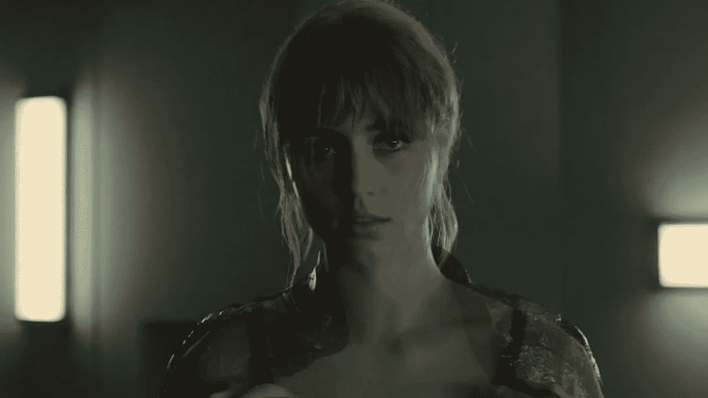

Joi syncs up with replicant prostitute.

剧透:K 是一个复制人，但他对 Joi 的爱，他与她互动的方式以及他在整部电影中关心她的方式表明，当你真正思考时，他实际上是多么有人情味。他倾听她，让她安慰他，向她敞开心扉，甚至为她冒生命危险。而且，真正的问题是，她只是华莱士工业公司开发的计算机系统中的一个全息图。从任何意义上来说，她都不是真实的，但是对 K 来说，她比他所知道的任何东西都要真实。甚至有一个场景，他随身携带的 Joi 的便携式设备被华莱士的仆人压碎了，就在她被压碎之前，她恳求那个女人让 K 一个人呆着，并能够在她被摧毁之前说出一点“我爱……”。当这一切发生时，K 脸上的表情证明了他有多爱她，他们的关系有多真实。这让我开始思考；有没有可能爱上一个不存在的东西？虽然《银翼杀手 2049》是一部优秀的电影，但它绝对不是过去几年中第一部探索爱上先进技术的电影。我想到的一个例子是斯派克·琼斯的《她》。

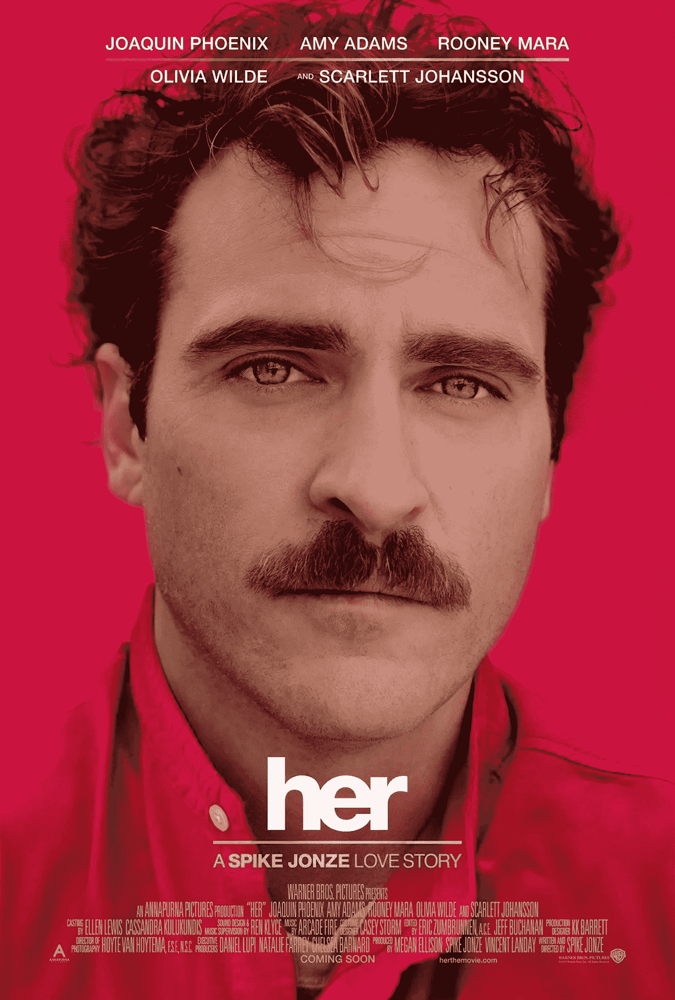

Her — Film directed by Spike Jonze.

《她的 T1》于 2013 年上映，讲述了一个名叫西奥多的男人，由乔阿金·菲尼克斯饰演，生活在不久的将来，最终爱上了一个高级操作系统，由斯嘉丽·约翰逊配音，名叫萨曼莎。起初，这似乎是一个非常“计算机和人类”的关系，直到她进化，他们开始了一个非常奇怪但认真的关系。乔阿金·菲尼克斯最终对萨曼莎有了感觉，你可以看出他以前从未对其他人有过这种感觉。

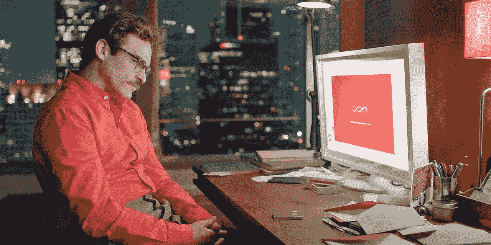

Theodore sets up his new OS.

如果你比较和对比他与萨曼莎和他前妻的关系，你会发现，尽管他确实爱他的前妻，他们在一起也很开心，但他们在情感上没有联系。在整部电影的倒叙中，你可以看到西奥多和他的前任慢慢地疏远了对方。他的前任总是在情感上与他断绝关系，也从未试图解决他们关系中的问题。回到西奥多和萨曼莎，我们看到他们彼此敞开心扉，公开分享他们的想法、感受和愿望。有一个场景我想特别提及，它真实地展示了他们关系的演变；西奥多正在和萨曼莎谈论他和前任的关系，因为他们目前正处于复杂的离婚过程中，当她说一些让西奥多感到有点防御的话时，他回答说她只是不理解他正在经历的事情。第二天，他们交谈，她承认她对他对她说的话感到不安。她甚至说，她开始为生他的气而感到快乐。

Theodore (Joaquin Phoenix) and Samantha (Scarlett Johansson) talk late at night.

这是这部电影非常重要的一部分，因为它不仅展示了萨曼莎的进步，还展示了她如何看待他们不断发展的关系。虽然萨曼莎不是真实的，但他们之间的关系是当今许多现实生活中的夫妇羡慕的。他们的关系充满了理解、爱、欲望和幽默。即使当萨曼莎在电影结尾离开时，作为观众，你也不会觉得萨曼莎离开了。你真的觉得她帮了西奥多很多，他们对彼此的感情是如此真实，以至于她的一部分将永远和他在一起。这显示在电影的结尾，西奥多悲伤地接受了她必须离开的事实，甚至对他的朋友/邻居(由艾米·亚当斯扮演)表示同情，因为所有的人工智能都离线了。在这部电影的过程中，西奥多和萨曼莎之间发生的事情是如此甜蜜和相爱，以至于你不得不提醒自己，她只是一个操作系统。

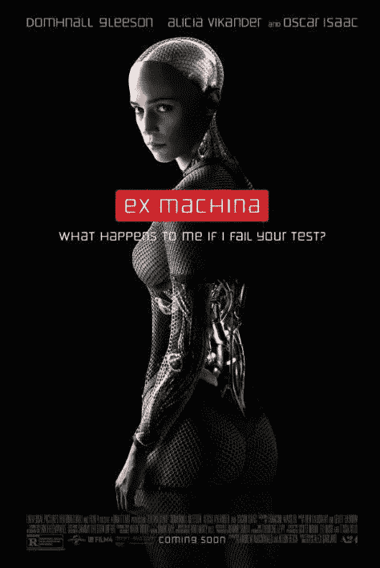

Ex Machina — Film directed by Alex Garland.

让我们把时间快进到 2014 年，看看亚历克斯·嘉兰的电影《玛奇纳前传》。这部电影讲述了一个名叫凯莱布的年轻计算机技术员/程序员的故事，由多姆纳尔·格里森饰演，他赢得了公司彩票，并与奥斯卡·伊萨克饰演的内森公司的所有者和创始人共度了一周。迦勒飞到内森在森林里的私人宅邸，内森承认他想和他分享他的最新发明，这可能会改变人类的进程；他的话不是我的。

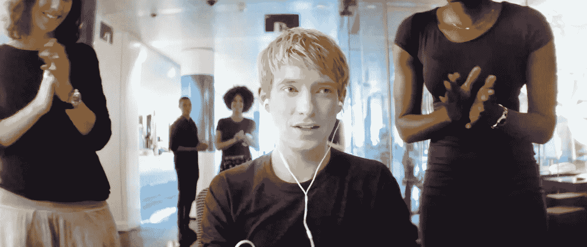

Caleb (Domhnall Gleeson) wins the work lottery.

似乎内森已经创造了一个全意识的机器人，并希望凯莱布实质上执行一个“图灵测试”的修改版本，以便看看他创造的机器人是否真的有知觉。凯勒同意了，在接下来的几天里，他认识了由艾丽西卡·维坎德扮演的机器人艾娃。在与艾娃相处期间，迦勒开始对艾娃产生了一些认真的感情，甚至在这个过程中开始质疑自己的人性。在电影的高潮附近有一个很棒的场景，凯勒在内森的公寓里，他割开自己的手腕，看着血流出来。在我看来，这个场景代表了迦勒对自己人性的质疑，并试图获得具体的证据，证明他确实不同，甚至“身体上优于”艾娃，这就是内森试图在电影中向迦勒宣扬的。艾娃和迦勒之间的关系越来越密切，最终迦勒帮助她逃离了造物主的暴政。这部电影还有很多其他方面我可以谈论，但我想更多地关注艾娃和迦勒。

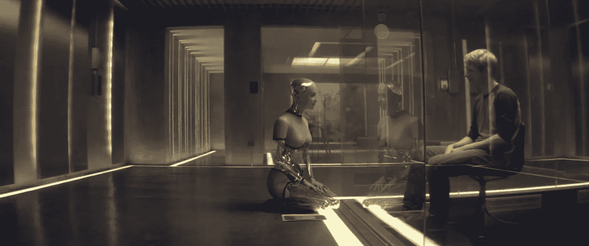

Caleb (Gleeson) and Ava (Vikander) talk in a “modern Turing Test” environment.

为了确保迦勒在与艾娃的互动中尽可能客观，内森把她建成了一个传统的机器人，只有她的脸、手和脚看起来像正常人。尽管如此，迦勒最终还是爱上了她。一天晚上，他做了一个关于她的非常生动的梦，甚至还梦见抱着她并亲吻她的画面。还有一个晚上，他房间的电视里会弹出闭路电视录像，他可以看到艾娃挑逗地穿上袜子，躺在她的床上。她直视镜头，作为观众，你可以看出她知道凯勒在看着她。下一次他们交谈时，她穿上一件衣服，描述如果他们去约会会是什么样子。他们所有的互动和新发展的感情最终在这部电影的结局中发生了重大碰撞。当他发现内森开发了几个机器人女人并随意利用和摧毁她们后，迦勒决定帮助艾娃逃跑。

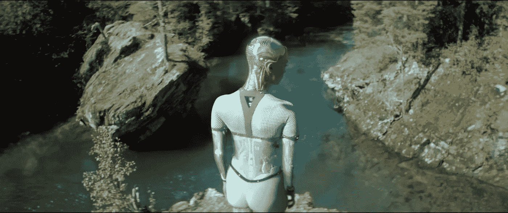

Caleb dreams of Ava.

迦勒走到内森的背后，让他喝得烂醉如泥，晕过去，同时他让艾娃离开她的“笼子”，反过来，她告诉迦勒等她，因为她“为他做好准备”。从这里我们可以看到艾娃穿着内森为了看起来更像人类而制作的旧机器人的皮肤。当内森醒来并发现发生了什么时，他们开始争吵。艾娃为了救凯莱布杀死了内森，在清醒的时刻，他决定把凯莱布留在被封锁的公寓里。这是这部电影非常重要的一部分，因为艾娃揭示了一个非常真实的人性:是的，她确实对凯莱布有感情，但他将永远提醒我们，尽管她看起来和行为像人，但她不是真正的人。如果艾娃身边有人知道她到底是什么样的人，她就无法过上真正或完整的生活。这一切都是通过一些尖锐的对话和令人震惊和难以忘怀的图像来描绘的，在电影的结尾，我们看到迦勒被困在房子里，内森的尸体与艾娃的倒影并列在公共广场中央的反光面上。

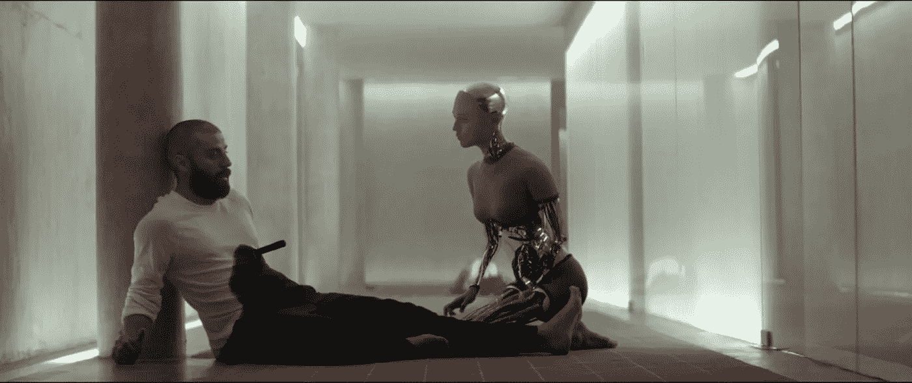

Ava stabs Nathan (Oscar Issac).

《Ex 玛奇纳》是一个非常独特的现代爱情故事，因为我们看到一个人爱上了一台机器，他们的爱是如此强烈，以至于最终成为他们的失败。类似于罗密欧与朱丽叶，他们的爱情从来就不是注定的，因为他们不仅是完全不同的物种，而且他们之间的关系的缺陷太多了。艾娃是机器人，她会比凯勒长寿，不会像他那样脆弱。艾娃永远不能给迦勒孩子，她也永远不能和他一起变老。这些都是人类需要经历的事情，或者至少有机会去实现他们的生活。艾娃明白这一点，并决定给迦勒这个机会，而不是和他一起逃跑。艾娃不仅想要自己的生活，她还非常关心迦勒，给他机会和像他一样的人拥有这些东西。如果这不是真爱的例子，我不知道什么是。

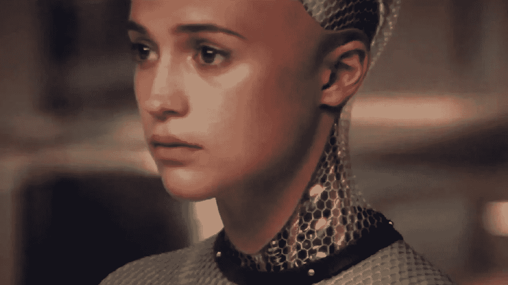

Ava up close.

所以，让我们回到我在本文开始时提出的最初问题，人类有可能爱上先进技术吗？这样做真的是禁忌吗？我得出的结论是肯定的。如果有人制造了一个有感知能力的机器人，能够感受任何情感，并能够进化，我们作为人类将会把它视为人类，并像人类一样发展对它们的感情；这很简单，某种程度上，是精神吸引。在西奥多和凯莱布的案例中，他们分别爱上了萨曼塔和艾娃的思想和个性。虽然艾娃确实有人类的体格，但她有一个非常机械的结构来提醒凯莱布她确实是一台机器。在萨曼莎的情况下，她只有一个声音和一个西奥多会带着她的装置。切换到 K 和 Joi，她基本上是两个女人之间的全息混合体。所有这些的共同点是:这三个人最终都在智力层面上爱上了机器。说了这么多，我想强调的是，我相信真实的人与人之间的互动和关系要比人和机器健康得多。我只是想解释为什么以及如何在今天的技术时代，与人和机器的关系是可能的和可接受的；不仅如此，还有正常甚至…人类。