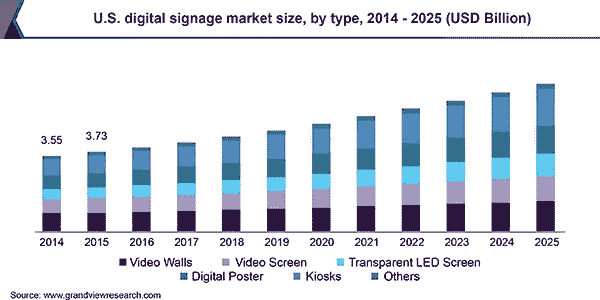

# 数字营销软件市场的快速增长表明，到 2025 年，随着最新技术和未来范围的扩大，数字营销软件市场将得到增强

> 原文：<https://medium.datadriveninvestor.com/digital-marketing-software-market-8031b79047a7?source=collection_archive---------9----------------------->

根据 Grand View Research，Inc .进行的一项新研究，全球[数字营销软件市场](https://www.grandviewresearch.com/industry-analysis/digital-marketing-software-dms-market?utm_source=medium&utm_medium=social&utm_campaign=Gaurav_Aug9_ict_DigitalMarketingSoftware_RD1&utm_content=Content)的规模预计到 2025 年将达到 1052.8 亿美元，在预测期内 CAGR 将增长 15.2%。数字营销软件可以集成多个数字内容交付平台，以便组织可以自行计划、设计和执行营销活动。

公司也可以利用该软件对其营销活动进行深入的实时分析。互联网的激增和社交媒体的使用正在鼓励公司增加在数字营销以及创建交互式和直观的数字内容上的支出，从而推动了数字营销软件的采用。

Digital Marketing Software Market

数字营销软件使公司能够利用社交网站、即时消息系统和移动应用程序等多种资源来瞄准更多的受众，并改善他们的客户互动。各公司也在部署该软件，用于有针对性的广告活动，并将具有相似属性的客户联系起来，这些属性包括位置、收入、购买模式和消费能力。它还帮助公司有效地分析消费者行为、购买模式和各种维度的趋势。

 [## 网络安全非营利组织帮助中小企业打击网络犯罪|数据驱动的投资者

### 一个名为全球网络联盟(GCA)的非营利组织发誓要改善…

www.datadriveninvestor.com](https://www.datadriveninvestor.com/2019/02/22/cybersecurity-non-profit-to-help-smes-fight-against-cybercrime/) 

据观察，市场参与者关注稳健的安全措施和政策的开发。担忧增加的主要原因是对客户隐私和机密数据的安全威胁不断增加，这可能会阻碍数字营销软件的采用。

**如需索取本报告的样本或查看报告摘要，请点击以下链接:**[**https://www . grandviewresearch . com/industry-analysis/digital-marketing-software-DMS-market**](https://www.grandviewresearch.com/industry-analysis/digital-marketing-software-dms-market?utm_source=medium&utm_medium=social&utm_campaign=Gaurav_Aug9_ict_DigitalMarketingSoftware_RD2&utm_content=Content)

**该报告的进一步关键发现表明:**

*   在预测期内，服务部门将以 15.8%的最高 CAGR 扩张。随着数字营销解决方案的日益普及，对各种专业服务和托管服务的需求可能会增加
*   在预测期内，托管服务子细分市场预计将出现显著增长，这是因为增加了一些功能，例如通过作为托管服务一部分提供的基于订阅的定价模式对 IT 基础架构进行远程监控和经济高效的管理
*   日益激烈的竞争促使主要行业参与者采取各种战略举措，如升级现有产品、开发新产品、建立合作伙伴关系和进行收购，以加强其现有的市场地位
*   由于成本效益和更高的可访问性，预计数字营销软件的云部署模式将在预测期内获得更多关注
*   严格的政府法规，如欧洲的 GDPR，预计将对该地区采用数字营销软件产生重大影响
*   预计北美将在整个预测期内主导市场，到 2025 年将达到 464.5 亿美元的价值
*   数字媒体的迅速普及，尤其是在发展中经济体，如印度和中国，为 APAC 的数字广告提供了巨大的增长潜力。中国企业越来越重视电子商务和移动商务，将其作为整体销售战略的重要组成部分
*   全球数字营销软件市场的主要参与者包括 Adobe Systems Incorporated 甲骨文公司；IBM 公司；SAP AG 微软公司；Marketo 公司；Salesforce.com 公司；SAS 研究所有限公司；惠普企业；和 Hubspot 公司。

**查看更多此类报道:** 

****关于大观研究:****

**Grand View Research，Inc .是一家总部位于美国的市场研究和咨询公司，在加利福尼亚州注册，总部位于旧金山。该公司提供联合研究报告、定制研究报告和咨询服务。为了帮助客户做出明智的商业决策，我们提供市场情报研究，确保从技术到化学品、材料和医疗保健等一系列行业的相关和基于事实的研究。**