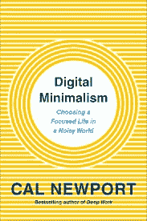

# 数码极简主义:选择专注的生活

> 原文：<https://medium.datadriveninvestor.com/digital-minimalism-choosing-a-focused-life-by-cal-newport-nicole-schlinger-book-review-cd6f08fc08cc?source=collection_archive---------12----------------------->

This isn’t so much a book as it is a manifesto. There’s a reason it was top on [Ryan Holiday](https://medium.com/u/2e2701ae378f?source=post_page-----cd6f08fc08cc--------------------------------)’s 2019 reading list (and mine, too.)

与其说这是一本书，不如说是一份宣言。

# 手机是数字时代的香烟。

它们旨在消耗你给予它们的每一分注意力，作为回报，你会焦虑、不开心、变得更笨。

这不是史蒂夫·乔布斯在发布 iPhone 时的想法。他们只是想把你的音乐和手机放在一个设备里。就是这样。

现在有告密者告诉你我们一直以来的怀疑。马克·扎克伯格并不是一个“友好的书呆子上帝，正在建设一个更美好的世界。”他和那些像他一样的人正在消耗你的注意力——你生命中珍贵的、不可替代的时刻——并将它们卖给出价最高的人，让你在情感上破产。

*当我同意比尔·马厄的观点时，我想这将是地狱里寒冷的一天…但你必须看看这个…*

 [## 比尔·马厄抨击社交媒体大亨创造这种令人上瘾的产品

### 相反,“实时”节目主持人呼吁他们承认自己“只是穿着 T 恤衫，卖香烟的烟农。”

www.huffingtonpost.com](https://www.huffingtonpost.com/entry/bill-maher-social-media-drug-dealers_us_5916a78ce4b0031e737dd975) 

# 他们是这样做的——不定期奖励。

你打开应用程序，有一个红色的小通知。你得到了多少个赞？就像老虎机一样。你必须继续玩下去。下次你会赢的。

> 你的大脑会发生什么？你被剥夺了真正与人交往的能力。你被剥夺了集中注意力的能力。简而言之——上瘾。

卡尔·纽波特会告诉你该怎么做。

关于如何保留数字时代真正好的东西，去掉有害的东西，他有很多好的建议。他会解释你如何在紧急情况下仍能随身携带手机，让真正值得你关注的紧急事项通过，用真正重要的活动取代浪费时间的手机。

When I did a Google Image search for Cal Newport … these rotary pay phones appeared in my search. To be clear — this is NOT what he recommends.

***希望你还有注意力跨度去读他的书。***

如果没有，我会给你一个提示。把脸书的电话关掉。现在！

世界不会终结，你的生活会更好。我保证。

卡尔·纽波特谈到了“数字抵抗”今天，这是一场地下运动，但它具备了马尔科姆·格拉德威尔“引爆点”时刻的所有要素。

它是由一小群有影响力的人提出和推广的，他们有着粘性的想法，就像纽波特书中的社交媒体企业家一样，她雇佣别人来管理她的社交媒体账户，因为它们“太分散注意力了！”

毫无疑问，我们正处于 80 年代吸烟带来的社会变革的风口浪尖。

小时候父母都抽烟(当着我的面！)你可以在餐馆里抽烟。电视上的角色抽烟。见鬼——你甚至可以在一些办公室吸烟！

今天，这是不可想象的。

很快有一天，吃饭时掏出手机，不理同桌的人，也会同样令人反感。

我等不及了。

成为数字抵抗的一部分。跑，不要走。今天就买 Cal Newport 的书吧。

 [## 数字简约主义

### 在这本及时且有启发性的书中，畅销书《深度工作》的作者介绍了一种技术使用的哲学…

calnewport.com](http://calnewport.com/books/digital-minimalism/)