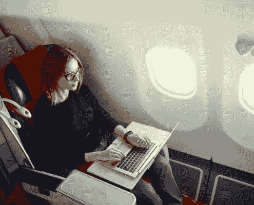

# 数字游牧，这不是度假

> 原文：<https://medium.datadriveninvestor.com/digital-nomadism-its-no-vacation-8432c13b3f4?source=collection_archive---------7----------------------->

我最近写了一篇关于人们对数字游牧生活方式的看法的文章。我在本文中提到的一个观点是相信数字流浪者总是在度假。

如果你已经成为整个数字游牧场景的一部分有一段时间了，不幸的是你知道大多数时候并不是这样的。如果你对数字游牧生活方式感兴趣，请做好失望的准备。准备好回想你在办公室的日子，而不是在海滩上的工作日。

已经有很多关注数字游牧生活方式的有趣部分，以显示它是一个假期。为了让你对现实有一个更好的认识，我将更深入地研究这种认知，并向你展示像数字游牧者一样生活并不等同于终身长假。

# 假期的定义

假期是一个假期或一段远离工作或职责的休闲时间，用来休息或娱乐。在公司里，一个人为别人工作，这个人会在一年中给自己一段短暂的休息时间。在一些国家，一年只有几天，在另一些国家，一年只有几周甚至几个月。

> *假期:暂停工作、学习或其他活动的一段时间，通常用于休息、娱乐或旅行；休息或假期。*

然而，从公司世界转向数字游牧生活方式意味着一个人即将重新定义假期。如果你想进入数字游牧生活方式，因为你想要全职假期，重新考虑你的下一步。除了美丽的目的地，没有多少关于数字游牧生活方式的假期。你不只是朝九晚五地工作，你每天都要工作，包括假期和周末。

# 严酷的事实是，数字游牧不是度假

每次我离开我的祖国，人们都祝我“节日快乐”、“假期愉快”或类似的话。这在几年前可能是对的，当时我正在背包旅行。现在肯定不算。我敢肯定，几乎所有的数字游牧民都能体会到这一点。

除了总是度假，数字游牧者什么都是。普通的数字流浪者每周工作 7 天。没有所谓的周末。是的，我们会休息一段时间，但是当普通人在晚上看电视的时候，数字流浪者会弥补白天失去的工作时间。

> *所以，再见了，你当之无愧的周末！*

# 你总是在工作，即使你认为你没有工作

即使你给自己一些时间休息，当你试图经营自己的企业时，也很难完全脱离。与其他数字游牧民朋友的对话不是关于最新的时尚趋势或城镇谣言，而是关于商业。如何成长，如何外包等等。

即使当你将注意力转移到某件事情上，决定去徒步旅行时，总会有一个客户遇到紧急情况。当然，你没有带笔记本电脑去远足，所以你坐下来，试着用手机解决紧急情况。这不仅要花很长时间，还会让人非常沮丧，这都是交易的一部分。

> 吸取的教训徒步旅行时千万不要带手机😉

如果没有紧急客户，你将与你的徒步旅行伙伴谈论业务。新的商业想法将会出现，外包的可能性将会被讨论。总而言之，即使你快乐的远足也变成了办公时间。

# 数字游牧民不能在海滩上工作！

虽然你可能认为数字游民一直在海滩、游泳池或吊床上工作，但实际上很少发生。你屏幕上的阳光不允许你看到任何东西，所以你不可能在外面完成工作。在泳池里工作？谁想弄湿自己的笔记本电脑？在我决定把我的笔记本电脑放在沙滩上之后，有一次我不得不把它带到苹果商店去清除里面的沙子。我不会建议任何人这样做。

> *阳光照射在屏幕上，你真的能工作吗？*

当然，我们经常在风景优美的地方工作，但是和其他人一样，我们也需要电力和网络。这意味着我们经常在室内，坐在咖啡厅的桌子上，坐在不舒服的木椅上工作。或者在家里、床上、沙发上或餐桌上。你不会看到的照片，因为你不想看到一个穿着慢跑裤或睡衣的人坐在黑暗中，因为我懒得在离开家之前洗澡。

# 浪费的旅行时间

大多数数字游牧民也会经常旅行，所以在这些时间里，普通人正在做他们喜欢的事情，你可能正坐在一架不舒服的廉价飞机上，生病的人正在乘坐公共汽车，或者在雨中在路边等待下一次搭便车。

在飞机上，我喜欢再次赶上工作，但在公共汽车或汽车上的时间对我来说是浪费时间。我不能盯着屏幕，我只是头疼和恶心。但我见过那些甚至在最美的风景公路上打开笔记本电脑的人。另一个紧急客户需要马上解决问题。我不知道我是否应该对那些智能手机感到高兴，它们让我们有可能在任何地方创建 w if I。

# 常规仍然是高效的关键

如果你真的想富有成效，制定一个计划仍然是关键。当你在世界各地旅行时，有些事情并不总是可能的。你需要在一个地方呆至少一个月，最好是能够适应正常的生活。制定适当的工作目标和工作时间，既能完成工作，又能结识新朋友，参观新地方，做有趣的事情。因为这是开始这种美好生活方式的全部意义🙂

# 返校义务

当数字游牧民回到他们的祖国时，他们实际上有很多义务。你将不得不去看你的祖母，你的父母和朋友的新生婴儿，他们的生活突然变得完全不同。除了你要做的工作之外。当你想到回家放松时，你就错了。回家常常感觉比离开还要辛苦。

> ***如你所见，到目前为止没有多少假期..***

# 回想过去的美好时光

有时我会回想起背包旅行的日子，那些我可以旅行、读书、放松、和随机的人就随机的话题进行每小时一次的交谈的日子。只是因为根本没有义务。这么多空闲时间。但是那些宿舍时代已经过去了，必须为此做出让步。有一个工作的未来，这就是数字游牧生活方式的完美结合。没有办公室工作，仍然能够工作的未来。

我们根本不能抱怨。我是说，大部分时间我们都在神奇的地方。因此，当我们想要休息时，或者当我们因为工作结束而关闭笔记本电脑时，我们会跳进游泳池，在海滩上喝鸡尾酒，或者做一些我们真正喜欢的事情。

# 接受数字游牧生活不是一个漫长的假期

正如你所看到的，难怪新的数字游牧者面临的最大挑战之一是接受这种新的生活方式不是一个长期的假期。大多数人从银行账户里的一点钱开始，所以一开始看起来一切都很好。当他们开始耗尽积蓄时，当他们实际上不得不谋生时，担忧就开始了。请记住，作为一名数字流浪者，你将不得不在旅行、娱乐和实际创业之间周旋。

# 误解的原因

对数字游牧生活方式的误解有两个主要原因。首先是数字游牧生活方式和其他类似生活方式之间的混淆，比如背包环游世界或间隔年旅行。其次是因为这是数字游牧民在社交媒体上展示自己的方式。

# 由于相似的生活方式而产生的误解

那么，你如何判断你遇到的是一个数字流浪者，而不是一个背包客或任何其他类型的旅行者呢？在你感到困惑之前，这里有一些数字流浪者和真正长期度假的生活方式之间的区别。

如果你想了解更多的术语和区别，我会推荐你去看看我写的另一篇[博文](https://activeworkation.com/the-differences-between-the-definitions/)。

总的来说，你会发现数字游民在任何类型的咖啡馆或合作空间工作。他们有更多的例行公事。不会经常喝酒、聚会和外出，因为他们知道第二天会有多少工作量在等着他们。他们知道，如果他们想继续探索世界，他们必须完成工作。当然，这并不意味着数字游牧民根本不喝酒或聚会。每个人有时都需要减压和娱乐，没有比喝酒更好的与人交流的方式了。

# 社交媒体造成的误解

误解的另一个主要原因是数字游牧民自己如何展示数字游牧民。在大多数情况下，我们在 instagram 上看到的这些人的照片是他们在音乐会或“聚会”上拍摄的无数照片，而不是他们所做的工作或他们经历的斗争。只展示好的一面是很正常的，但也可能会产生误导。因此，人们的感觉是娱乐而不是工作。但正如你现在所做的，[需要努力工作。](https://activeworkation.com/digital-nomadism-its-no-vacation/)

# 虽然数字游牧不是度假，但还是值得的！

如果你准备好努力工作，尽情玩乐，尽情投入。这仍然是一个伟大的世界，探索起来令人惊叹。做好准备，如果可以的话，试着去度假吧！这可能不是一个漫长的假期，但仍然有很多自由和乐趣！