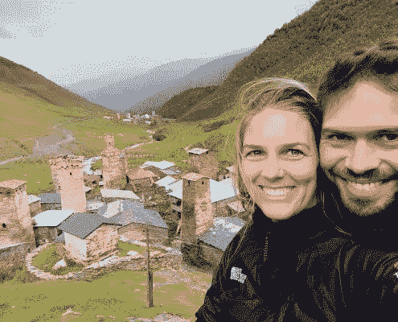

# 数字游牧，他人的看法

> 原文：<https://medium.datadriveninvestor.com/digital-nomadism-the-perception-of-others-832b4b17644a?source=collection_archive---------9----------------------->

如果我问你对数字游牧的看法，你会怎么想，你会怎么回答？你对数字游牧生活方式的总体看法是什么？

也许你没有想过这个问题，我让你有点困惑。但是，我相信大多数人对数字游牧者的生活方式都有自己的看法，也许是时候花一分钟想一个答案了。这些年来我听到的普遍看法蒙蔽了许多对数字游牧生活方式感兴趣的人。他们认为这都是闪闪发光和魅力或在海滩上的鸡尾酒，以留在数字游牧民族的话。可惜不是。成为数字游牧者的现实与人们对他们的看法大相径庭。让我们来看看其中的一些看法。

# 数字游牧民总是在度假

这是显而易见的。如果不是为了度假，你怎么能决定离开你的祖国去外国呢？人们很容易以这种方式来思考数字游牧生活方式，尤其是当你在社交媒体上分享大量生活方式的照片时。拿着笔记本电脑坐着，手里拿着鸡尾酒在海滩咖啡馆工作。人们看不到照片拍摄后发生了什么。我们大多数人会回到室内，把自己锁在笔记本电脑后面，再也见不到阳光。难怪每次回家都有人问我为什么没有晒黑。

你可能会在很棒的地方生活和工作，重要的假期肯定结束了。当你开始为自己工作时，就没有人支持你的假期和病假了。你没有时间不去想所有你还必须做的事情。即使你想给自己一些假期，也很难完全关闭自己的公司。尤其是当你和客户一起工作的时候。

# 数字游牧者总是快乐的

这是最大的认知之一。当然，生活在另一个国家的想法和想去哪里就去哪里的自由会让你快乐。这很好，但不是全部。不一定会让某个人开心。

就像婚姻一样，最激动人心的时刻通常是在早期。当孩子出生或者你们都开始变老时，一切都变了。新婚的日子结束了，真正的生活开始了。数字游牧生活方式也是如此。这种生活方式的很多方面会让你感到不快乐——从生活在资源有限的偏远地区到文化障碍。从孤独、想念朋友和家人到赚不到足够的钱。就像生活中的所有事情一样，一切都有起有落。数字游牧生活方式也带来了其他挑战。没有互联网或互联网连接差，在炎热或不舒服的天气条件下工作，而且压力很大，因为你想看东西，见人，还要完成工作。

# 数字游牧民总是在开派对

出于某种原因，我们从数字游牧民分享的视频和照片中得到的想法是一种饮酒和聚会的生活方式。一些数字游牧民玩得很开心，每天晚上都喝啤酒。然而，尽管我是一个数字流浪者，我不喝酒，也不参加任何聚会。相反，我是一个更严肃的类型，尽管我喜欢我所做的。

大多数数字游牧民需要完成工作，没有时间参加聚会。这是你所看到的数字游民的生活，他们通常刚刚起步，试图在这种生活方式中找到自己的路。它可能来自那些在间隔年背包环游世界的人，他们可能在途中没有真正赚到钱，但仍然希望将自己与数字游牧生活方式联系起来。

对于那些努力工作的人，你会看到那些令人惊叹的照片。当然，我们会分享我们一起参加聚会、享受快乐生活的照片。一张我们坐在 Airbnb 的或共同工作的地方的笔记本电脑后面的照片不会给那些喜欢和关注者；-).

# 数字游牧者不做关系

在每天喝酒和聚会之后，一般人都期望一个典型的数字游牧者在他们访问的几乎每个国家都有几个短期的浪漫关系，对吗？每个大洲至少有一个。不幸的是，情况也并非如此。大多数数字游民，比如我自己，在人际关系方面都非常长远。我去外国不是为了到处调情和勾搭当地人，我相信大多数数字游牧民除了到处调情还有很多事情要做。

当然，有些时候你会遇到与你联系的那个特别的人，也有一些数字游民在不工作的时候会打情骂俏。释放蒸汽和减少压力可能是这样的原因。但这不是我们生活方式中的主要部分。

我过这种数字游牧生活的时间越长，我看到的数字游牧者之间的关系也越多。我认识结婚的，甚至成家的。在旅途中的数字游牧生活不仅仅是工作和环游世界时的放纵。然而，在过着数字游牧生活的同时发展关系并不容易。你们要么根本不在一起，要么全天候在一起。这不太像是慢节奏的约会，更像是孤注一掷的约会。但那是另一个话题；-).

# 数字游牧民赚了很多钱

像大多数人一样，你可能在脸书上看到过一些广告，人们说他们通过环游世界赚了几百万，你也应该这样。“如何在环游世界的 4 周内建立起 6 位数的生意”。就我个人而言，我不太相信这大部分是真的。如果你有六位数的生意，为什么你要卖掉你的生活方式，还要做更多的工作？

还有一些人辞掉他们“无聊”的工作，卖掉他们曾经拥有的一切，环游世界。是的，当你的银行账户上有一定的存款时，或者当你在世界各地旅行时，你可以这样做。我也是这样开始的。但这不是数字游牧，这叫做背包旅行。

如果你称自己为数字流浪者，或者希望有一天成为一名数字流浪者，请记住，你的储蓄是你在新公司的投资资金，它们会在你刚起步时支持你，不会像后来那样有那么多客户。这是一项巨大的投资，希望回报能在晚些时候到来。

当然，有一些人可能做得很好，但很多人都在为“钱”的事情而奋斗，至少在开始的时候是这样。不要低估这一点，但也不要让它吓跑你。

# 数字游牧民可以随时随地自由生活

这是一个棘手的问题，因为它部分是真的，部分是假的。这在一定程度上是正确的，因为作为一名数字流浪者，在大多数情况下，你不会被限制到你想去的地方，但比如说，会有签证限制。如果你来自欧洲，你可以在任何一个欧洲国家想待多久就待多久。你来自欧洲以外吗？你被限制在三个月内。很多国家都有一个月的旅游签证，有些是三个月，有些是六个月。最终，签证限制了每个数字流浪者在他们想去的地方呆多久就呆多久。

然后是预算。许多数字游牧民可能会有某种预算，更喜欢住在更便宜的国家以降低成本。在巴厘岛、清迈(泰国)、里斯本(葡萄牙)和保加利亚等数字游牧民中心，你会发现很多数字游牧民。不太可能在世界上最昂贵的国家找到人，因为他们没有这样的预算。这并不意味着他们不会在那里，只是他们会更少或停留更短的时间。

所以，尽管你有自由住在任何地方，你仍然受到某些限制。

# 为什么我们对数字游牧生活方式有这种错误的看法？

关于数字游牧有很多看法，但是为什么我们对数字游牧的生活方式有这样的感觉和想法呢？

*   成功案例:“成功的”数字游牧民和所谓的“古鲁”一夜成名的故事。有时没有任何生活方式的经验。
*   社交媒体影响:当你在 Instagram 上看到那些美丽的海滩照片时，你很可能会很想以不同于现实的方式来感知生活方式。
*   对过“有意义的”生活的狂热:无论“有意义的”生活是什么，大多数人都认为它是通过数字游牧生活过的。直到他们试一试。
*   不适当的准备和测试:你可能会认为在国外生活和在自己国家生活是一样的。也许在你真正开始之前先测试一下。有很多工作可以满足其他数字游民，看看他们的生活方式到底是怎样的。
*   过度营销:由于数字游牧生活方式的流行，几乎每个国家都在营销自己，因为现实可能是不同的。

我是不是说做一个数字流浪者不好？当然不是！至少，我是其中之一，而且我喜欢它。然而，重要的是帮助人们理解生活方式的现实可能与他们最初对它的看法完全不同。你看到的那些人们在海滩或游泳池边用笔记本电脑工作的“惊人”的工作照片，大多数时候都是假的😉

原发表[此处。](https://activeworkation.com/the-digital-nomad-perception-of-others/)