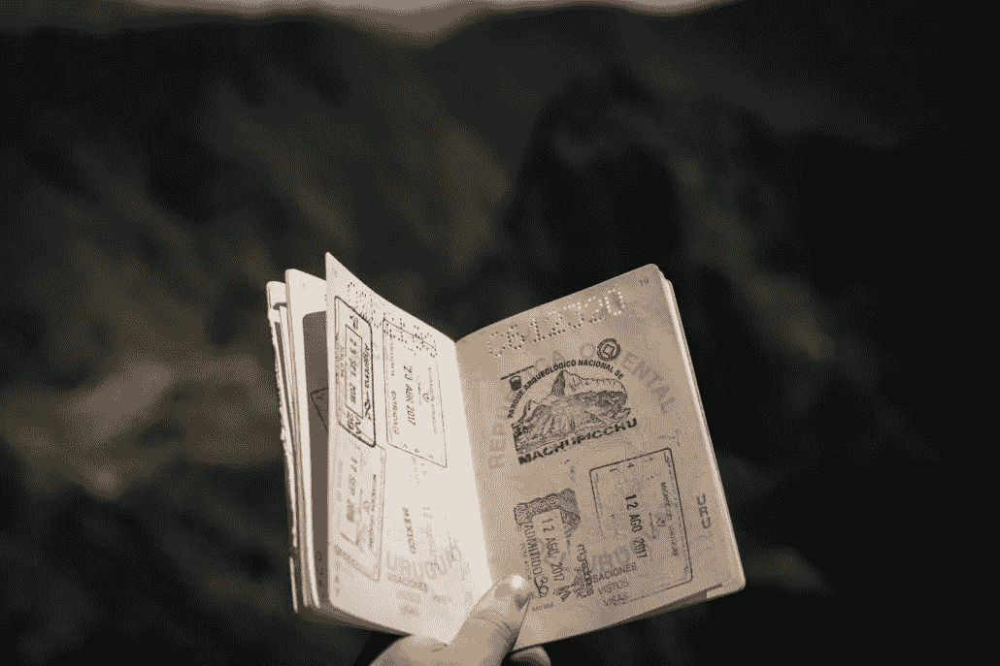
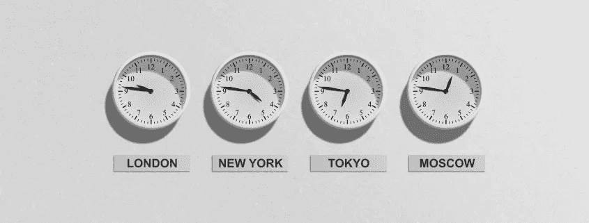

# 数字游牧者，随时随地工作

> 原文：<https://medium.datadriveninvestor.com/digital-nomads-working-whenever-wherever-415e7caa29c9?source=collection_archive---------27----------------------->

当我开始成为一名数字流浪者时，我想到的一个想法是，能够在我想去的任何地方、任何我想工作的时候工作该有多好。夏奇拉的《无论何时何地》这首歌在我脑海里萦绕了几个星期！

当我发现无论何时何地都可以工作是不可能的时候，我震惊了。当然，我在想什么？我怎么会这么天真？我知道，你可能也没准备好，对吧？我怎么能说这样的话让你失望呢？其他的数字游牧者都说服你成为数字游牧者，这样你就可以在任何时间任何地点工作了。让我解释一下。

# 数字游牧者，在任何地方工作

我们先来看“无论哪里”这部分。当然，作为一名数字流浪者，你几乎可以住在任何你想住的地方。这是毫无疑问的。如果你喜欢冲浪，你很可能会在一个阳光海滩位置的冲浪点。如果你是一个单板滑雪的狂热爱好者，你宁愿花时间呆在白雪皑皑的高山上。这通常是过数字游牧生活的主要原因之一，在我看来也是最好的原因之一。但是，当您搬到一个新的地方并投入远程工作的世界时，仍有许多事情需要考虑。

# 数字游牧民通常寻求高质量的生活

你没有开始你的远程生活方式，因为你想要一个比你在企业界朝九晚五的生活更糟糕的生活。你开始这种生活方式的改变，是因为你想让你的生活有所改善。你不可能在任何地方都得到你想要的质量和某些生活标准。

无论你想去哪里，如果你第二天必须高效工作，最好休息一下。所以，睡个好觉，第二天会更有效率。

# 数字游牧者需要一个有互联网的地方

住在一个接近荒野的地方怎么样，那些美丽的山，在沙漠里或者在一艘航行在海洋上的船上？这看起来像一个梦，但在那些地方，如果有任何互联网连接，可能更难获得高速互联网。

电呢？即使没有互联网你也能生存，你也需要能够给所有典型的数字移动设备充电。当你需要有离线时间的时候，去荒野、山区、沙漠和海洋上的地方玩几天是很棒的。但是这些地方并不是你作为数字流浪者能够生活的地方。

当然，你会学到很多东西，并获得一些如何在野外生存的经验，但完成工作几乎是不可能的。过一段时间不会太无聊和孤独吗？

*无论何处意味着任何有良好互联网的地方*

# 数字游民需要一个他们买得起的地方

好了，你找到了一个地方，那里有你要找的一切。你在那里呆了一段时间，发现这个地方并不像你希望的那么实惠。我们都喜欢旧金山、夏威夷和纽约，但这并不意味着每个人都能负担得起在那里永久居住。

你愿意住在一个生活费用是你月收入两倍的地方吗？我肯定不会。

这就是为什么你会在东欧或亚洲更便宜的地方看到很多数字游民。

# 数字游牧者经常寻找有数字游牧社区的地方

一些数字游牧民离开了他们的祖国，因为他们想摆脱所有的政治不便。他们在寻找一种远离所有麻烦的生活，远离川普的愚蠢和英国退出欧盟的废话。难怪他们不总是试图融入当地社区。他们根本没有动机这么做。

虽然你可能会发现与当地人或旅行者的联系，但人们倾向于寻找志同道合的人来陪伴自己。同舟共济的人们，有着相同的问题和相同的兴趣。一个旅行者可能有同样的兴趣，他们并不总是理解你没有时间每天做所有有趣的事情。一个旅行者有很多时间做他们喜欢的事情，享受乐趣和聚会，而你作为一个数字流浪者必须工作和赚钱。你不会总是能够加入他们，进行同样的对话。

数字游牧者倾向于寻找彼此，并建立他们自己的志趣相投的社区。没有任何一种社团，你都会觉得很孤独。加入一个团体对你的健康很重要，对你的生意也有好处。

# 数字游民需要一个安全的地方

当你选择下一个目的地时，你可能想在预订航班前检查一些安全问题。就我个人而言，我不认为政府的建议总是正确的，我一个人去埃及或其他会吓跑其他游客的国家没有任何问题，我确实会再三考虑去巴西的萨尔瓦多。根据我的经验，我知道这不是放我所有电子产品的最安全的地方。

作为一名数字流浪者，你会随身携带相当多的昂贵物品。笔记本电脑、智能手机，有时还有平板电脑、相机甚至无人机。无论你决定去哪里，安全还是不安全，确保你购买了特殊的旅行保险，并在携带设备时小心谨慎。

# 数字游牧友好的地方和签证

因为数字游牧民创造了这些社区，一些全球数字游牧民热点也就自动产生了。良好的天气、特定的时区、良好的货币兑换和可承受的生活成本是这些枢纽的原因。

其中一些景点是现在可以获得特殊数字游牧签证的原因。泰国批准了智能签证(也称为数字游牧签证)。这种签证允许企业家在没有工作许可证的情况下在泰国生活和工作最长四年。

其他国家大多是以旅游签证入境，允许你在某个地方呆几天到几个月。所以，尽管你可以自由地去很多地方，但签证可能是一个主要的限制。有时是因为你的护照，有时是因为你想在一个特定的地方停留的时间。

# 在路上的数字移动办公室，共同工作的地方

如果你真的想提高工作效率，并确保你有高速互联网，去办公室可能是一个很好的解决方案。世界上有很多共同工作的空间。在某些地方比其他地方更多。这些共同工作的地方不仅仅是为当地企业家准备的。有很多共同工作的空间，你可以在那里租一张桌子一周、一天，有时甚至几个小时。

你会在一个共同工作的空间里找到路上最好的办公室！

# 数字游牧者，随时工作

现在，让我们到“无论何时”的部分。作为一名数字流浪者，你可能独自一人，几乎不用对任何人负责(当然税务机关除外:)。你可能是自由职业者、雇员或企业家。不管你是什么，大多数情况下你都要和客户或老板打交道。

相信我，除非你不积极工作，否则你不会像你想的那样“随时”工作。

# 客户端和时区

如果你问自己是否真的想“随时”工作？答案很可能是肯定的。如果你是一个早起的人，你会坚持早上工作，晚上做任何你喜欢做的有趣的事情。如果你是一个晚上的人，你可以早上休息或娱乐，晚上工作。你可以决定自己什么时候想工作。

如果你的工作需要和海外客户打交道，那就非常非常不同了。您可能有来自世界各地的客户，来自各个时区的客户，想要或有时需要您立即支持的客户。他们不在乎你决定在世界另一端你最喜欢的海滩上工作，他们只在乎你是否按照他们期望的方式去做。

您当前时区和客户时区的差异会影响您的业务和个人健康。取决于你在哪里和你做什么，你可能不得不熬夜或醒得特别早。这意味着有时你可能不得不凌晨两点起床或者工作到深夜。这种情况发生一两次没问题，如果你每天都要这样，那就成问题了。

这就是现实发生的地方。

# 数字游牧截止日期

像任何其他类型的工作一样，大多数数字游牧工作你也必须处理最后期限。当你计划一项活动、推出一个网站或一个产品时，时间可能不是你最好的朋友。日历紧密工作，任务必须完成。越是临近活动日期，越是需要在最后一刻完成的事情。即使阳光明媚，你想在海里游泳休息，优先事项必须设定，你放松的周日必须等待，又一个星期。

# 无论何时何地工作并不总是一件积极的事情

大多数数字游民在笔记本电脑和智能手机之间周旋，以完成工作。您接触设备的频率取决于您需要完成的工作量。

# 数字游牧民几乎可以在任何地方工作

作为一个数字流浪者，你会在你能想到的最荒谬和最随意的地方打开你的笔记本电脑。当你过去常常阅读一本书或赶上你的社交生活时，现在准备好打开你的笔记本电脑，做一些最后一分钟的事情。当你在机场等下一趟航班时，当你坐在下一辆将你带到下一个目的地的旅游巴士上时，当你等着入住新酒店时，你都会打开你的笔记本电脑。

# 数字游牧者实际上一直在工作

即使你不工作，你也会一直工作。未来的客户可能无处不在。你对一个人的兴趣从想了解这个人变成了想知道这个人是否对你和你的生意有任何意义。

所有的生日聚会，婚礼，女孩们外出的夜晚，都突然变成了商业对话。有时候无法逃避。即使你不想，人们的好奇心会导致询问你的业务，所以即使你想给自己一个晚上的休息时间，也要准备好谈论它。工作被带到了一个全新的水平。

# 数字游牧者如何处理他们的生活方式？

在你过上数字游牧生活之前，你可能认为随时随地工作是最理想的。这种生活方式伴随着大量的纪律。提高你的生产力和效率的最好方法之一就是遵守纪律，管理好你的时间。作为一个数字流浪者，最大的财富是你的时间。如果有一点被浪费了，你会觉得失去了对自己生活的控制。

你会发现自己所处的情况和环境不允许你享受在任何时候去任何你想去的地方的自由。如果你不好好管理你的资源，尤其是你的时间，你可能会有一些紧张的日程安排，有时会让你感到压力。接受是关键，生活并不总是充满乐趣，有时工作是必须要做的。

即使你的日程安排很紧，休息和放松对你这个数字流浪者来说也同样重要。你必须找时间睡觉和放松。尤其是在辛苦工作一天之后。这将有助于你的身体恢复新的能量。偶尔从你的设备上拔掉插头是完全可以的，也是值得推荐的。

