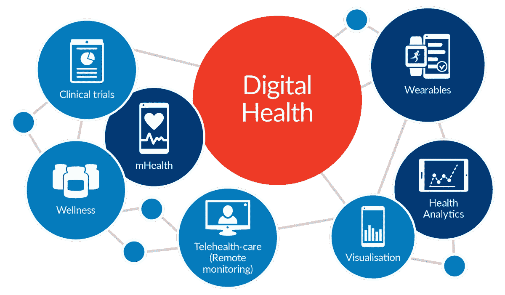

# 加强非洲卫生系统的数字技术

> 原文：<https://medium.datadriveninvestor.com/digital-technologies-for-health-system-strengthening-in-africa-88adca7dd22c?source=collection_archive---------8----------------------->

> 最近，我提出了关于英国非洲研究和创新数字创新平台的想法，以指导未来在全球挑战研究基金下对撒哈拉以南非洲使用数字卫生技术的研究伙伴关系的投资。以下是我的投稿摘要。

Digital Health (Picture credit: Halcyon Group)

数字技术包括但不限于移动应用，包括移动数据收集和分析工具，数字基础设施，特别是互联网接入，可穿戴设备和智能手表，电子健康记录，健身和患者参与工具，电子学习平台，远程医疗，数字治疗和电子处方，以及人工智能健康。每一项都可以用来改善非洲的健康状况。虽然移动应用程序、电子学习平台和远程医疗等一些工具正在多种环境下进行测试，结果不一，但可穿戴设备、数字治疗和人工智能等其他工具尚未成为主流工具。

重要的研究领域包括:

1.**定义数字卫生技术**:这是一个有用的起点，可以澄清这些术语和概念对非洲人意味着什么，并最终在卫生利益相关者之间达成共识。

2.**卫生技术评估**:在将数字卫生工具引入卫生服务之前，有必要发展评估其价值的能力。国家健康和护理卓越研究所与几所优秀大学合作，对所有卫生技术进行严格和及时的评估，并指导其在英国国家卫生服务中的使用政策。在国家和/或区域一级，一个类似的机构对于指导全面评估非洲卫生系统中数字卫生工具的开发和部署非常重要。

3.**数字工具和健康信息管理系统的采用**:尽管随着移动设备和互联网渗透率的增加，数字工具有可能被广泛采用，但数字工具的采用率可能较低。研究资金可以优先考虑关于决策者、创新者、卫生工作者和卫生服务用户对采用和使用数字工具和卫生信息管理系统的行为的问题。

4.**能力建设**:尽管传染性和非传染性疾病负担沉重，但撒哈拉以南非洲国家严重缺乏卫生工作者。数字工具有助于通过电子学习平台弥补卫生专业人员培训方面的差距，但鲜有证据表明其广泛大规模使用对健康指数产生了可持续的影响。也有机会为现有卫生工作者采用数字工具的能力建设计划提供资金，并为建设数字卫生医生提供新的空间。

5.**疾病监测和预防**:根据世界卫生组织的数据，非洲每 4 名儿童中就有 1 名无法获得儿童疫苗，每年导致 50 万人死亡。撒哈拉以南非洲的疫苗覆盖率为 72%,使儿童暴露在疫苗可预防的疾病面前，这些疾病每年在非洲大陆造成 130 亿美元的损失。通过使用移动设备更好地收集和清理数据，以及连接到一个集中、开放的分析平台进行及时干预以提高免疫覆盖率，数字工具可以在疾病监测中发挥至关重要的作用。

6.**人工智能**:没有高质量的训练数据和出色的计算能力，AI 的空间有限。非洲有哪些潜在的和现有的大数据源？如何部署这些技术来构建机器学习算法，以帮助预防、诊断和治疗热带疾病？

*更多信息请关注* [*数字健康非洲*](https://twitter.com/DigitalHealthA2) *。*

# DDI 特色数据科学课程:

*   [**用于数据科学的 Python**](http://go.datadriveninvestor.com/intro-python/mb)
*   [**深度学习**](http://go.datadriveninvestor.com/deeplearningpython/mb)
*   [**数据可视化**](http://go.datadriveninvestor.com/datavisualization/mb)

**DDI 可能会从这些链接中收取会员佣金。我们感谢你一直以来的支持。*