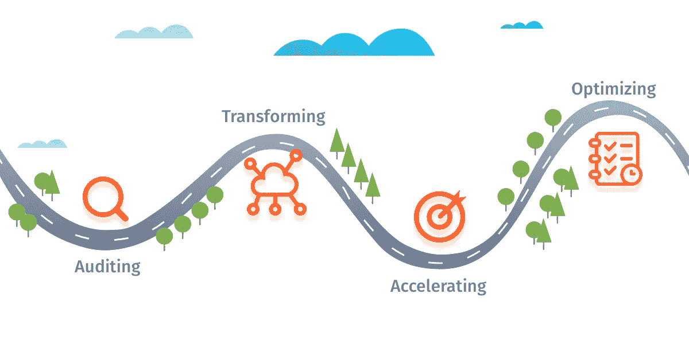

# 数字化转型——迈向完美的无尽旅程

> 原文：<https://medium.datadriveninvestor.com/digital-transformation-an-endless-journey-towards-perfection-9168eb197e12?source=collection_archive---------29----------------------->

Forrester Research 宣布 2018 年为企业开发运维年，因为全球超过 50%的企业已经完成了向开发运维的过渡。然而，他们的数字化之旅才刚刚开始。

正如最近发布的 [SoftServe 关于数字化转型状况的研究报告所述](https://softserveinc.com/softserveinc/media/whitepaper/the-enterprise-digital-journey-survey-softserve.pdf)、**大约 70%** 的美国和欧盟公司目前正在经历数字化转型。这包括来自多个行业的公司，如[金融](https://itsvit.com/blog/devops-financial-services/)、[医疗](https://itsvit.com/blog/devops-healthcare-benefits-case-studies/)、[保险](https://itsvit.com/blog/devops-insurance-industry/)、[旅游](https://itsvit.com/blog/devops-transforming-travel-industry/)、[电子商务](https://itsvit.com/blog/make-devops-trump-card-e-commerce-competition/)和电信，他们了解采用 DevOps 对其业务绩效的影响，并希望利用这一竞争优势。

然而，对于这一进程的本质存在着严重的误解。首先，人们无法确定数字化转型究竟是什么。其次，大多数企业倾向于将其视为采用新工具、流程和 DevOps 文化的一次性工作，并有特定的 KPI 和截止日期。实际上，数字化转型没有截止日期。

> **数字化转型是使用最新技术并遵循 DevOps 文化最佳实践来改善业务运营的持续过程。**

这个过程可以分为 4 个主要部分:

1.  **审核**现有的工作流程和基础设施，以了解薄弱环节并确定增长领域
2.  **通过云过渡转变**现有流程，[采用 DevOps 文化](https://itsvit.com/our-whitepapers/transition-to-devops-the-reasons-methods-and-results/)，实施最新的 DevOps 最佳实践和工具等。
3.  **由于技术的进步和团队效率的提高，加速了业务目标的完成。**
4.  **优化**新采用的技术，使其更好地与公司愿景和战略保持一致。

因此，第四阶段可以没有截止日期，并将从完成最初的[数字转换](https://itsvit.com/our-whitepapers/how-to-perform-a-successful-digital-transformation-guideline/)的点继续向前。新技术会不时出现，你使用的 [DevOps 工具](https://itsvit.com/blog/must-have-devops-tools-make-things-right-get-go/)会不断发展，云服务提供商无疑会在这一领域进一步创新——所以在你的数字化之旅中没有也永远不会有一个句号。

例如，采用 DevOps 将大大加快软件开发，并提高面向客户的生产系统的性能和可靠性。然而，这也需要你的产品和服务经得起未来的考验。这意味着:

1.  改革您的网络安全方法，将安全检查转移到软件交付流程的左侧，并使其自动化以支持 DevSecOps
2.  为您的企业生成的数据设计和实施机器学习支持和大数据分析。这将成为持续创新和提高客户价值的基础。
3.  构建[多云生产环境](https://itsvit.com/blog/digital-transformation-multi-cloud-strategy/)，能够在几分钟内通过添加或删除某些模块进行调整，因此您的产品保持灵活性，能够随时响应不断变化的客户需求。

# 关于数字化之旅的最后思考

正如你所看到的，数字化转型是一项复杂的努力，但它是非常有益的。当您的公司通过使用最新的技术和最佳实践获得新生时，应对任何业务挑战都会变得容易得多。

那么，如何开始数字化转型呢？通过雇用知道如何做的人才！你可以努力在内部建立专业知识，或者雇佣外部承包商来执行这项任务。如果您选择后者，IT Svit，世界领先的托管服务提供商之一，随时准备为您提供帮助！

*原载于 2018 年 11 月 22 日*[*itsvit.com*](https://itsvit.com/blog/digital-transformation-actually-journey/)*。*