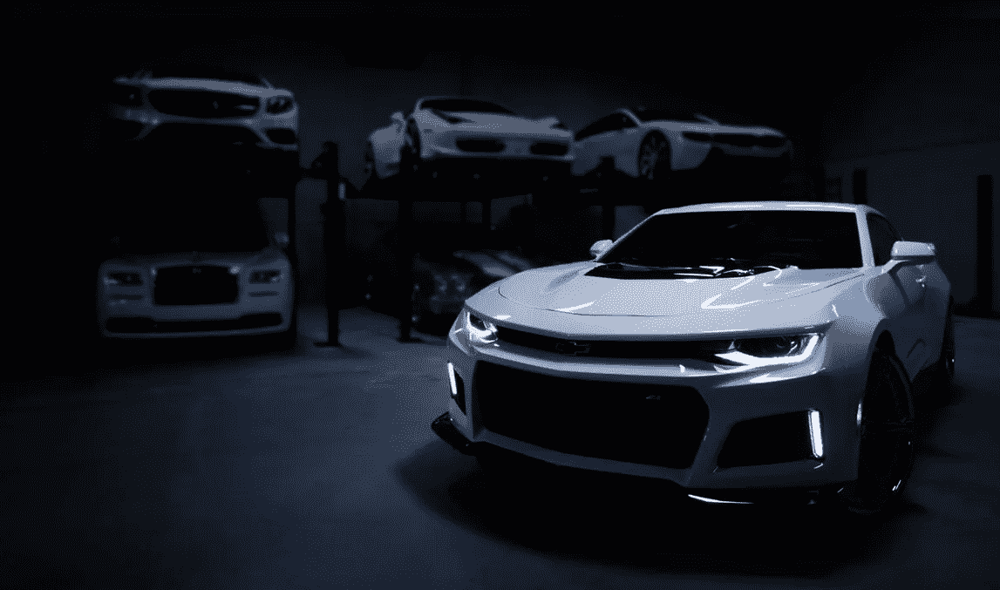

# 二手车经销商的数字化转型:是必要的吗？

> 原文：<https://medium.datadriveninvestor.com/digital-transformation-for-used-car-dealerships-is-it-a-necessity-abc95da68fa5?source=collection_archive---------0----------------------->

如今，数字化转型影响着所有行业。事实上，一项研究表明，到 2020 年，你更有可能与机器人交谈，而不是与你的配偶交谈。这基本上说明了数字化转型正在全球蔓延的势头。

汽车行业也感受到了。我们选择和购买汽车的方式已经改变。例如，在美国，汽车销售[趋于放缓](https://www.thetruthaboutcars.com/2017/11/usa-auto-sales-brand-brand-results-october-2017-ytd/)。消费者持有汽车的平均时间是 6.5 年，而十年前是 4.3 年。为了克服这些挑战，汽车经销商引入了数字化体验，以便与经销商的数字化体验相协调。

 [## 在自动驾驶汽车发生事故的情况下，谁应该承担法律责任？数据驱动的投资者

### 我仍然认为自动驾驶汽车是一种奢侈品，而不是必需品…

www.datadriveninvestor.com](https://www.datadriveninvestor.com/2018/11/02/who-is-legally-accountable-in-the-case-of-an-autonomous-vehicle-accident/) 

二手车经销商也在试图找出在技术时代增加销售的方法，这也许并不奇怪。数字化转型影响经销商的方式有很多，但让我们来看看一些更重要的方式。

# 研究汽车

谷歌声称 [95%](https://www.thinkwithgoogle.com/marketing-resources/auto-digital-retail-trends/) 的潜在购车者使用网络作为信息来源，这一调查过程花费了他们大约 3 周的时间。在开始阶段，大多数买家不确定他们应该买什么型号，所以他们对选择持开放态度。最后，当他们到达经销商处时，他们清楚地知道自己想买什么。

视频研究是用户最常使用的形式。从品牌考虑，似乎是最有效的一个。几乎每个潜在买家的选择都会受到 YouTube 视频的影响。试驾和走查是主要的决策因素。

汽车经销商的主要任务是在消费者做出最终决定之前接触他们。创建一个 YouTube 频道，提供二手车的视频，这可能是一个吸引客户注意力的好方法，让他们在你提供的车辆中进行选择，其优势是价格更低。

# 全渠道方法

就在几年前，买车还很老套。潜在客户由销售人员引导，达成交易并购买汽车。这种方法仍然可以代表今天的一些采购。

然而，虚拟展厅和上述研究的日益流行意味着二手车经销商需要一个可靠的数字存在，以在研究的早期阶段捕捉潜在的买家。他们必须在众多渠道上提供大量信息，以确保信息来源的一致性。

如果你想成为一家成功的二手车零售商，那么在客户研究过程和购买决策的各个层面创建全渠道战略并提供出色的数字体验是至关重要的。

# 移动使用增加

当然，和其他事情一样，汽车消费者使用他们的移动设备来寻找关于他们下一辆车的信息。请记住，客户越来越不能容忍在智能手机上运行不佳的网站。零售商需要在其数字战略中优先考虑移动设备，因为它的使用越来越多。

你也可以考虑为你的二手车零售公司开发一个移动应用。用户的移动之旅始于认知、考虑和意向，并在购买和忠诚度方面不断发展。你必须确保这些旅程的所有阶段都可以通过移动设备访问。

# 数字广告

数字是汽车零售商营销计划中的头号渠道。事实上，到明年，汽车行业的平均数字广告支出将达到 140 亿美元。仅 3 年时间就增长了 200%。广泛的数字广告工具给了经销商吸引更多客户的机会。

社交媒体是最有效的广告平台之一。想想消费者去哪里研究他们未来的汽车。基于他们的习惯，社交媒体能够向他们展示他们似乎喜欢的车辆的报价，但价格要低得多，因为每次他们滚动订阅源时都会用到它们。这很容易引起潜在买家的注意，并把他们带到你的虚拟展厅。

了解不同类型的消费者至关重要。[例如，雷克萨斯](https://www.lexus.com/)为了了解脸书不同的消费者群体，制作了一千个针对不同人群的独立广告。这使得他们的数字之旅更有可能以购买结束。

# 电子商务中的增强现实和虚拟现实

增强和虚拟现实正在许多行业掀起波澜。预计 2023 年收入将达到[1600 亿美元](https://www.statista.com/statistics/591181/global-augmented-virtual-reality-market-size/)，他们都在寻找不同的方式来利用它们。在这方面，汽车行业领先了一步。

将 VR 和 AR 技术以及专门的应用程序应用到你的二手车展厅，会让你远远超过你的竞争对手。一些制造品牌已经在使用这种模式。然而，二手车卖家也可以利用这些新潮的技术升级他们的业务。

根据 Gartner 1 亿的数据，到 2020 年，消费者将在增强现实网上和店内购物。尤其是当涉及到像汽车这样更昂贵的产品时，混合现实在做出最终决定时将非常有帮助。

成为首批在展厅、网络和移动应用程序中实现增强和虚拟现实的二手车经销商之一，肯定会让你走在游戏的前面。这可能是一项相当大的投资，但未来表明，从长远来看，这完全值得。

# 包装它

数字化转型遍及每一个行业，汽车行业也不例外。它给二手车经销商带来的好处也不容忽视。我们列出了数字化转型给汽车行业带来的一些最重要的变化，这些变化是汽车行业必须接受的。

数字化转型对于二手车经销商来说是必要的，因为它提供了尽可能接近客户期望的购物体验。

更重要的是，现在多样化你的汽车销售组合比以往任何时候都更重要。我们可以看到新技术正在崛起，比如 T2 的车联网 T3。随着它们不断涌现并改善整体用户体验，买家将坚持拥有最广泛的选择。