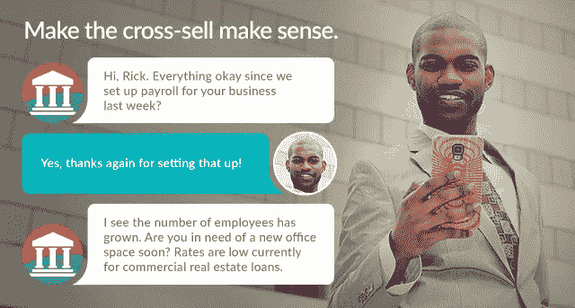
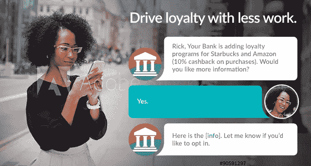
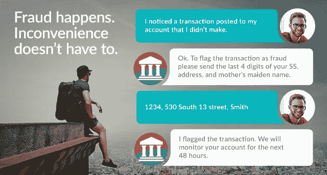

# 银行业的数字化转型——聊天机器人时代

> 原文：<https://medium.datadriveninvestor.com/digital-transformation-in-banking-era-of-chatbots-7fff05932e7a?source=collection_archive---------1----------------------->

数字化转型是每家银行的核心，因为技术已经成为提供卓越客户体验的关键因素。全球银行业巨头在利用技术绘制客户期望、了解他们的需求以及提供高度个性化的产品和服务方面处于领先地位。拥有最佳客户关系模型的银行正在部署人工智能(AI)驱动的聊天机器人和分析，以降低成本、提高效率并增强整体体验。

## 请继续阅读:[未来的聊天机器人](https://medium.com/@phanimarupaka/chatbots-of-the-future-1a94bb51db18)

# **聊天机器人在银行业获得显著地位**

到 2020 年，全球分析公司 Gartner 估计，客户将在不与人互动的情况下管理 85%的企业关系。移动应用程序可能会过时，20%的品牌会完全放弃它们(根据 Gartner 的数据，到 2019 年)，尽管对话式用户界面将取代其位置，成为客户参与的首选模式。

已经有证据表明，越来越多的客户，特别是千禧一代，更喜欢人工智能机器人而不是人类提供金融建议和决策。自动化正在增加，有可能简化流程，而基于人工智能的商业模式正在改变银行产品和服务的访问方式。

银行正在利用 Kore.ai 等人工智能聊天机器人平台提供的对话界面，提高客户体验的门槛。这些平台还配备了最先进的机器学习(ML)和[自然语言处理(NLP)](https://kore.ai/bots-platform/natural-language-processing/) 功能，使银行能够挖掘海量数据，并向客户提供高度有针对性的个性化服务。

# **聊天机器人在银行业的使用案例**

银行领导人可以从聊天机器人中获得巨大的价值，聊天机器人提供超出正常营业时间的服务，推动销售，培养忠诚度。银行业聊天机器人的一些典型用例场景如下:

1.  帐户余额:-用户可以从特定帐户或所有帐户中以多种不同方式用自然语言检查余额
2.  交易历史:-交易类别、时间段和值搜索

*   Bot 可以根据历史模式提供未来支出建议
*   消费历史可视化

3.反馈管理:-机器人可以被训练来摄取产品文献和调查问卷。根据用户的具体反应，机器人可以回答他们需要回答的所有问题

4.机器人代理移交:- Kore.ai 实现了聊天机器人，这些机器人经过训练，可以根据客户的情绪状态做出响应。机器人执行情绪分析和扫描情绪行为，以知道何时移交给活体代理

5.搜索贷款产品:- Bot 帮助用户根据他们的要求申请特定类型的贷款

6.常见问题:-机器人帮助用户回答常见问题，并提供多种输入选项

7.自动柜员机和分行定位器:-机器人帮助用户找到自动柜员机或分行在一个特定的城市或位置。Bot 帮助他们过滤出基于外汇服务、禁用友好分支等设施的结果

8.支付账单:-使客户能够支付账单，添加收款人并设置定期付款。查找即将到来的定期付款

9.转账:-使客户能够在各种账户之间转账——内部或外部，具体取决于银行规则

10.开户:-机器人指导用户开设新的银行或信用卡账户

11.可操作的警报:-用户设置或银行设置-选择加入或自动:

*   余额提醒
*   欺诈警报
*   基于价值或时间的交易警报
*   特定事件—工资、费用等

12.保险:-机器人帮助用户购买保险的需求，它还记得用户拥有的现有政策

13.信用卡搜索:-机器人帮助用户识别基于需求的特定类型的信贷

14.P2P 支付:-机器人帮助用户转移资金到一个现有的接收者，并在转移资金之前添加新的接收者

15.请求或询问:-

*   申请支票
*   更改地址
*   请求保险箱
*   取消支票
*   阻塞卡
*   支票存入或支付的状态

**又往下读:** [**【智能聊天机器人】**](https://medium.com/@phanimarupaka/intelligence-in-chatbots-2be2fad3fc0c) **&** [**【聊天机器人(的)未来**](https://medium.com/@phanimarupaka/chatbots-of-the-future-1a94bb51db18)

谢谢你

法尼·马鲁帕卡

 [## Phani Marupaka -产品营销&开发者福音- Kore.ai | LinkedIn

### 查看世界上最大的职业社区 LinkedIn 上 Phani Marupaka 的个人资料。Phani 有 7 个工作列在他们的…

www.linkedin.com](https://www.linkedin.com/in/phani-marupaka-02646b33/) 

推特:@phani_teja