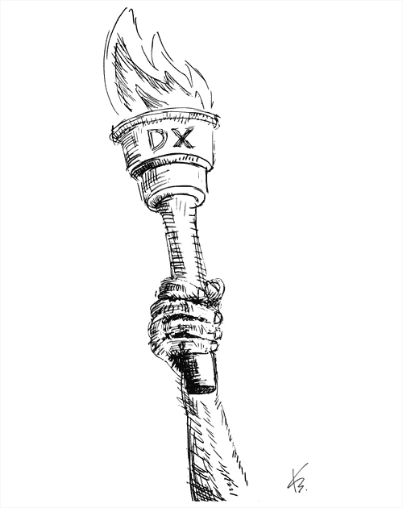
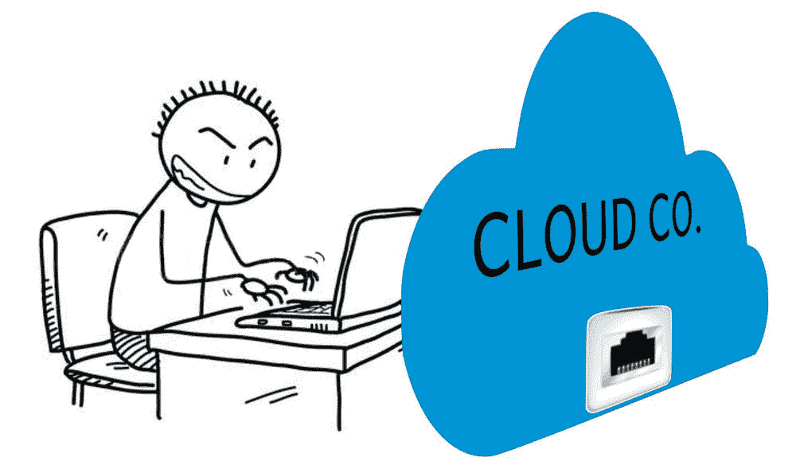

# 数字化转型和其他宗教

> 原文：<https://medium.datadriveninvestor.com/digital-transformation-other-religions-b2030b2e7265?source=collection_archive---------15----------------------->

Digital Transformation

当我的一个朋友要离开他工作的公司时，他的同事给了他一个标有“应用程序总线”的小纸总线模型。那是十五年前的事了，“应用总线”之类的口号非常准时。类似于今天的时代，承认你不知道什么是数字化转型是一种耻辱(必须以应有的尊重在 Hab-acht 注意力中发音)。那个时候，只有真正的新手不知道什么是“应用总线”以及它能把他们带到哪里。应用程序总线应该使所有那些有问题的系统和应用程序相互通信，最终为整个人类(或者至少是那些每天诅咒他们的人)的利益而工作。我的朋友将他年轻的几年奉献给了应用总线项目，在他呆在那里期间，这个项目从未停止过，当他最终放弃换工作时，他的同事们送了他一份小小的礼物来告别他。

可爱的技术商业口号是 IT 市场不可分割的一部分。棘手的首字母缩略词给了更多的粉丝。它们发展得比摩尔定律所能定义的更快、更精确。浏览首字母缩略词丛林的能力，以及在恰当的时间恰当引用它们的能力，将 noob 与真正的专业人士区分开来；要么你知道妈妈是什么，要么不要参与讨论。

安装认知开关的能力不那么重要——更看重的是该主题的理论知识。你还记得千禧年开始时的大数据谈话吗？有人(丹·艾瑞里？)最后用“大型约会就像青少年性行为:每个人都在谈论它，没有人真正知道如何做，每个人都认为其他人都在做，所以每个人都声称自己在做……”这句话摆脱了它

顺便问一下，谁能说他的“大数据”不仅仅是 Excel？

# 合作与交流是关键因素。

一个管理零售 IT 的家伙自豪地在门上钉了一张纸，上面写着一个喧闹的标题:“我们就是生意！“一个会计，他的办公室在对面，从来没有声明过“*我就是它！*”。它是“商业”，就像它是金融、物流或销售一样。不多不少。今天的世界迫使专业化。专业化提高了生产率。没有一个足够聪明的人会雇佣高级数据库管理员或网络安全专家来处理“业务”毫无疑问，网络架构师将能够过帐发票，但反过来，它是否也能同样有效呢？“从筒仓中退出”并不是放弃你的领域并转移到邻近的部门，而是相互影响、交流和激励。

苹果 2 可能是最后一个几乎一个人赚了这么多钱的例子(史蒂夫 Woźniak).)合作、交流和相互启发是一切的关键。孤独的发明家的角色已经被遗忘了。在“数字化转型”中，IT 不仅在技术领域扮演着重要角色，IT 部门也是如此。它不是一个企业；既不是字面上也不是象征性的。业务就是靠它运行的。

# 组织文化。

组织文化就像火车头。如果火车坏了，没有一个乘客或所有人能开动它。如果公司的组织文化不鼓励创新、奖励创意，也不包含变革，那么它就走上了失败和出局的正确道路。如果公司想要跟上不断变化的市场动态，他们必须拥有能够快速采用现代技术并适应变化的人才。这种适应始于领导层拥抱技术，然后是其他人的参与。这是一个明确的信号，表明变革很重要。创新不是来自“创新主管”。创新不会因为公司的公告和规定而产生。没有魔棒或穿越之路——业务或团队的领导把他们的影子投射到员工身上。这些影响可能很弱，也可能很强。并且结果将是适当的。

# 中层管理者的虚假力量。

经理可以给员工翅膀，但也可以有效地看不到改变和适应新的经营条件的需要。经理不可能是半导体——员工能够以最简单的方式表达自己的想法非常重要。扁平化组织支撑创造力；在这样的氛围中交流变得更容易，更多的想法诞生。经理的经理是一个过滤器，经常带来负面后果。即使帕累托原则没有打破 80/20(不均衡往往更大)，很明显，创新者是少数，大多数是追随者。有意识的组织创造条件来支持活跃的员工，并保持他们的结构最大化的扁平化。

# 技术相对便宜——最大的成本是劳动力。

现在技术相对便宜。20 年或 10 年前，我们有一个为最终用户提供可靠的企业系统和技术的部门。这两个世界非常接近。设备和解决方案现在便宜多了。还有一个非常强大的开源软件运动。如果这并不总是意味着软件是免费的，实际上每个公司都有该产品的社区版和企业版。基于社区解决方案，你可以构建真正先进的系统。真正产生成本的是工作。为您的业务成本定制软件。很多。公司决定他们是否有资源来定制广泛可用的标准系统，或者他们是否将为他们的供应商所做的定制付费。下载并使用很少奏效。

# 转型要么一直存在，要么从未存在。

技术的发展推动商业冒险。我们之前没有用智能手机叫出租车，不是因为没人有这个想法，而是因为没有智能手机。因为没有平板电脑，我们没有购买报纸的数字版在平板电脑上阅读。分析销售数据和计算过去五年的平均篮子是不可能的，没有人生产和销售合适的软件，因为没有个人电脑可以处理这些任务。识别机遇和快速采用技术的能力使领导者与众不同。有些人看到了歌声，有些人却没有。

你听过多少次“我们在转型”？有意识的公司每天都在转型。系统和业务流程不应该在特殊的场合创建——这是一个循环。这是一个过程。这个系统和它的实现一样好。如果它的潜力过期了——是时候更换它了。公司需要合适的工具来帮助他们以历史上最快的速度进行变革。

Cloud Computing

# 云是别人的电脑。

有句老话是这么说的，“预测未来很容易…正确预测才是困难的部分。”很久以前就有预言说，许多 IT 职业会消失，取而代之的是云。根据他们的说法，程序员将会是多余的，因为每个人都应该自己构建所需的程序——用鼠标拖动所需的模块。我们仍然有开发人员，他们是 IT 行业薪酬最高的职业之一。此外，数据库管理员和其他与数据库相关的职业也将很快从市场上消失。虽然如果我们生活在数据时代，世界每天产生 2.5 艾字节的数据需要保留(至少一段时间)和处理，但根据预测，这个行业将会消失。即使“数据库”一词的含义稍有不同，它也很可能是 it 行业中最安全的工作之一。

从大型机到移动时代的演变，企业内部 IT 部门从 MIS 到 IS 的发展，以及 IT 人员的工作和用户的工作之间不断变化的界限，经常会导致误导性的结论。用户变得更加独立，但技术变得更加复杂——在平板电脑上偷偷摸摸的能力与首席信息安全官的知识不同。外包不是唯一正确的模式。许多公司有意识地选择内包——不是因为缺乏对市场趋势的定位，而是因为它增加了他们业务的价值。

云仍然是物理处理器、磁盘、服务器、交换机和电缆。有人支持这一切。如果你没有看到他们，并不意味着他们不存在。计算机服务提供商——我们仍然需要你。即使公司 IT 迁移到“云”。