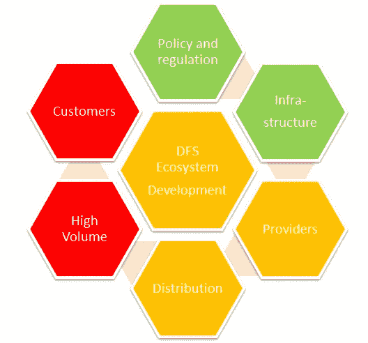

# 数字化转型——第 3 部分——了解国家背景

> 原文：<https://medium.datadriveninvestor.com/digital-transformation-part-3-understanding-the-national-context-f4cfc2610070?source=collection_archive---------2----------------------->

UNCDF HoneyComb DFS readiness model — Jordan (own research)

在第 2 部分中，我们看了数字开发的 9 个原则。

 [## 数字化发展的 9 个原则

### 在第 1 部分中，我们已经讨论了为什么小额信贷行业正在向数字化发展，现在提醒一下…

medium.com](https://medium.com/datadriveninvestor/the-9-principles-of-digital-development-38e05962777c) 

现在我们将调查国家背景。世界各地的中央银行正在推动和支持国家金融普惠战略。在许多情况下，小额金融部门被视为一个主要支柱，特别是在向微型和小型企业提供信贷方面。然而，对于如何最好地提高金融包容性，各国的解释各不相同。在一些国家，监管允许小额金融机构吸收存款，开展代理银行业务，并与纳米贷款的支付服务提供商建立合资企业，而在其他国家，小额金融机构不能提供此类服务。

充分了解所有的市场动态非常重要。这项研究将引导您了解谁是您的客户(后 6)，开发合适的产品(后 7)，制定 IT 路线图(后 8)，设计走向市场战略(后 9)，并为您的业务案例奠定基础(后 10)。

一些要做的活动/要研究的领域包括:

1.分析金融服务和金融机构的监管环境和政府政策；

2.对参与 DFS 和 MFI 的主要政府组织和部委的分析。具体而言，这应包括那些与金融包容性、许可和偏离轨道的中央银行/监管机构有关的机构

3.分析活跃在该部门的私营公司、非政府组织和捐助者——寻找使用案例；

4.分析客户对 DFS 产品和服务的认知和使用情况；

5.大量支付驱动因素的分析；

6.使用金融产品和服务的驱动因素和障碍

7.现有支付系统概述；

8.确定国内和国际汇款服务的提供者；

9.绘制电信网络覆盖图；

10.功能和智能手机市场渗透率分析；

11.市场需求(人口、获得金融服务、小额信贷部门)；

12.DFS 基础架构—支付、电信、银行(POS、ATM、分行)

13.金融服务提供商(银行/小额金融机构、跨国公司、支付服务提供商、非正规金融服务——即乡村储蓄和贷款团体)的分布图；

14.代理网络——银行代理、广播时间分销网络、零售分销渠道；

15.支付——国内和国际汇款量，现金转移的潜力；

16.客户的金融意识和素养

17.全球趋势，如:机器对机器学习、人工智能、区块链、加密货币等。

作为这项研究的成果，你可以完成一个生态系统图形，例如资发基金 MM4P 方案所使用的“蜂巢”。当向董事会或投资者总结营销条件时，这可能是一个有用的工具。

这篇文章着眼于国家背景。第四篇文章将深入探讨什么样的数字模型可能最适合小额信贷机构，因为没有哪两个小额信贷机构是相同的。

# [点击此链接，订阅关于数字化转型的 13 篇系列文章](https://medium.com/series/digital-transformation-99b424533220)

