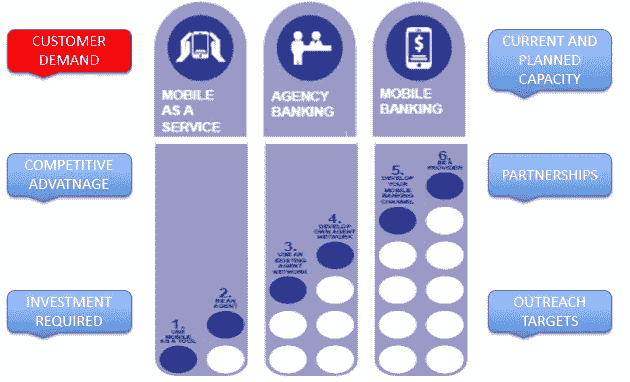

# 数字化转型—第 4 部分—什么样的数字化模式适合您？

> 原文：<https://medium.datadriveninvestor.com/digital-transformation-part-4-what-digital-model-is-for-you-7557dc8ecddd?source=collection_archive---------2----------------------->

UNCDF with own additions

一旦你调查了[宏观层面的机遇和挑战(后 3)，](https://medium.com/datadriveninvestor/digital-transformation-part-3-understanding-the-national-context-f4cfc2610070)这需要在组织层面的背景。为此，MFI 应进行数字化转型准备情况分析。

数字化转型形势分析应包括但不限于:

1.检查当前的业务/战略计划

2.SWOT 分析(特定于数字化转型)

3.创新文化能力和项目/变更管理能力等。

4.内部沟通让整个组织，从首席执行官到现场官员，都有平等的认同和统一的愿景

5.客户细分的当前水平(后 6)

6.产品开发流程和当前产品路线图(后 7)

7.IT 基础架构符合法规要求，同时能够灵活地添加新产品和服务以及内部系统(第 8 篇文章)

8.投资预算(员额 10)

9.社会、运营、财务关键绩效指标(后 11 项)

10.项目管理/变革管理/转型能力和经验(员额 12 和 13)

通过检查内部(后 4)和外部(后 3)环境，MFI 可以开始:

1.利用**的优势**

2.解决**的弱点**

3.将**机会**变成现实

4.针对**威胁制定缓解策略**

通过这样做，最合适的数字模型将变得清晰，数字化转型之旅也将由此开始。

有关各种数字模型的大量工具包和案例研究，请访问:

 [## 外勤部工具包-联合国资本发展基金(资发基金)

### 编辑描述

www.uncdf.org](http://www.uncdf.org/microlead/download-the-dfs-toolkits-from-microlead) 

## 现在，小额金融机构在组织的各个层面都有一个独特的愿景，人们应该认识到，要取得集体成功，就需要跨部门的合作。D **数字化转型不仅仅是一项 IT 活动，更确切地说，技术是支持业务以满足客户需求的推动者。**

 [## 数字化转型的 13 个步骤

### 第 1 部分—如何、为什么、何时。

medium.com](https://medium.com/series/digital-transformation-99b424533220) 