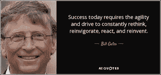
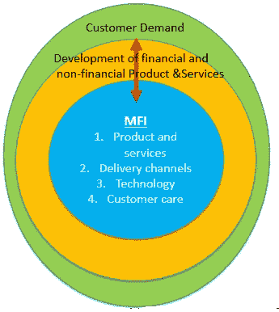
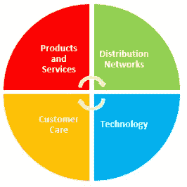

# 数字化转型—第 5 部分—构建敏捷能力

> 原文：<https://medium.datadriveninvestor.com/digital-transformation-part-5-building-agile-capability-2a9274549ef2?source=collection_archive---------7----------------------->

一旦你评估了机会，就该打好基础了，在金融服务的背景下，这意味着:开发**敏捷能力**，这将允许小额金融机构开发金融和非金融产品和服务的组合，以**满足客户需求**建立在能力、能力和**监管合规性**的强大核心之上。

这使得小额金融机构能够:

1)增加客户群

2)改善和深化客户服务

3)降低成本和价格

4)增加每个细分市场的收入

5)完善风险管理。

有些战略喜欢用“支柱”来类比，战略就是建立在这些支柱上的，但我不这么认为，因为即使一个支柱断了，另一个支柱有裂缝，屋顶仍然被支撑着，这会导致一种错误的安全感。

在考虑数字化转型的时候，你不能让任何一个支柱不强大。因此，我更喜欢使用四个象限，它们一起构成一个整体。

了解市场需求并预测需求的产品服务。这是可扩展的、有利可图的，并且考虑了市场知识，例如客户的金融教育需求和监管环境。

**交付渠道和工具—** 能够向市场分销产品和服务，无论它们是 1) MFI 所有—分行、ATM、2)第三方，即移动货币代理、POS 3)客户所有，即移动电话和平板电脑。

**技术平台和系统—**是开发产品和服务、管理渠道、员工充分参与和提供优质客户服务的基础。

**客户关怀系统**是建立信任和品牌认知度的关键资产。工具包括:CRM 和查询解决方案，以有效地响应最终用户的查询、投诉和请求。

**现在，一个强大而敏捷的组织的基础已经到位，我们可以**更深入地研究细节，这必须从了解谁是你的客户开始——第 6 篇

 [## 数字化转型的 13 个步骤

### 第 1 部分—如何、为什么、何时。

medium.com](https://medium.com/series/digital-transformation-99b424533220)