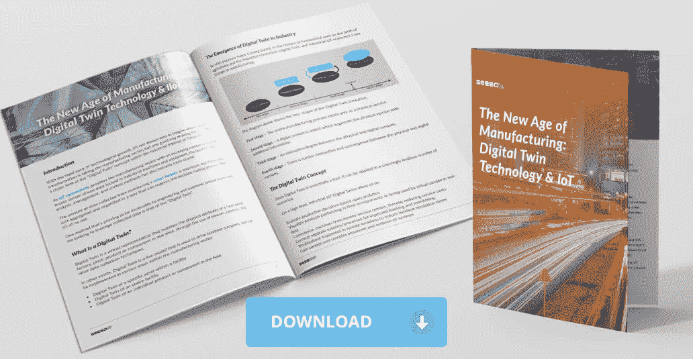
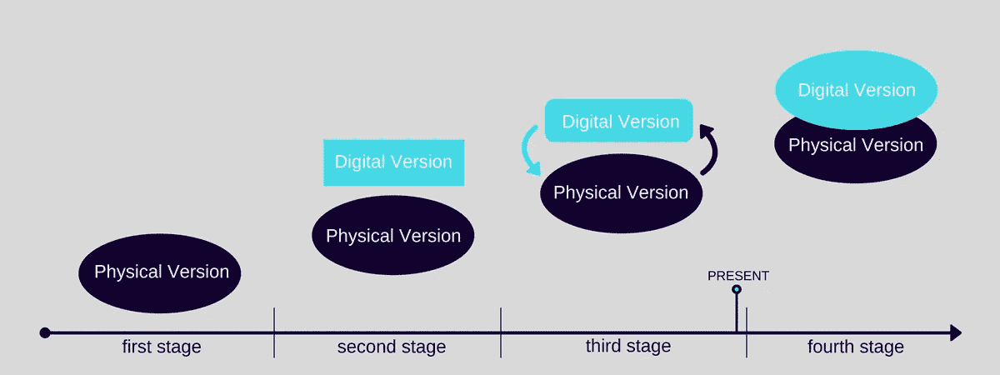
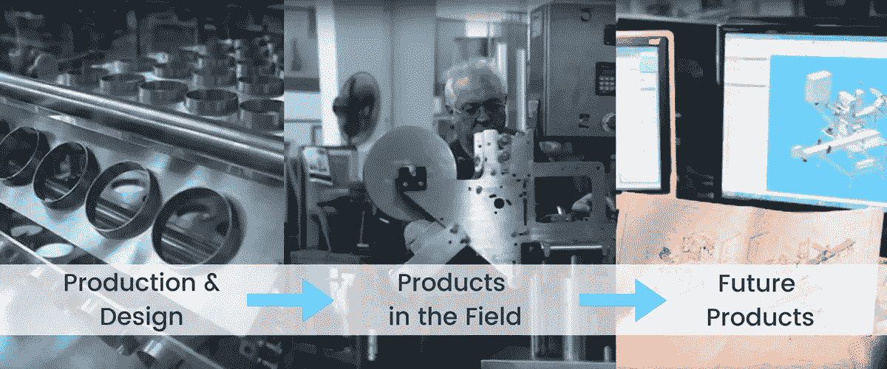
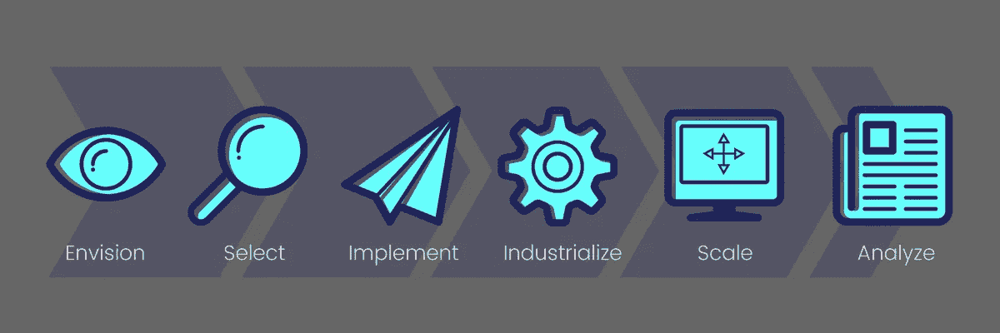
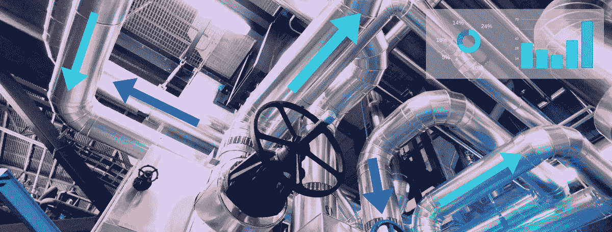

# 数字孪生——制造业的新时代

> 原文：<https://medium.datadriveninvestor.com/digital-twin-the-new-age-of-manufacturing-d964eeba3313?source=collection_archive---------0----------------------->

*** [*原贴于 Seebo*](https://www.seebo.com/digital-twin-technology/)

# 介绍

随着技术的快速发展，想象数字化转型将制造业带向何方并不容易，但一个很好的方法是仔细看看工业物联网(IoT)中的“数字化双胞胎”概念。

随着[物联网连接](https://www.seebo.com/iot-connectivity/)为制造业提供越来越多的方式来访问锁定在工业机器和设备中的传感器驱动的数据，对数据分析、管理和控制方法的需求也变得更加重要。

通过监控一个[智能工厂](https://blog.seebo.com/guide-to-factory-4-0/)收集的数据量是巨大的，但是如果这些数据没有以一种可以支持决策过程的方式进行汇总和组织，那么这些数据就没有任何用处。

对于希望利用收集到的数据的工程和客户服务团队来说，有一种方法被证明是非常宝贵的，那就是“数字双胞胎”方法。

## [随身携带免费白皮书](https://iot.seebo.com/digital-twin-wp?utm_campaign=Cornerstone%20-%20PDF&utm_source=Digital-Twin-Cornerstone&utm_medium=PDF%20CTA)

# 什么是数字孪生？

Digital Twin 是一种虚拟表示，通过使用传感器、摄像机和其他数据收集技术，实时匹配“真实世界”工厂、车间、产品或组件的物理属性。

换句话说，Digital Twin 是一种用于推动业务成果的实时模型，可以在制造业中以多种方式实施:

*   设施内特定资产的数字副本
*   整个设施的数字双胞胎
*   现场单个产品或组件的数字复制品

# 数字孪生在工业中出现

正如人类历史上以前的重大转折点，如农业和工业革命的诞生一样，[数字双胞胎和工业物联网代表了制造业的巨大变革](https://www.seebo.com/digital-twin-software/)。

上图显示了数字孪生进化的四个阶段:

第一阶段—整个制造过程仅以物理形式存在。

第二阶段—添加数字版本，用附加信息扩充物理版本。

第三阶段——实体版本和数字版本之间开始互动。

第四阶段——实体版本和数字版本之间进一步互动和融合。

# 数字孪生概念

由于 Digital Twin 本质上是一种工具，它可以应用于无数的场景中。

从高层次来看，工业物联网数字双胞胎让我们能够:

*   基于分析评估生产决策
*   实时可视化产品在其环境中的表现或实际使用情况
*   从远程服务中心调试机器，从而降低服务成本
*   连接独立的系统/流程，以改进跟踪和监控
*   对远程位置的设备进行故障排除，以缩短事件解决时间
*   获得对复杂流程和系统的控制

# 数字孪生对制造业的影响区域

Digital Twin(以及一般的工业物联网)之所以如此有价值，是因为它可以在整个产品制造生命周期中为企业提供价值。

数字孪生技术的影响可分为三个主要“区域”:

# 影响区 1 —生产和设计

工业物联网数字双胞胎通过预测生产中的故障来优化效率，以便在故障影响制造目标之前将其修复。可以通过调整 twin 生产线上的参数来模拟改进，而不会对生产造成损害。成功的模拟可以应用于现实生活中的系统。

此外，工程团队可以分析产品的数字双胞胎，将实际产品行为与其设计进行比较。行为偏差可以被评估以影响产品未来的开发迭代。

# 影响区 2 —现场产品

工业物联网数字双胞胎支持对已经投入使用的产品进行远程调试和诊断，从而降低服务成本，提高客户满意度。

在需要技术人员亲自接触产品以排除故障的情况下，可以首先通过 twin 远程诊断问题，以便订购必要的设备和部件。

类似地，当新产品被委托给客户时，配置可以由服务人员远程执行。

# 影响区 3 —未来产品

新产品可以根据现实世界中现有产品的行为来开发。性能和客户使用情况反映在 twin 中，然后反馈到产品开发和制造流程中，以帮助提高产品利润，增加客户满意度和市场份额。

# 数字孪生制造的两大优势

## 形象化

人类的学习和决策通过可视化得到增强，但随着当今制造业中许多先进流程的出现，准确掌握工厂车间和单个机器的状态并不总是容易的。当实时数据以图表或基本图表的形式呈现给管理者时，有时会显得过于抽象，无法形成行动的基础。

工业物联网 Digital Twin 提供混合可视化，将视觉信息与实时和历史数据相结合。管理人员可以走到每台机器的引擎盖下，查看磨损和温度异常等物理参数。不重要的信息可以隐藏起来，以防止视觉混乱，但可以随时回忆起来。

这种程度的可视化是前所未有的，大大提高了做出明智决策和确定需要立即关注的关键领域的能力。

## 合作

工业物联网数字双胞胎的视觉方面也有助于提高协作水平。与现实世界产品/系统的物理距离不再妨碍利益相关者监控活动和发表意见。这种连接性意味着警报会立即到达管理层，同时通过消除单点故障来减少人为错误。

Digital Twin 提供了比商店更广泛的专业服务。数据科学家、产品经理和设计师对工作中的机器和整个过程有了更好的理解。这导致更好的设计和更有效的过程，节省时间和资源，特别是那些涉及创建原型和测试它们的过程。

# 产品线工程

当上述两种优势融合时，我们就获得了一个非常强大的工程工具。具体来说，数字孪生方法非常自然地适用于[产品线工程](http://www.aerospacemanufacturinganddesign.com/article/what-is-product-line-engineering-ple/) (PLE)。在复杂的制造操作中，一个产品的多次迭代由多个团队完成。这可能导致混乱和人为错误。材料经常被浪费，工作时间也是如此。

有了工业物联网数字双胞胎，产品或流程的版本可以并存。这些版本也可以被划分为每个部门的迭代，这样就可以根据特定的需求来测试想法。

PLE 在工业 4.0 领域发挥作用，因为它允许采用一种集成的方法来利用 Digital Twin，并确保制造的各个阶段之间有一个强大而流畅的连接。

# 开始使用 Digital Twin 技术

数字孪生帮助制造商制造更好的产品，防止故障和错误，并预测影响业务的结果，但实际制造过程是什么？

让我们从一个有用的提示开始:*任何数字双胞胎的第一个版本都应该在复杂性上适中*。

太多的传感器和大量的数据将难以整合，只会增加决策过程的混乱。另一方面，遗漏关键警报和没有足够的数据来产生有用的分析将阻止 twin 发挥其作为工程师和经理的强大工具的潜力。

当采用新技术时，重要的是遵循一条具有挑战性但不专横的道路。投资回报需要是短期的，以便为项目提供动力，并[确保利益相关者保持参与和积极性](https://www.clarizen.com/best-practices-for-stakeholder-engagement-on-an-enterprise-level/#)。

下面是构建数字孪生的一般攻击计划:

## 第一步——想象

你将获得的最重要的洞察力是什么？在第一步中，想象数字孪生兄弟通过提高效率或改善客户满意度来释放价值的情形。关注已经为公司提供价值的过程，并与代表各种技能的团队一起验证概念。

## 第 2 步—选择

挑选你的飞行员。你的第一个项目应该最有可能获得回报，同时也有很大的成功机会。一个非常特殊的机器的复杂双胞胎，将允许深入的分析和监控，可能是一个具有高 ROI 的有价值的工具，但是作为一个试点，它可能太复杂了。更广泛的项目有可能扩展到整个组织，适用于不同的设备和流程。

## 步骤 3 —实施

让试点成为现实，并专注于您的初始投资回报目标。应该采用敏捷和迭代的开发策略。使用具有模拟能力的[可视化物联网建模工具](https://www.seebo.com/iot-modeling/)来设计数字双胞胎，以便它复制工厂/资产/流程的行为。

您选择的试点应该有一个有限的范围，专注于业务的特定部分，并且必须能够证明它对企业的价值。对于管理层和团队成员来说，保持专注是很重要的，但也要足够开放，以利用过程中收集的新数据。在衡量成功的初步迹象时，应该设定更有意义的结果的目标。

## 第四步——工业化

项目的身份应该从试点项目转变为成熟的工具。这应该通过提高性能和利用新的孪生派生资源(如数据湖)来实现。来自开发和部署过程的见解应该与其他部门共享。

## 第 5 步—规模

您能否找到机会来扩展数字双胞胎，以实现更完整的工业物联网平台？最初为控制 twin 的范围而设置的限制现在应该被取消，以便它可以在整个企业中增加价值。应利用试点过程中获得的经验教训和形成的方法来改进流程。

## 第 6 步—分析

应该根据有形的[物联网优势](https://blog.seebo.com/business-benefits-iiot/)来评估数字孪生，例如产量、质量和效率的提高，以及成本降低和问题预防。这种分析应该为进一步调整 twin 及其与企业的关系提供一个跳板。

换句话说，Digital Twin 是一个动态工具，而不是一个一劳永逸的项目。

# 为更好的数字孪生进行基于模型的系统工程

对于初始开发阶段和持续维护，[基于模型的系统工程](https://blog.seebo.com/mbse-guiding-iot/) (MBSE)是一种越来越受欢迎的方法，作为一种成功交付和管理数字孪生和物联网项目的方法。

基于模型的系统工程是一门成熟的工程学科，这意味着它提供了一批具有特定技能的专业人员。

作为一个有其自身原则和解决方案的框架，并且由于其数据驱动的方法，基于模型的系统工程在成功交付数字孪生项目中非常有用。

# 数字孪生概念的未来

工业物联网数字双胞胎的未来在于它将如何与其他新兴技术一起使用，如机器学习、对象识别、声学分析、高级信号处理和自然语言处理(NLP)。

Digital Twin 已经在帮助公司更好地满足客户的需求，并快速适应市场的新需求，还有很多有待发现。

探索同类最佳工具如何帮助您快速为企业或资产生成数字化双胞胎，迈出数字化转型的第一步。