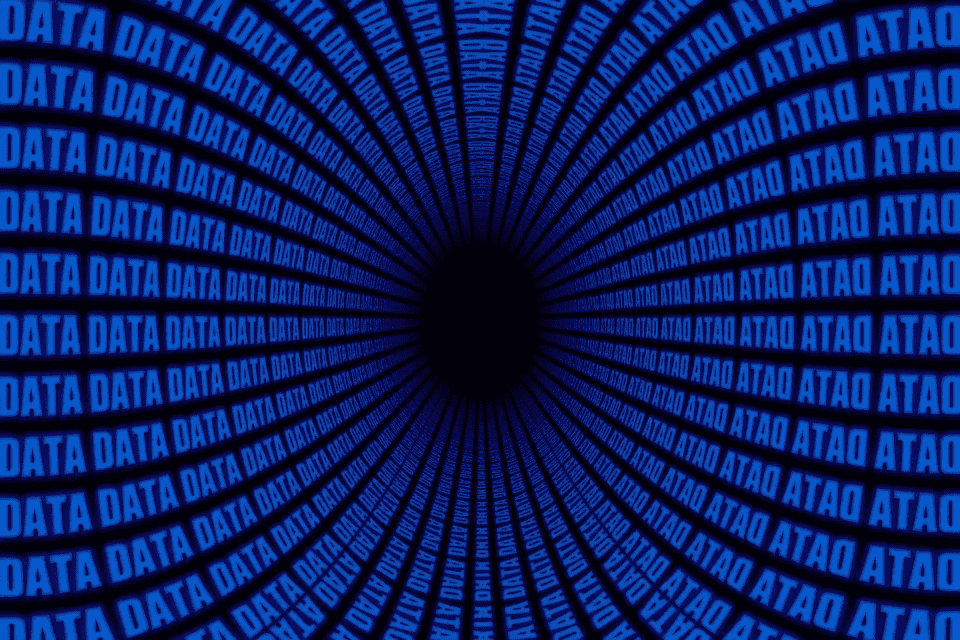
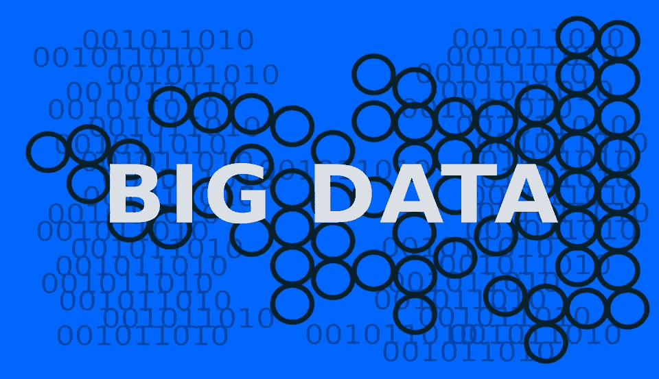

# 数字双胞胎和新的零工经济

> 原文：<https://medium.datadriveninvestor.com/digital-twins-and-the-new-gig-economy-cecd3c1333a7?source=collection_archive---------8----------------------->

> "银行记录的关于我们每个人的数据越多，我们的存在就越少." *—马歇尔·麦克卢汉*

**你拥有你的数据**，对吗？嗯，也许…

事实证明没那么简单。毕竟，我们都曾因没有阅读条款和条件就接受了它们而感到内疚，而且我们并不总是意识到我们实际上放弃了什么。最重要的是，我们生活在一个数据经济中，在这个经济中，我们使用的网站和服务很大程度上是“免费”提供服务的——好吧，交换条件是访问你的数据。

 [## DDI 编辑推荐:5 本机器学习书籍，让你从新手变成数据驱动专家…

### 机器学习行业的蓬勃发展重新引起了人们对人工智能的兴趣

go.datadriveninvestor.com](http://go.datadriveninvestor.com/5ML1) 

这些网站通过允许广告商根据用户的浏览历史和其他数据向他们投放相关广告来赚钱。这与医疗保健行业的工作方式没有太大的不同。尽管我们的医疗保健数据可能是我们拥有的最私人的数据——毕竟，它是基于我们的身体——但它并不真正属于我们。

相反，它属于电子健康记录(EHR)提供商。现在，医生花在更新这些记录上的时间比他们与病人面对面咨询的时间还要多。如果这些数据被用于开发新的治疗方法和新的行医方式，这可能没什么大不了的，但事实并非如此。事实上，这些 EHR 系统没有一个是真正可互操作的，这导致数据被存储在孤岛中，这取决于任何给定的医生使用的特定 EHR 系统。如果你去三家不同的医院，你可能会得到三份不同的病历。

更糟糕的是，EHR 公司经常通过将这些数据出售给其他方而从中获利。这些本应属于病人的数据，却被那些根本不关心病人健康的营利性公司夺走了。他们只关心提高他们的底线。

是我们收回数据的时候了。

# 新的零工经济

到目前为止，我们大多数人都听说过“零工经济”这个术语。这个想法是，互联网创造了新的工作方式，让创纪录数量的人成为个体经营者和在家工作的自由职业者。“演出”通常是短期或一次性的项目，而不是长期的雇佣关系，人们很容易通过 Upwork、PeoplePerHour 和 Fiverr 等网站过上好日子，这些网站充当买家和卖家的中间人。

在为 PulsePoint 撰写的一篇文章中，安吉拉·拉德克利夫(Angela Radcliffe)认为我们的个人数据是新的零工经济，她解释道:“当我们在谷歌的朋友们正悄悄从 GDPR 和剑桥分析的影响中走出来，并在整个硅谷回荡，作为对我们在脸书的朋友的警示，还有其他人认为这是一个机会，最终将权力还给消费者，并站在数据历史的正确一边。这种新的零工经济的未来将属于那些也追随这一方的公司。”

雷德克里夫本人是医疗保健研究和开发领域的创新者，在她因未确诊的健康状况意外失去一个兄弟后，她对临床试验产生了兴趣。作为 PulsePoint 位于曼哈顿的临床试验解决方案业务的负责人，她清楚地知道自己在说什么。

她解释说:“程序化交易可以为那些愿意为其数据用户提供默许的用户提供第二收入来源。”“这显然是一个互惠互利的局面:公司可以投资广告，并确信它们将触及相关受众，而用户可以因提供这一有价值的信息而获得报酬。用户将不再需要忍受烦人和不相关的广告。一个负债累累的学生不需要被一个令人作呕的奢侈手表的广告所嘲弄。正在康复的酗酒者可以避免啤酒和烈酒的广告。他们不仅可以升级用户体验，还可以获得报酬。”

拉德克利夫说，最有趣的好处将在医疗保健领域发挥作用。例如，这些数据可以用来“为治疗疾病的新药候选物的开发提供信息”，同时“[民主化]和[分散化]以前只由掌握权力地位的一小撮人控制的事情。”

然后，这种新型的零工经济有助于消除贫困。“如果消费者能够以每月 200 美元的价格将使用他们数据的许可货币化，”拉德克利夫说，“发展中国家的人会用这些新发现的资产做什么呢？尤其是在健康数据价值如此之高的情况下。”

拉德克利夫认为，我们看待数据的方式的这种变化并不容易，但如果我们要站在历史的正确一边，这是不可避免的。“为了更大的利益，我们需要勇往直前，赋予新的、去中心化和民主化的零工经济权力，”她说。

# 你的数字孪生兄弟

不久前，我看到了西门子医疗保健公司首席执行官 Bernd Montag 的一篇颇有见地的文章，他在文章中谈到了数字双胞胎的概念。“在医疗保健领域，”他解释说，“数字双胞胎就是要尽可能多地收集数据，模拟任何需要模拟的东西——器官、病人、手术结果。”

为了进一步说明这一概念，Montag 提到了罗切斯特市梅奥诊所(Mayo Clinic)的最新研究，心脏病学家训练了一种深度学习算法，以识别有严重心力衰竭风险的患者。“预测相当不错，”蒙塔格说，“如果没有算法的帮助，这些预测是不可能实现的。这项研究只涉及一个心脏数据来源，即心电图。想象一下:如果我们使用许多数据源——成像、基因组学、电生理学、临床记录——来创建一个通用的心脏数字双胞胎，一个不仅可以预测风险，还可以模拟结果的数据集，会有什么可能？”

真正的数字孪生包括来自各种来源的数据，从可穿戴设备和医疗记录到智能手机和数字助理。蒙塔格说:“医疗保健中数字双胞胎概念的美妙之处在于，它本质上是来自不同来源的大量数据的集合——如果你愿意，可以说是终身多维个人健康记录。这样的数据集合不能归医疗机构所有。让这种事情成为可能的唯一方法是，如果我们，作为公民或患者，拥有这些数据集，并可以选择我们想让谁访问它们。”

这本质上又回到了分权的概念。目前，许多患者将他们的医疗记录存储在孤岛中，不同的提供者可以访问不同的数据，这些数据没有联系起来，无法提供患者整体健康的真实情况。好消息是我们已经知道解决方案可能是什么:区块链。该技术被完美地设计为提供一个分散的医疗保健信息数据库，可以从不同的来源提取信息，并将所有权转移回患者手中。

蒙塔格还建议，数字双胞胎可以用来帮助治疗损伤，他解释说:“每一种损伤都是不同的。外科医生都知道。在这样一个世界里，病人可以很容易地接触到他或她的数字双胞胎，外科医生可以对这个数据集进行模拟，以预测不同类型的外科手术的结果。在大数据时代，外科医生甚至可以根据化名医学数据库中成百上千的其他患者数据集来检查单个患者的疾病模式，以了解在特定情况下什么是最好的，什么是不可取的。”

至于我，我喜欢蒙塔格的思考方式，但我的视野更进一步。我认为有一天我们都会有数字化身，我们会用它在网上代表我们自己。我还认为，它们会根据可穿戴设备、社交网络档案和其他数据源以及我们的医疗记录提供的实时数据而发生变化。假设你在现实生活中不够积极。你的头像可能会通过增加体重来反映这一点。如果你睡眠不足，它可能会有眼袋。

这样的系统将有助于进一步让人们参与到他们自己的医疗保健中，并向他们展示他们的决定的切实后果。同样，人们试图理所当然地使用滤镜来让自己的自拍看起来最好，这可能有助于创造一种文化，让人们在现实中照顾自己的身体，以确保他们的虚拟化身处于最佳状态。

# 想了解更多？

我在我的书《医疗保健的未来:人类和机器合作获得更好的结果》中更多地谈到了新技术及其对医疗保健行业的影响。点击此处为自己购买一份。