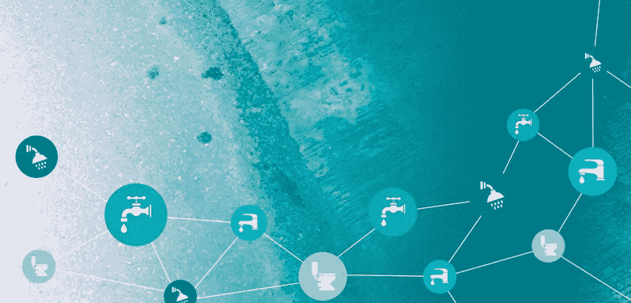
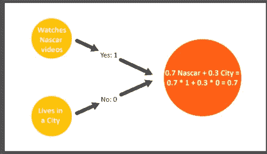
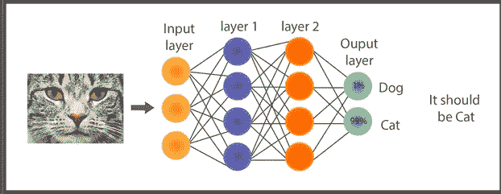

# 数字水务转型:人工智能的承诺

> 原文：<https://medium.datadriveninvestor.com/digital-water-transformation-the-promise-of-artificial-intelligence-7d88fb07e79b?source=collection_archive---------1----------------------->

**沃特铸造公司创始人兼首席执行官威尔·萨尔尼**

**Camilo Huneeus Guzman，开发署秘鲁办事处，Gruber 研究员**

本文回顾了人工智能在水工业领域的现状，为*数字水务*提出了新的人工智能应用，并展望了人工智能在该领域的未来路线图。

**1.0 什么是人工智能？**

人工智能(AI)和机器学习(ML)正在成为我们日常生活的一部分，但我们没有花一分钟来研究和理解它，让杞人忧天的媒体传播恐惧和错过信息。在本文中，我们将通过用简单的英语解释人工智能来揭开它的神秘面纱，稍后我们将分享我们认为它为水务部门和在其供应链中使用水的公司提供的机会和好处。

> [DDI 编辑推荐——商业人工智能和机器学习:数据驱动技术实用指南第三版，作者 Steven Finlay](http://go.datadriveninvestor.com/daib05/matf)

人工智能是一个广泛的概念，包括任何由计算机执行的人类认为是“智能”的活动。机器学习是数据科学家用来“训练”和“学习”的统计方法的集合，而无需通过编程来执行特定任务。*训练和学习*，在这种情况下，基本上是指调整数据并使其符合统计模型。

AI 本质上是模式识别和分类。人工智能最简单的形式是众所周知的线性回归，在这种情况下，会生成一条趋势线，人们可以在一定程度上确定某样东西是否属于某种模式或趋势。

例如，最常见的 AI 应用是定向广告。当亚马逊、谷歌或脸书向我们提供附加服务时，它们所做的是检测我们的行为模式，跟踪我们的点击，并“理解”我们喜欢或不喜欢的东西，利用这些数据，人工智能可以预测，以一定程度的不确定性预测我们会购买什么产品。我们会购买该产品。

更复杂的人工智能工具是人工神经网络。它们受到大脑工作方式的启发，因为数百万个“节点”是相互联系的。节点是网络中处理数据的单元或“点”。最简单的版本是 20 世纪 50 年代末发明的[感知器](https://blogs.umass.edu/brain-wars/files/2016/03/rosenblatt-1957.pdf)。感知器接受简单的 0(否)或 1(是)输入，将它们相加，并评估它是高于还是低于阈值(偏差)。如果高一点，它会吐出一个 1(是)，如果低一点，吐出一个 0(否)

例如，脸书可以使用一个感知器来决定它是否应该向您显示一个关于汽车的附加信息，基于评估 if:

1.  你是纳斯卡迷。
2.  你住在城市里。

因为脸书知道，如果你是一个狂热的纳斯卡迷，你更有可能买一辆车，这个参数将比住在城市里更重要。假设它对概率的权重是 70%。所以，如果你是一个纳斯卡迷，你住在乡下，感知器会做如下操作:

图 1:感知器的基本操作，神经网络的核心(由作者准备)

只有当这个简单操作的结果——阈值——高于 0.5 时，脸书才会显示汽车添加，就像上面的例子一样。随着时间的推移，脸书可能会*认识到*作为一个纳斯卡爱好者的体重应该更低或更高。这叫做“调整权重”。

这显然是一个简单的操作，不需要人工智能。但是，如果我们在决策中加入更多的参数，会使决策变得更加复杂吗？举个例子，如果脸书知道我们可能会买车，可能会坐飞机旅行，它才会向我们提供商务舱附加费。为此，它首先必须决定我是否会购买一辆汽车和乘飞机旅行。然后，脸书会使用一个神经网络，它只不过是一系列决策节点，如图 2 所示。

这和模式识别有什么关系？假设我们想让计算机识别一幅图像(0 和 1 的排列)是不是一只猫。我们将这种排列输入网络，然后节点网络根据每个节点的权重和偏差(阈值)处理图像。每个节点(或层或节点组)可能识别猫的一部分，然后，通过许多层，整个网络将输出 1 或 0，以一定程度的确定性说，是或不是猫。

图 2:神经网络的表示

网络能够识别这只猫是因为它已经被*训练*这么做，它已经*学会了*什么是猫。为了做出这个决定，必须调整网络的权重和偏差，换句话说就是训练**。因此，首先输入标记数据(带有猫标签的图片),如果网络说它不是猫，当它是猫时，权重和偏差会自动调整。现在网络可以可靠地识别一只猫。它已经学会了什么是猫。**

****2.0 AI 在其他行业领域的应用****

**人工智能目前正在其他领域使用，以下示例为数字水务转型中的潜在应用提供了有用的指导。**

**制造业:人们可能会期待人工智能在工业中的惊人应用，比如像波士顿动力公司 [Atlas 机器人这样的人形机器人。毫无疑问，制造业中类人机器人的崛起将是一个臭名昭著的突破，然而今天人工智能正在以一种更安静的方式在制造业中找到自己的道路:异常检测。人工智能是关于模式识别的，而异常是模式的中断。其应用范围从分析飞机涡轮的声音到将传感器整合到旧的发动机上，以分析它们的运行和预测维护。这就是部署传感器网络来监控飞机引擎的](https://www.bostondynamics.com/atlas)[吸收](https://www.uptake.com/industry-solutions/aviation)的情况。**

**o **外科手术**:在医疗领域，人工智能不仅帮助医生理解医学图像，更准确地进行诊断，还帮助外科医生进行手术。这就是 Microsure 的案例，一个帮助医生进行显微外科手术并稳定他们手部颤抖的机器人。减少手抖是异常检测的另一个应用。**

**o **汽车**:人工智能最知名、最被广泛期待的应用之一就是自动驾驶汽车。通过使用先进的模式识别系统，汽车可以识别周围的情况，并在任何给定的情况下做什么。 [Waymo](https://waymo.com/) (谷歌)[宝马](https://www.bmw.com/en/automotive-life/autonomous-driving.html)[日产](https://www.nissanusa.com/experience-nissan/news-and-events/self-driving-autonomous-car.html)领先。**

**o **能源:**其应用不仅仅是所谓的智能电网，还包括预测未来电网中断以及太阳能和风能预测。随着绿色能源在应对气候变化方面的扩张，能够预测发电量是减少碳电厂备用需求的关键。像地球网络这样的公司正走在前列。**

**o **消费类产品:**有了像 [Google Now](https://www.google.com/intl/es-419/landing/now/) 、 [Cortana](https://www.microsoft.com/en-us/cortana) 、 [Siri](https://www.apple.com/siri/) 或 [Alexa](https://developer.amazon.com/alexa) 这样的助手，我们就看到了日常生活中的应用。但是随着物联网的发展，我们将会看到消费品的重大变化，从有冰箱的智能房屋到监测个人健康的可穿戴设备。不用说，随着新助手[的发布，谷歌拓展了各种可能性。很快我们将会生活在一个我们不知道是在和机器还是人类对话的世界里。可能不会，但是这种工具让日常工作变得简单多了。](https://www.google.com/url?sa=t&rct=j&q=&esrc=s&source=web&cd=2&cad=rja&uact=8&ved=2ahUKEwip_773o5beAhWRzIUKHRnhDFwQwqsBMAF6BAgBEAc&url=https%3A%2F%2Fwww.youtube.com%2Fwatch%3Fv%3DpKVppdt_-B4&usg=AOvVaw1NJsIGvxJTSbjDvK9dOGqU)**

****3.0 水务领域有哪些机会？****

**人工智能工具可以让——也正在让——供水和卫生系统变得更加便宜，并有助于确保饮用水和废水处理质量达标。人工智能系统可以为任何应用创建强大的供水系统。面对气候变化，这尤其有帮助。这可能是一个关键的工具，用于创造有弹性的水系统，能够抵御极端天气事件的影响，并帮助我们在灾难发生后快速重组和恢复。**

**水部门的机会很多，应用范围从紧急情况下的水和卫生到优化海水淡化厂，包括饮料、灌溉、公用事业、运河和许多其他领域。想象力是极限。但是需要数据。而且有数据。很多。我们只需要找到、处理和应用它。历史上，农民、供水公司和行业一直在收集数据，用于向政府报告合规情况、向投资者报告运营结果以及进行质量控制。但是有没有大数据[【1】](#_ftn1)？是的，每个拥有 SCADA 系统[【2】](#_ftn2)的人都将拥有大数据来应用人工智能方法！**

**利用这些可用的数据，一些初创企业和大公司，如 IBM 已经开始着手将先进的数据分析技术引入水务公司。这些举措为管理者提供了洞察力，帮助他们做出战略决策。然而，经理们通常不做实时自动决策。换句话说，他们使用现有数据来发现趋势，然后向经理报告，而不是实时调整。**

**这是 AI 可以帮助弥补的差距。我们举了一些例子来说明不同的水行业会有什么样的结果:**

****3.1 公用事业****

**使用上述人工智能方法，如神经网络，来优化废水处理:研究表明，使用神经网络来优化传统的 *PID* 控制器，在废水实时处理中可以减少高达 40%的能源成本。这是因为 WWTP 是使用“书本”参数设计的，不一定适合当地条件。同样，核电站的设计是为了应对很少发生的极端情况。因此，它们通常体积过大，消耗了过多的能量。此外，许多中小型设施甚至没有适当的实时控制器，仅依赖低效的开/关系统。**

**部署传感器网络和远程执行器，以优化泄漏检测和饮用水压力，尤其是在缺水的城市。根据麦肯锡的调查，仅泄漏检测一项每年就可以为世界公共事业节省高达 690 亿美元。传感器网络和人工智能的结合也可以帮助管理城市的水资源，因为没有足够的水来维持整个系统的必要压力。这可以通过预测水的需求和供应来实现。简而言之，城市可以在需要的地方和时间直接供水，而不是努力在整个网络中保持 40 PSI 的压力。**

**在公用事业公司和工厂的 WWTPs 之间共享数据，这样“学习”效果会更好，决策也会得到优化。通过在几个用水者之间共享数据，可以更容易地改进和优化每个系统。**

**部署传感器网络，更好地实时了解饮用水和污水系统。拥有一个扩展和全面的传感器网络可以帮助识别和控制非收益水，并在水资源有限的城市中根据需求管理压力和流量(例如， [EMAGIN](https://emagin.ca/) )。**

**同样，传感器网络可以帮助早期识别供水或水处理中的任何水质问题(例如，[液体人工智能](https://realtechwater.com/products/liquid-ai/))。这也适用于饮料公司的生产过程或分水岭。**

****3.2 水和工业应用****

**人工智能工具[已经到位](https://www.pumpsandsystems.com/instrumentationcontrols/february-2017-artificial-intelligence-redefining-desal-industry)用于优化智利和以色列的人工智能海水淡化厂，例如用于饮用水和工业用途。各行业通常都有良好的水流注册，这意味着使用人工智能获得洞察力很容易获得数据。这创造了机会，例如:**

**协调合流制排水系统，避免雨季合流制排水系统溢流。通过在流域或城市的工业之间共享某些非敏感信息，有可能协调排放，避免溢流并降低抽水成本。甚至有可能协调取水。**

**与水务设施一样，人工智能可以帮助确保遵守当地法规，优化能源使用，降低污水排放价格。如果数据在不同用户之间共享，这些应用将受益最大，因此工厂可以充分利用内部 WWTP。**

**优化内部流量、泵送速度和内部泄漏。人工智能可以洞察复杂设施中正在发生的事情，但它也可以帮助优化和控制系统，特别是泵送率，这些泵送率通常没有得到很好的调整，从而导致高能源账单。(例如 [IntelliFlux](https://ifctrl.com/) 和[冥王星 AI](https://www.plutoshift.com/) )。**

****3.3 水和农业:****

**由于回报和竞争的不断减少，像在水利设施中一样，农民，尤其是中小规模的农民需要快速采用新技术才能生存。人工智能不仅通过改进自动拖拉机、发现作物疾病或监测动物健康为农民提供了大量机会。它为水管理和节水带来了机遇:**

**使用卫星和航空图像的智能工具有助于比肉眼更早、更快地发现用水问题。(例如[天鼠](https://skysquirrel.ca/)**

**AI 可以管理灌溉系统(特别是滴灌)，并帮助它们适应特定的当地气候和植物条件。更重要的是，在提高产量的同时减少灌溉费用。(例如[顾问](https://conserwater.com/))**

****3.4 餐饮价值链****

**食品和饮料行业面临着来自公用事业公司、农场和行业的复杂挑战。对于既要处理水资源又要处理废水的饮料公司来说尤其如此。此外，他们作为所在流域的管理者，负有重要的社会责任。他们可以在几个方面受益于人工智能:**

**与公用事业一样，食品和饮料工厂可以从优化其污水处理厂中受益匪浅。人工智能方法可以优化 PID 参数，甚至取代传统的控制理论，以更低的成本运行工厂。**

**食品加工厂可以从供应链的高级分析中受益。通过与供应商合作，向他们提供基于人工智能的技术来提高产量和应对气候变化，他们可以有更好的产量预测。(例如[血统](https://lineagelogistics.com/))**

**通过在电厂所在流域的其他利益相关者和用户之间共享数据，他们可以协调排放和提取行动。这可以支持他们在水资源管理方面的工作。**

**通过适当的仪器和监控，人工智能可以帮助实施*早期预警系统*，以应对过程、产品或水源甚至下游水质的任何令人担忧的变化。(例如[液态人工智能](https://realtechwater.com/products/liquid-ai/))人工智能可能是成为水管家的关键因素。**

****3.5 消费者/客户参与度****

**关于客户参与和人工智能，令人讨厌的聊天机器人浮现在脑海中。然而，在水务领域，人工智能可以像帮助水务经理一样帮助客户。使用人工智能系统，公用事业公司可以为客户提供使用模式，提醒客户使用高峰，甚至帮助他们检测泄漏。已经有几家公司提供家用智能检漏设备，比如 [StreamLabs](https://streamlabswater.com/) 和 [Meetflo](https://meetflo.com/) 。**

****4.0 人工智能的未来——路线图****

**随着计算能力的大规模化和 keras、tensorflow 和 scikit-learn 等软件库的公共可用性以及大规模在线课程，人工智能可供任何具有一些微积分和代数知识并愿意努力工作的人使用。**

**今天，机器学习是统计方法和不同神经网络的集合，可以在不同的语言和平台上实现，有些是 Matlab 专有的，有些是 Python 或 r 开放的。使用不同的软件库，人们可以编写任何类型的人工智能工具，只需要一台计算机和大量的咖啡。**

**水务部门的几家公司为水务经理提供预打包的软件或服务，这样他们就可以避免编码的麻烦，只需在他们需要的时候提供他们想要的信息。**

**“物联网”(IoT)和人工智能的融合是一个明显增长的趋势。物联网是传感器与互联网的连接，因此可以即时分析数据，实时做出决策。今天，[2500 万](https://investor.fitbit.com/press/press-releases/press-release-details/2018/Fitbit-Community-Grows-to-More-Than-25-Million-Active-Users-in-2017/default.aspx)人正在使用 FitBit，一种记录心率、计步和许多其他事情的传感器。同样，用于跟踪物体的射频识别(RFID)标签是一个[110 亿美元的市场。](https://www.idtechex.com/research/articles/the-global-rfid-industry-according-to-idtechex-an-11-billion-market-00015770.asp)**

**趋势很明显，世界变得越来越相互联系，不仅是我们之间，不仅是事物之间，而且是事物和我们之间。**

**人工智能正在颠覆每一个有重复任务的商业和行业。尽管供水部门高度自动化，但它为优化当前系统提供了机会，以确保其可持续性和稳健性。**

**为此，监管机构、用户和私营部门必须携手合作，为水资源管理的业务数据共享和协调行动奠定基础。好处大于风险。这是一个机会，可能会导致我们管理我们的水的方式的主要麻风青蛙。**

**在过去的 50 年里，水务部门没有发生根本性的变化。人工智能是下一个前沿领域，可以确保水安全，水安全和有弹性的未来。**

**[【1】](#_ftnref1)广义定义，大数据是训练人工智能方法所需的大型数据集。**

**[【2】](#_ftnref2)监控和数据采集，用于操作和控制任何工业设备的系统**