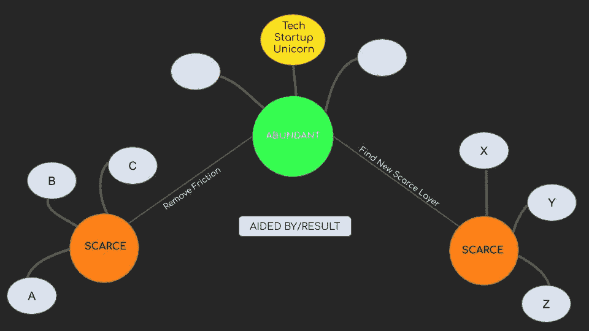

# 维度 1:宏观层面的价值创造机会

> 原文：<https://medium.datadriveninvestor.com/dimension-1-value-creation-opportunity-at-macro-level-b205a8f05561?source=collection_archive---------13----------------------->

***回顾:*** *这是一个中型系列，着眼于在理解巨型科技独角兽如何形成中发挥作用的不同因素(以维度表示)。你可以在这里找到* [*简介*](https://medium.com/datadriveninvestor/intro-tech-startup-unicorns-be40ed9ff9c9) *。*

**技术如何帮助创造价值？**

洗油技术，信息就是技术。在一段时间内稀缺的技术，当被提取并变得丰富时，会导致增长或价值创造。如果这种技术消除了摩擦(换句话说，提供了获取稀缺资源的途径)，并且可以在全球范围内推广或惠及数十亿人，那么价值数十亿美元的公司就诞生了。例如，谷歌和亚马逊分别抽象出对索引信息的访问和对跨境零售的访问。从而创造巨大的价值。

对于现代科技公司来说，它总是关于未来的事情，而不是简单地保护今天的事情。创新是一个持续的学习过程。为了创造价值，一家公司需要找到一个稀缺且有需求的实体，并提供进入该实体的途径，使其变得丰富。换句话说，消除客户和稀缺资源之间的摩擦。

 [## 准备在 2019 年改变世界的技术-数据驱动的投资者

### 很难想象一项技术会像去年的区块链一样受到如此多的关注，但是……

www.datadriveninvestor.com](https://www.datadriveninvestor.com/2019/01/17/the-technologies-poised-to-change-the-world-in-2019/) 

技术的前沿发展很快。今天有价值的技术可能在几年后变得一文不值。但是今天的技术和不久的将来的技术之间的转换是技术独角兽产生的地方。

**稀缺性、丰富性和抽象性:**

Alex Danco 的这篇精彩文章讲述了如何通过提取稀缺资源并使其丰富来创造新的价值。一个新的稀缺项目的出现创造了一个全新的前所未有的市场。

**示例:**

19 世纪早期，一个村庄的当地戏剧艺术家通过利用属于他的稀缺资源“他的存在”来谋生和赢得声誉。不考虑世界其他地方更好的艺术家，他在自己领域的统治地位是不可动摇的。

随着 19 世纪后期电影录制技术的出现，一个村庄的人们可以从村外获得更好的戏剧表演。稀缺的东西:由于一个新的稀缺层:录音和发行，各种戏剧表演变得丰富起来。换句话说，观众和各种戏剧表演之间的摩擦被抽象掉了。

这里要注意的重要一点是:虽然本地戏剧艺术家在市场上失去了价值，但录音和发行行业以及观众都受益于新技术的引入。

最终，目前的摩擦点——录音和发行——被 21 世纪的新玩家夺走了。

什么是稀缺的？百视达每部电影都高价出租 CD。稀缺品是:以固定成本获得无限(更多)的使用权。

网飞通过推出一种基于订阅的模式消除了这种摩擦，在这种模式下，消费者可以以固定的价格无限制地(以有限的方式)观看电影/连续剧。网飞通过丰富稀缺资源创造了巨大的价值。

在线流媒体(网飞)抽象出了稀缺的东西:基于订阅的多部电影/连续剧。于是一个新的摩擦点出现了:无限制访问。

事后来看，追踪这些稀缺资源要比预测下一个可以提取的稀缺资源容易得多。

**跨行业的价值创造**

在宏观层面上，通过提取稀缺的东西并使之丰富，创造价值的新机会就会出现。

现在，我们将尝试将上述原则应用于多个行业，并了解以下行业的当前发展情况:

1.  [*硅业*](https://medium.com/datadriveninvestor/1-1-dimension-1-silicon-industry-869acfd8e7f8)
2.  [*人工智能*](https://medium.com/datadriveninvestor/1-2-dimension-1-artificial-intelligence-c186c9417333)
3.  [*区块链*](https://medium.com/datadriveninvestor/1-3-dimension-1-blockchain-39d59552f173)
4.  [*生物技术*](https://medium.com/datadriveninvestor/1-4-dimension-1-biotechnology-94b94294e5be)
5.  [*能量*](https://medium.com/datadriveninvestor/1-5-energy-c8400581bde9)
6.  [空间*空间*空间](https://medium.com/datadriveninvestor/1-5-energy-c8400581bde9)
7.  [*量子计算*](https://medium.com/@arvindvairavan/1-7-dimension-1-quantum-computing-6e80943560e6)

*注:*这种宏观层面的价值创造只提供了一个机会，但并不决定谁将成为赢家。其他因素将在维度 2、3 和 4 中探讨。

*接下来:*您可以了解微观层面的颠覆性机会和增长性机会是如何出现的(表示为[维度 2](https://medium.com/datadriveninvestor/dimension-2-disruption-opportunity-at-micro-level-and-growth-e37f078544eb) )。)