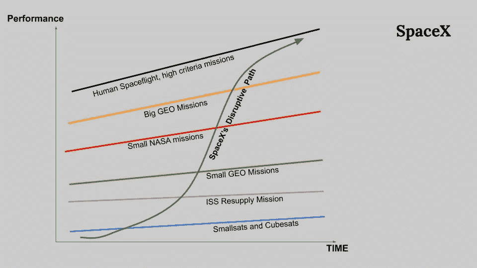
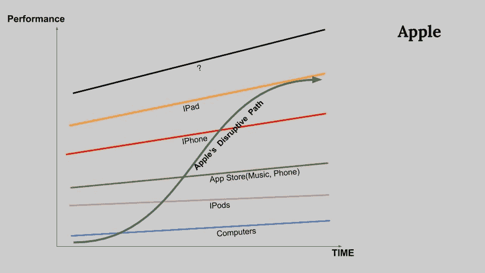
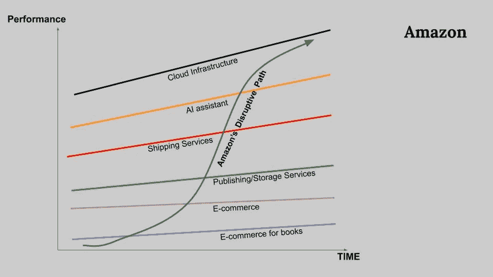

# 维度 2:微观层面的颠覆机会和增长

> 原文：<https://medium.datadriveninvestor.com/dimension-2-disruption-opportunity-at-micro-level-and-growth-e37f078544eb?source=collection_archive---------6----------------------->

***回顾:*** *这是一个中型系列，着眼于在理解巨型科技独角兽如何形成中发挥作用的不同因素(以维度表示)。你可以在这里找到* [*简介*](https://medium.com/datadriveninvestor/intro-tech-startup-unicorns-be40ed9ff9c9) *。*

*我们之前谈到了如何创造新的价值机会层(表示为* [*维度 1*](https://medium.com/datadriveninvestor/dimension-1-value-creation-opportunity-at-macro-level-b205a8f05561) *)。*

 [## 模式和机器人:一个复杂的现实数据驱动的投资者

### 哈耶克的名著《复杂现象理论》(哈耶克，1964)深入探讨了复杂性的话题，并断言…

www.datadriveninvestor.com](https://www.datadriveninvestor.com/2019/03/04/patterns-and-robotics-a-complex-reality/) 

在这个维度中，我们将研究公司如何扰乱和扩展:
2.1 [扰乱市场空间——新进入者如何扰乱市场](https://medium.com/@arvindvairavan/2-1-dimension-2-disruption-market-spaces-edd6cc85bb5e)
2.2 [增长和扩展——不同的扩展方法](https://medium.com/@arvindvairavan/2-2-dimension-2-growth-scaling-and-innovation-81b8d087cbdc)

**颠覆与创新**

公司创造高价值，或者在某些情况下，高价值公司是在创新发生的地方产生的。创新通过提高性能或提高价格来改进产品。克里斯滕森被认为是颠覆性和持续性创新背后的理论。

颠覆理论经常被错误地描绘成一种创新，这种创新如此先进，以至于它会通过做与现有公司同样的事情，甚至做得更好，来驱使现有公司走向失败。这不是颠覆性创新的工作方式:恰恰相反，因为老牌公司通常可以毫不费力地赶上帮助他们改进产品的新技术，而且因为开发新技术是他们的谋生之道。克里斯滕森称之为持续创新，因为他们改善了今天的客户已经重视的服务。颠覆性的通常不是技术本身，而是如何驾驭和使用技术。这是文化和商业模式的改变，而不是技术的改变。

“相比之下，颠覆性创新并不试图为现有市场的老客户带来更好的产品。相反，他们通过推出不如现有产品的产品和服务来扰乱和重新定义这一轨迹。但颠覆性技术还有其他好处——通常，它们是更简单、更方便、更便宜的产品，对新客户或要求较低的客户有吸引力。一旦颠覆性产品在新的或低端市场站稳脚跟，改进周期就开始了。由于技术进步的速度超过了客户使用技术的能力，以前不够好的技术最终会得到足够的改进，以满足要求更高的客户的需求。当这种情况发生时，颠覆者正走在一条最终将击垮现有者的道路上。”

——克里斯滕森在《创新者的困境》一书中

虽然克里斯滕森和他的公司积极地表示低端颠覆是扩大和发展公司的关键，但特斯拉是那些从高端开始颠覆，同时一路向下渗透的公司之一。如维度 1 所述，对稀缺服务/产品的需求增加，或者通过快速创新来提高性能/可负担性，都有助于颠覆。

**低端颠覆:**
谷歌的页面排名算法索引信息
优步进入拼车接入经济

**高端颠覆:**
苹果进军移动行业
特斯拉进军汽车行业

苹果带来了软件，学会了手机，而诺基亚有很棒的手机，却学不会软件。特斯拉将电动汽车和软件(最终是 autonomy)引入汽车，而老牌汽车公司将努力适应 autonomy 或电动发动机。当然，Waymo 或优步更适合扮演汽车安卓的角色，消除摩擦，从而丰富自主软件。

**可扩展性**

不管是颠覆性创新还是持续创新，初创公司都需要实现增长，要么通过快速扩张，要么通过霍夫曼所说的快速扩张，要么通过面向过程的计算进入，要么通过在新的创新周期中获得时间优势

接下来:你可以在这里阅读如何创造新的颠覆机会[。](https://medium.com/@arvindvairavan/2-1-dimension-2-disruption-market-spaces-edd6cc85bb5e)

你可以阅读一下外部因素在创业独角兽中的作用(表示为[维度 3](https://medium.com/@arvindvairavan/3-1-dimension-3-luck-and-timing-2240c222bed6) )。)