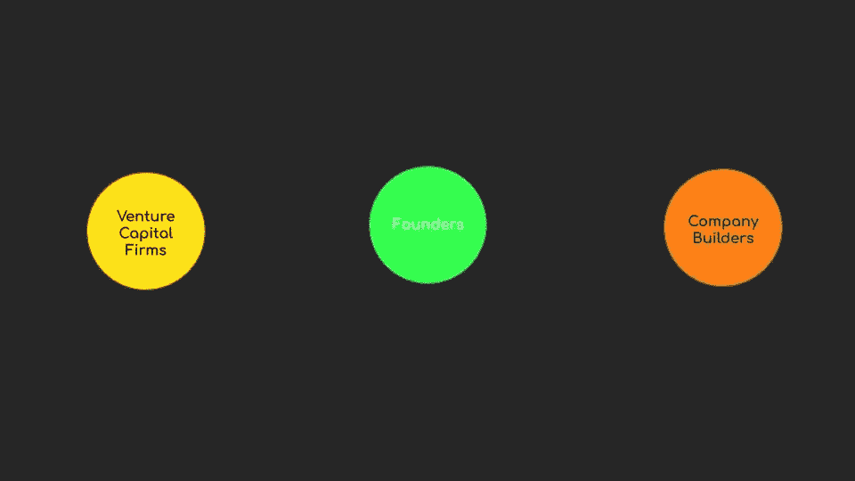

# 维度 4:科技创业生态系统的角色

> 原文：<https://medium.datadriveninvestor.com/dimension-4-role-of-tech-startup-ecosystems-6ee1c632718c?source=collection_archive---------8----------------------->

***回顾:*** *这是一个中型系列，着眼于在理解巨型科技独角兽如何形成中发挥作用的不同因素(以维度表示)。你可以在这里找到* [*简介*](https://medium.com/datadriveninvestor/intro-tech-startup-unicorns-be40ed9ff9c9) *。*

*我们之前谈到了如何创造新的价值机会层(表示为* [*维度 1*](https://medium.com/datadriveninvestor/dimension-1-value-creation-opportunity-at-macro-level-b205a8f05561) *)。我们介绍了微观层面的颠覆机会和增长机会是如何出现的(表示为* [*维度 2*](https://medium.com/datadriveninvestor/dimension-2-disruption-opportunity-at-micro-level-and-growth-e37f078544eb) *)。*

 [## 金融科技初创公司正在扰乱世界各地的银行业-数据驱动的投资者

### 传统的实体银行从未真正从金融危机后遭受的重大挫折中恢复过来…

www.datadriveninvestor.com](https://www.datadriveninvestor.com/2018/10/20/fintech-startups-are-disrupting-the-banking-industry-around-the-world/) 

[*维度 3*](https://medium.com/datadriveninvestor/3-1-dimension-3-luck-and-timing-2240c222bed6) *讲了对创业独角兽成功起塑造作用的外部因素。*

*Dimension 4 将讲述科技创业生态系统的角色。*

创业生态系统在帮助资助/建立这些高增长科技公司方面发挥着巨大的作用，包括但不限于帮助找到产品与市场的契合度、开发创意和扩大产品规模。科技生态系统中有各种各样的参与者帮助/可能帮助创建这些初创企业独角兽:

1.  像埃隆·马斯克、史蒂夫·乔布斯、杰克·多西、杰夫·贝索斯等企业家和创始人。他们有能力想象一个迷人的未来，并在足够长的时间内有条不紊地创造出那个未来。
2.  风险投资公司，如 Social Capital、A16Z、Future Ventures、Future Positive Ventures，它们要么是数据驱动型的，要么是愿景驱动型的，有助于为它们希望参与的未来提供资金。
3.  像 YCombinator、EntrepreneurFirst 这样的公司建立者建立新的模式，将人才或想法引入创业生态系统。

这个维度将探索每一个参与者，以及他们如何帮助构建未来。

4.1 [埃隆马斯克](https://medium.com/@arvindvairavan/4-1-dimension-4-elon-musk-cd749da806b4)

4.2 [社会资本](https://medium.com/@arvindvairavan/4-2-dimension-4-social-capital-f8c80a46991e)

4.3 [企业家第一](https://medium.com/datadriveninvestor/4-3-dimension-4-entrepreneur-first-7a5f1717f43f)

远见卓识者为创业奠定基础，即建立愿景并发现新的[价值创造机会](https://medium.com/datadriveninvestor/dimension-1-value-creation-opportunity-at-macro-level-b205a8f05561)。风险投资公司帮助开发 T4 的增长机会。公司创建者建立一个模型，帮助将人才或想法转化为价值创造机会，并最终实现规模化。

***接下来:*** [埃隆马斯克](https://medium.com/@arvindvairavan/4-1-dimension-4-elon-musk-cd749da806b4)

你可以在这里找到系列[的概要。](https://medium.com/@arvindvairavan/summary-tech-startup-unicorns-728e9f0ca976)