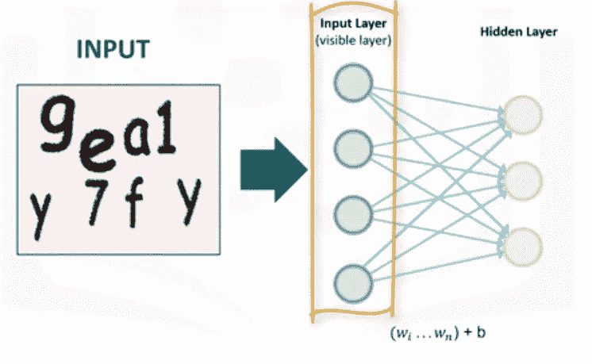
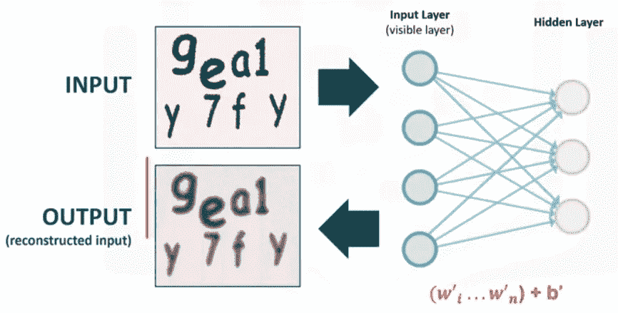
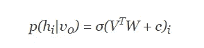
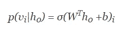
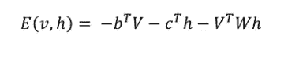
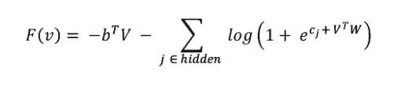
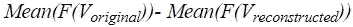
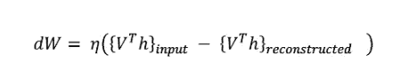

# 使用 RBM 重建图像

> 原文：<https://medium.datadriveninvestor.com/dimensionality-reduction-and-feature-extraction-with-rbm-f499965979e9?source=collection_archive---------2----------------------->

# 介绍

受限玻尔兹曼机(RBM)是一个两层神经网络，第一层称为**可见层**，第二层称为**隐藏层**。RBM 也被称为**浅层神经网络**，因为它只有两层深度。RBM 是 Paul Smolensky 在 1986 年发明的，名为 Harmonium，后来 Geoffrey Hinton 在 2006 年提出用对比发散(CD)作为训练它们的方法。

RBM 可用于降维、特征提取和协同过滤。

# 它是如何工作的

假设我们提供一张图片作为 RBM 的输入。像素由输入层处理，也称为**可见层**。

 [## 2019 年深度学习的终极学习路径及更多...-数据驱动型投资者

### 又一个美好的一周，一些好的教育内容将会到来。我最喜欢的&最受欢迎的帖子之一…

www.datadriveninvestor.com](https://www.datadriveninvestor.com/2019/01/07/the-ultimate-learning-path-for-deep-learning-in-2019-more/) 

RBM 通过重构输入来学习模式并提取数据中的重要特征。因此，学习过程由几次向前和向后传递组成，其中 RBM 试图重构输入数据。

神经网络的权重以这样的方式调整，即 RBM 可以找到输入特征之间的关系，然后确定哪些特征是相关的。

训练完成后，网络能够根据它所学到的内容重建输入。在这里，重建的图像只是所发生的事情的一种表示。

# 理解需要步骤

在整个训练过程中，三个步骤被反复重复

*   **向前传球**
*   **向后传球**
*   **比较:在可视层，将重建与原始输入进行比较，以确定结果的质量**

**向前传递:**可见单元( *V* )的信息通过权重( *W* )和偏差(c)传递给隐藏单元( *h0* )。隐藏单元可能开火或不开火取决于随机概率( *σ* 为随机概率):

**向后传递:**隐藏单元表示( *h0* )然后通过相同的权重 *W* ，但是不同的偏置 *b* 传递回可见单元，在那里它们重建输入。再次对输入进行采样:

这两个过程重复 k 步或直到达到收敛。根据研究人员的说法， *k=1* 已经显示出惊人的效果，所以我们将保留 *k = 1* 。

可见向量 *V* 和隐藏向量的联合配置具有能量。RBM 的能量函数 *E(v，h)* 定义为:

其中 W 代表连接**隐藏**和**可见**单元的权重，b，c 分别是可见层和隐藏层的偏移量。

与每个可见向量 *V* 相关联的还有自由能，这是一个单一构型需要具有的能量，以便与包含 *V* 的所有构型具有相同的概率:

使用对比散度目标函数，即，

重量变化由下式给出:

这里， *η* 是学习率。对于偏差 *b* 和 *c* 存在类似的表达式。

数学爱好者可以在这里找到不错的教程[。](http://deeplearning.net/tutorial/rbm.html#rbm)

这篇文章附带的 jupyter 笔记本可以在这里找到[。](https://github.com/nitwmanish/Dimensionality-Reduction-And-Feature-Extraction-Using-RBM)

# 结论

由于其重建图像的能力，RBM 可用于从现有数据生成更多数据。RBM 还用于**协同过滤**、**特征学习**、**回归、分类**和**主题建模**。它可以在**有人监督**或**无人监督**的方式下接受训练，这取决于任务。

***我希望这篇文章能帮助你基本了解受限玻尔兹曼机(RBM)如何作为*图像重建**、**降维和特征提取*工作。***