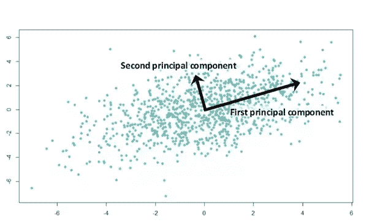
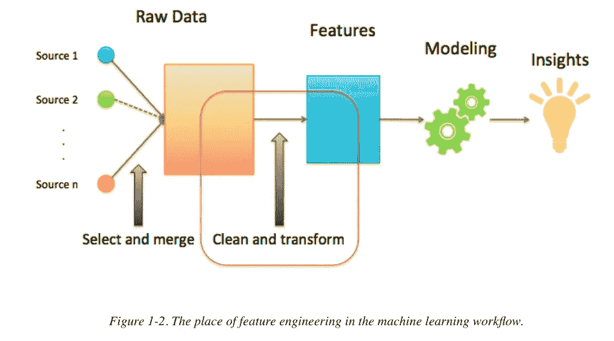

# 维度缩减技术

> 原文：<https://medium.datadriveninvestor.com/dimensionality-reduction-techniques-27049b5a4c55?source=collection_archive---------9----------------------->

[](http://www.track.datadriveninvestor.com/1B9E)

Source : [HPC](http://www.hpcwire.com)

那么，这个降维是什么呢？似乎有点复杂。但是，随着每天数据量的增加，跟踪数据变得越来越复杂。不同的社交网站、教育网站产生了大量的数据，很难将这些数据可视化。因此使用了这些技术。

在有大量变量的情况下，很难对数据集进行可视化和推断。因此，这些技术试图从数据集中提取一个子集，这个子集可以捕获由原始变量集所展示的正常数量的信息。

因此，如果我们有一个 X 维的数据集，我们可以将其转换为 Y 维的子集。这就是所谓的降维。

## 为什么我们需要这些技术？

*   如果维度减少，存储数据所需的空间也会减少。
*   它帮助我们将数据可视化。
*   它通过移除那些无用的特征来帮助我们处理多重共线性。
*   计算时间可以减少，从而提高我们的模型的速度。

## 降维技术列表:

1.  随机森林
2.  主成分分析(我们将讨论它)
3.  缺失值比率
4.  正向特征选择
5.  反向特征消除
6.  低方差滤波器
7.  高相关滤波器

## 主成分分析(PCA):

这种技术从原始数据集中提取一些要素。这些提取的特征/变量被称为主成分。这种技术背后的主要动机是从高维数据集中提取低维特征集。当我们处理 3 维或更高维的数据时，它更有用。

如果我们想要执行这项技术，那么矩阵必须包含数字和标准化数据。

*   PCA 是原始变量的线性组合。
*   第一个主成分应该解释数据集中的最大方差。
*   剩下的差异由第二个主成分解释。这些组成部分是不相关的，循环往复。



Source : [Medium](http://www.medium.com)

```
**Z² = Φ¹²X¹ + Φ²²X² + Φ³²X³ + .... + Φp2****Xp -> This is the equation by which we can calculate Principal component.**
```

我们将在下一篇文章中讨论实现部分。

让我们来看看一些**特性工程。**



Source : [Amazon](http://www.amazon.com)

> 机器学习的成功实际上是成功地设计了学习者能够理解的特征。
> 
> 它是将原始数据转换成能够以更准确的方式表示潜在的更多问题的特征的过程，从而提高我们的模型的准确性。

解决任何机器学习问题的步骤包括:

*   收集数据。
*   预处理数据。
*   *特色工程。*
*   定义我们的模型。
*   预测产量。

特征工程可以是任何事情，比如引入一个新的特征，它可以指出一些有用的信息，并且可以增加我们模型的准确性。或者可以是通过两个不同特征的组合引入新的特征。

有时，从我们的模型中删除一个不需要的特征也有助于特征工程，因为那个模型是我们模型失败的原因。

## 特征工程涉及的步骤:

*   删除特征。
*   创建新功能。
*   从一开始就检查所有功能是否正常工作。
*   用不同的测试案例反复运行我们的模型，用提取的特征检查我们的模型的准确性。

那都是乡亲们！

***快乐学习！！！***