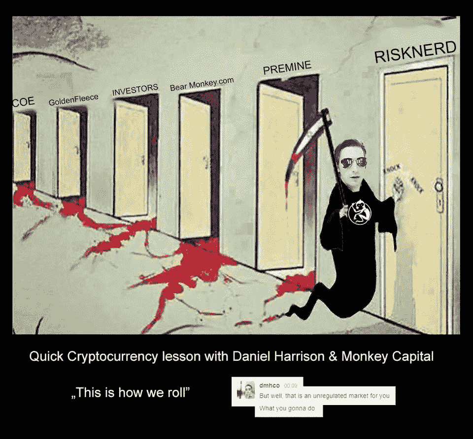

# 折扣还是奖金？

> 原文：<https://medium.datadriveninvestor.com/discount-or-a-bonus-45d0ac353eb?source=collection_archive---------0----------------------->

## 当没有人在数的时候，要寻找什么

今天早上，一位非常和蔼可亲的南非人找到了我，他自 7 月份以来一直在为各种首次公开募股(ico)提供咨询服务。

这家伙让我想起了 10 年前的自己；有点教育过度，有点太迷人，对你要说的话不太感兴趣，只对他自己的观点感兴趣。换句话说，他是你那种死气沉沉的私立学校和大学毕业的推销员，变成了早年的企业家。

回想起来，让这个人脱颖而出的或许是一种类似的品质，这种品质帮助我在加密货币开发的疯狂世界中获得了不必要的关注；我们的背景都让我们相信，只要我们全力以赴，我们就有资格取得压倒性的胜利，证明我们的自信是正确的。

他参与的 ico 有点缺乏想象力，但平心而论，它们也是高质量的。综合这些因素，他是少数几个我会在收到即时消息后的合理时间内回复的名字之一。

“ICO 团队]正在寻求收购 ad-network，以提高他们平台的使用率，”他开始说道。我问他在这个月的特别风味中他扮演什么角色。“我的角色——外部顾问——协助撰写白皮书、业务战略、市场定位、网站、令牌列表和业务网络。”

换句话说 ICO 项目中的每个角色都由这位来自南半球的名副其实的顾问来担当。哦，他继续说道，打断了自己的话(这是丹尼尔·马克·哈里森的习惯)，“我也是对冲加密公司的首席商务官。目前尚不清楚 hedge Crypto 是否提供数据(“他们与路透社有合作关系，正在产生巨额利润”)或交易工具，或就此而言，区块链工具。这位年轻的销售员非常肯定地向我保证，“这是一种纯粹的公用事业代币”，但随后又吹嘘这种公用事业代币“具有衍生品合约潜力的独特指数挂钩特征”。"我告诉他，在我听来，这就像是一种额外的安全措施. "不，它只是在某一天为数据平台上的服务付费，”他反驳道。是的，所以区块链实用范例中所有关于指数关联价值和衍生价值潜力的东西只是为了让女孩和你一起回家。当然，我明白了。我很清楚这是怎么回事。

但是回到广告网络。“如果你在接下来的 48 小时内购买价值 20，000 美元的商品，有 70%的折扣，”我被告知。就我个人而言，我讨厌 ICO 前的折扣，因为今年早些时候我在一个折扣上损失了近 25 万美元。本质上，你可能会得到折扣，但当管理团队完成向市场倾销代币时，价格处于或低于折扣报价水平，这意味着最高盈亏平衡结果的风险高于平均水平。尽管如此，70%似乎已经很慷慨了。

“所以我只需支付 8000 美元，然后呢？”我问他。沉默。轻拍。轻拍。轻拍。“让我澄清一下:Adbank。奖金不等于折扣。这是贡献金额之外的奖金。”

抱歉。那么，这是打六折还是打七折？70%的奖金并不等同于折扣！

“请记住，公共 ICO 奖金是前 24 小时的 20%，并相应递减，因此您有 50%的缓冲…这是一个仅限于我的封闭圈子的封闭回合，不向公众提供，只能通过我作为外部顾问获得。”

对，所以这是 70%的奖金，其中 71.4%的奖金现在只能在 24 小时内使用。当面对这种公然的逻辑短路时，我做了我经常做的事情，拿起电话给他打电话。

"你知道为什么奖金和折扣不是一回事吗？"我问他。沉默。“好吧，让我告诉你，因为我确实喜欢你，我希望你走得远。当你评估一项业务或资产时——事实上，当你评估生命中的*任何东西*时——你必须根据它在改善或减值后的未来价值来评估它的价值。例如，如果我在我的工厂上花了 1000 万美元，并想卖掉它，它在未来的价值会比我没有这么做时高得多，因为它的状况会好得多。

“因此，为了得出所谓的净现值，我们必须使用一种叫做贴现未来现金流的东西。为了得到贴现的未来现金流，我们使用一种叫做无风险利率的东西——利率。当一个是贴现值时，另一个——利率——就像一个奖金函数。因此，混淆奖金和折扣会完全扭曲今天出售的任何东西的价值。”

“哦，是啊。丹尼尔，你知道，你跟我一样，”这位对冲基金数据提供商的首席商务官反驳道。“你对金融建模有着深刻的理解。我来自同一个世界。”事情是这样的:他完全正确。我们完全来自同一个世界。请注意，我们俩都没有在金融领域工作过——但我们确实通过极其尽职尽责的投资银行父辈接触了足够多的金融领域。

正因如此，他 28 岁时是一名区块链顾问，而我在这个年龄时是一名亚洲记者，住在纽约，偶尔在 CNN World 上担任客座专家。具有讽刺意味的是，顾问和客座专家应该是对某个主题最了解的人。然而，当时我正在做我以前的南非门徒正在做的事情；试着尽可能快地说下去，希望我的大脑最终能跟上。

沿着这条线的某个地方，它做到了。十多年来，自信和特权带来的好处，以及我可以随时随地想去哪儿就去哪儿，让我拥有了一种强大的能力，可以让卖家大幅打折，并从买家那里获得高额佣金。沿着这条线的某个地方，我发现了我未来的价值。

如果我 2017 年的现值相当于我 2008 年净现值的两极，那么只要给予足够的关注和时间，就不难相信任何事物都有潜在的未来价值爆炸。

对于那些对今年密码价格的惊人增长感到震惊的人来说，这可能是一个很好的例子，说明事情有时会在眨眼之间发生变化。因为当价值*足够高*足够长*足够长*时，通常情况下，一个公共事业最终会从所有这些价值中脱颖而出。也就是说，通过简单的*持续估价和被估价的不知疲倦的行为，*曾经对你不利的折扣在某一天奇迹般地代表了一笔丰厚的奖金。