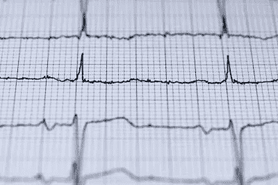

# 患病的心脏仍在供血:经济中的证券市场

> 原文：<https://medium.datadriveninvestor.com/diseased-heart-still-pumps-blood-securities-markets-in-the-economy-a7f7f759e552?source=collection_archive---------20----------------------->

在过去的一周里，我一直在思考证券市场在经济中的作用。总的来说，当我想到证券市场时，我有两种想法。最主要的一点，也是我的杏仁核中的兽性爆发，是我们应该害怕证券市场。你看，对于我这个年龄和教养的人来说，在很大程度上，我的整个生活都是经济在起作用。

我出生于 1981 年，所以我不记得与通货膨胀和沃尔克冲击相关的经济低迷。我依稀记得 90 年代初的经济衰退帮助克林顿当选，并确保了克林顿和布莱尔的第三条道路自由主义。发生了 911 事件，科技泡沫破裂，安然公司、世通公司和泰科公司被揭露为骗子，但布什上台给每个人减税，经济复苏了。

 [## 更好地预算以建立更大的数据驱动型投资者

### 即使是专家也承认它们并不完美。从 1 到 10 的范围内，安东尼·科普曼和德尔…

www.datadriveninvestor.com](https://www.datadriveninvestor.com/2018/11/08/budget-better-to-build-bigger/) 

经济以这样一种方式运行，我不必去想它，甚至不必去好奇它运行得如何。它的效果如此之好，以至于我对自己所有的智力天赋充满了信心，我可以安全地主修英语，并有创造性写作的成分，而不必真正担心后端会有什么样的工作。

我在大学和研究生院时不知道的是，证券市场正在发生一些事情。股市在增长，房价在上涨。如果你有 15 年前的美国有线电视，你就无法避免电视节目中关于房屋买卖者赞美快速致富的房产。顺便提一下，这种回顾性的想法引发了“米赫利奇金融第一法则”，即如果一个产品的电视广告存在，你就是被骗的那个。黄金，反向抵押贷款，加速贷款？所有这些都是为了让你的投资回报率高于一个精明的投资者，如果他们不依赖电视广告的话。房价不仅在上涨。

贷款需求的创造拉动了它们。这些贷款被分割成证券并出售给其他投资者，这个过程可能会一次又一次地重复。你也有像美国国际集团金融产品公司这样的公司在他们没有资本支持的贷款衍生品上进行信用互换。因此，这种需求驱使银行和其他贷款发放者降低他们的信用标准，这样他们就可以向信用差、没有工作、没有能力偿还贷款的人提供贷款。他们出售的贷款是负分期偿还贷款，这意味着每月还款不足以支付增加到贷款中的利息，因此即使人们保持当前状态，贷款的未偿金额也每月增长。

他们以很高的利率出售这些贷款，利率将会重置，他们将这些贷款出售给那些有资格获得更高利率的人，但他们得到了一笔可怕的交易，因为他们在传统上不应得的社区。与此同时，在贷款和房地产的所有权链上，存在着宽松的承销和未记录的转让。只要房价还在上涨，这些都不重要。

但当房价停止上涨时，这确实很重要。一切都爆炸了，为了混合我的比喻，花旗(Citi)的查克普林斯(Chuck Prince)用一句著名的话来证明这一切是合理的:“只要音乐在播放，你就必须站起来跳舞，”但随后音乐停止了，我们看到了谁没穿衣服。如果像科技泡沫一样，只是华尔街和沙丘路的一小撮人亏损，这一切都无关紧要，但因为他们从实体经济中抽身，当音乐停止时，人们失去了家园，人们失去了工作，政府觉得干预的最佳方式，也是唯一的方式是对最初制造混乱的银行和金融机构进行资本重组。

毫不奇怪，这导致了右翼和左翼的民粹主义反应，从占领运动到国会中的茶党候选人，以及伯尼·桑德斯和唐纳德·特朗普的政治崛起。一些东西从根本上被打破了，这在整个大缓和时期并不明显。我知道这一点，因为我受到了席卷经济的浪潮的影响。我失业了两年，发出了数千份求职申请，但最终只有少数几个面试机会，因为我尽可能地阅读一切，试图弄清楚到底发生了什么。这意味着我的蜥蜴脑部分想到了证券市场，我想做的是烧掉整个市场。

然而，我更善于分析。一旦杏仁核发出的信号消失，那么额叶就有发言权。与所有机构一样，证券市场之所以存在，是因为在它们成立之初，它们填补了一个需要填补的空白。我想起了华尔街的起源故事，交易商们是如何在华尔街的梧桐树下碰头结算交易的。有一个集中的地方见面比让年轻男孩整天在城市里跑来跑去要容易得多。纽约甚至不是我们现在所认为的城市。最高的建筑是一座教堂，住宅区的大部分仍然是农田，但是需要一个中心场所来交易商业股票。

证券市场在经济中确实有两个关键角色。首先，它们提供流动性和营运资本。企业可以出售股票或债券，然后获得现金注入。这些现金可以投资于实体经济中的生产性活动，而不是企业通过经营活动等待可投资的现金。企业确实放弃了一些未来现金流的权利，比如债券的息票是多少，或者预期的股息是多少，但这种发行就像银行一样，流动性是关键，因为有时你的业务很好，但现金有限。另一个重要的作用是，当企业在一级市场出售证券时，以及当证券所有者在二级市场买卖现有股票或债券时，市场是一个为现有企业寻找价格的持续过程，总的来说，它成为每个人知道这些证券的正确价格的一种方式。价格发现机制使得投资公开发行证券的公司变得容易，将所有权分配给任何可以购买股票的人，并可能使经济民主化。

问题在于，在某个时候，从一个为填补利基而诞生的新生机构，随着它成长和演变以满足其所处环境的需求，它可能会从经济的有用部分变成经济本身的拖累。除此之外，路径依赖意味着像证券市场这样的东西会在经济的某些领域出现，在这些领域，它是净损害，但不可能制定一项政策，将时钟回滚到任何假想的越界点。因此，尽管我仍然想炸掉整个东西，但我意识到，把这个机构连根拔起是有问题的，因为只要我们还有资本主义的社会关系，它就有生产的目的。最终，经济中的证券市场就像个人患病的心脏。有一天，它可能会杀死人，但在那之前，它仍然泵血。

*最初发表于*[*【http://econautodidactic.blogspot.com】*](https://econautodidactic.blogspot.com/2019/06/diseased-heart-still-pumps-blood.html)*。*