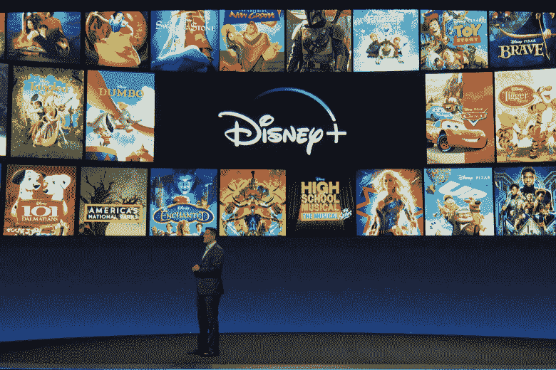

# 迪士尼加:它的竞争，问题，节目，和新的内容副总裁

> 原文：<https://medium.datadriveninvestor.com/disney-plus-its-competition-problems-programs-and-new-vp-of-content-c39beff34949?source=collection_archive---------2----------------------->

Image via IndieWire.

在一个流媒体服务的时代，迪士尼试图扩大其在娱乐领域的影响力。今年早些时候，关于这项服务的消息导致该公司股票大幅上涨。最近，这家价值数十亿美元的企业集团发布了期待已久的流媒体服务 Disney Plus。

瞬间迪士尼 Plus 积累了大量用户。在开通运营的第一天，用户总数就达到了 1000 万。迪士尼表示，在定于明年某个时候举行的下一次收益电话会议之前，不会提供更多的认购数字。

 [## 幸福的算法？数据驱动的投资者

### 从一开始，我们就认为技术正在使我们的生活变得更好、更快、更容易和更实用。社交媒体…

www.datadriveninvestor.com](https://www.datadriveninvestor.com/2019/03/08/an-algorithm-for-happiness/) 

与其他流媒体网络相比，HBO 现在花了近三年时间才达到只有 500 万订户的数字。截至今年早些时候，CBS All Access 只有 800 万订户，这一壮举花了四年多一点的时间才实现。Hulu 有 2800 万；亚马逊 Prime Video 在美国拥有超过 4000 万用户，在国际上也拥有大量追随者。

虽然[网飞在流媒体领域保持霸主地位，拥有超过 1.5 亿用户](https://www.adweek.com/tv-video/hulu-and-amazon-prime-video-are-gaining-on-netflix-in-the-streaming-wars/)，但迪士尼 Plus 在很短的时间内实现了突飞猛进的发展。

作为迪士尼持续垄断娱乐业的一个主要因素，迪士尼 Plus 和迪士尼公司的战略已经成为对该行业讽刺评论的主题。

一个例子是曲速地带的视频“网飞对迪士尼 Plus 的反应”，其中迪士尼高级官员迪克贬低网飞，并咆哮着迪士尼计划如何通过战略商业策略来控制情感景观。

迪士尼 Plus 的部分吸引力在于该服务提供了对其平台完全独特的系列，如 [*《曼达洛人》*](https://www.marketwatch.com/story/whats-worth-streaming-in-december-the-mandalorian-mrs-maisel-the-witcher-and-more-2019-11-27) 以及即将上映的漫威作品，如*《旺达·幻视》*和*《猎鹰与冬兵》*。迪士尼乐园也是一系列《星球大战》电影、MCU 系列电影和迪士尼经典电影的故乡。

然而，许多观众的高期望已经被连接问题的报告所抵消。这些问题在全国范围内涌现，其原因据称是初始订户数量出乎意料地高。迪士尼表示，在流媒体服务的开始阶段，它根本没有为用户的超级激增做好准备。

在很短的时间内，Disney Plus 因播放速度慢和观众经历的其他延迟而声名狼藉。甚至著名的电视主持人[史蒂芬·科拜尔也在推特](https://twitter.com/StephenAtHome/status/1194452581906632704)上取笑它，发表聪明的评论，比如:“到目前为止我最喜欢的迪士尼+节目是缓冲。”

[曼达洛人的第二季已经在计划中了。](https://www.radiotimes.com/news/on-demand/2019-11-25/mandalorian-season-2-disney/)最近，据透露[Chris Loveall——AMC Networks 的前高管——已被迪士尼公司聘用。Loveall 拥有丰富的国际节目制作经验，将负责从国际视角为 Disney Plus 内容创造创意。](https://www.hollywoodreporter.com/news/amc-networks-exec-chris-loveall-joins-disney-worldwide-push-1257832?utm_medium=social&utm_source=twitter&utm_source=t.co&utm_medium=referral)

可以预期的是，迪士尼加将继续增加受欢迎程度。订阅量的上升与华特·迪士尼公司股票的上涨相关联。