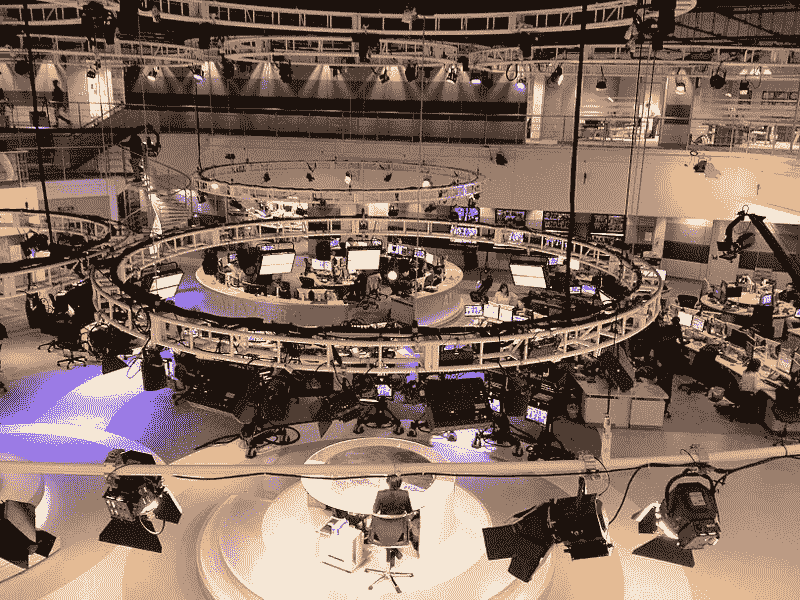

# 破除人工智能在新闻编辑室的神话

> 原文：<https://medium.datadriveninvestor.com/dispelling-the-myths-of-artificial-intelligence-in-the-newsroom-c6df92cf4359?source=collection_archive---------32----------------------->

“我们正在从一个移动优先的世界走向一个人工智能优先的世界”——谷歌首席执行官桑德尔·皮帅

人工智能在新闻行业的应用正以越来越快的速度增长，与许多技术趋势不同，现实世界中的用例比比皆是。德勤报告称，82%的人工智能早期采用者已经看到了对其业务的积极影响，而整个媒体和娱乐部门的平均投资回报率为令人印象深刻的 20%。在全球技术支出大幅增长的推动下，人工智能的重要性只会继续增加，预计将从 2018 年的 60 亿美元增加到 2021 年的 289 亿美元。从美国的谷歌到中国的腾讯，各大科技公司都将人工智能列为重要的战略重点。在我交谈过的许多科技公司中，人工智能是他们的头号关注点。

虽然作为一个行业，我们已经超越了机器人入侵我们新闻编辑室的最初歇斯底里，但围绕人工智能将对新闻以及最重要的是我们的生计产生的影响，仍然存在许多困惑和不确定性。

这篇文章旨在解决我在与新闻行业的记者和商业人士交谈中听到的一些最常见的误解。

神话 1:人工智能是工作杀手

历史表明，技术变革是就业机会的创造者，而不是就业机会的破坏者。举个例子，麦肯锡指出，个人电脑的发明对美国就业产生了积极的净影响，每年创造的就业岗位比它摧毁的多 1500 万个。历史证据表明，新技术等于提高生产率、增加支出和增加 GDP。

与此相反的观点是，现代世界的动态意味着这一次会有所不同；变化将会更快，更全面。工人们将没有时间提升他们的技能。事实上，有大量证据表明，技术驱动的变革在越来越短的时间内实现了全球采纳。

然而，中国从 1990 年到 2015 年的变化(三分之一的中国工人脱离了农业)表明，技术可以改变经济，同时降低失业率，即使是在人口快速增长的国家。中国现在是包括人工智能在内的先进技术产业的世界领导者之一。

人工智能随着时间的推移取代了任务和技能，而不是工作。这在实践中意味着，随着任务被自动化取代，工人有时间适应并通过更高层次的任务和技能继续增加他们角色的价值。出于这个原因，人工智能可能更好地描述为“增强智能”。

**神话 2:人工智能的真正价值是降低成本**

我遇到的对人工智能最常见的一种看法是，高级管理层将利用它来削减成本；在动荡而艰难的新闻市场中，利用自动化降低员工人数和运营成本。

对一家公司的战略方向来说，更重要的是人工智能作为价值创造者的角色。

普华永道认为，到 2030 年，人工智能将使全球媒体和娱乐行业的年增加值达到 1500 亿美元左右。这种附加值将来自生产率的提高、个性化程度的提高和质量的提高。领先公司的高级管理人员对于这个机会是明智的。在对 3000 名美国企业高管进行调查后，波士顿咨询集团报告称，被视为“人工智能先驱”的公司中，72%的受访者表示人工智能的商业价值将主要来自收入的增加。

根据麦肯锡的说法，这种想法的动机很简单:广泛采用人工智能的组织，将它视为价值的根本贡献者而不是有用的工具，将远远胜过人工智能的有限采用者。

此外，正如 Buzzfeed 和 Vice Media 认识到社交媒体和 OTT 对建立新的全球媒体组织的重要性一样，专注于人工智能的新进入者将从那些反应迟钝的人那里争夺市场份额。你只需要看看字节跳动在中国的成功，就可以理解一家专注于人工智能的初创公司对媒体市场的影响。

神话 3:人工智能会让记者的角色变得更加平凡

记者们的担忧之一是认为人工智能将把他们的角色降级到世俗，专注于数据库管理而不是内容创作。然而所有的证据都指向相反的方向。人工智能有可能消除平凡，简化繁琐，消除重复。用吴恩达的话说。，谷歌大脑联合创始人:

“就像工业革命将人类从体力劳动中解放出来一样，我认为人工智能有可能将人类从大量脑力劳动中解放出来。”

批判性思维、创造力、高级数据分析、领导力、沟通和谈判、复杂信息处理和适应能力都是未来需求增加的技能。

我自己的公司美联社(Associated Press)拥有人工智能这一有益特性的第一手经验。2014 年，我们将第一个自动化文章写作软件集成到我们的编辑流程中(将结构化数据转换为文本文章)，以自动创建财报。借助自动化软件，我们很快从每季度创建 300 份收益报告发展到 3，700 份。报告准确无误地在创纪录的时间内发出。

摆脱了通常为客户创建收益报告的时间压力，该团队的记者现在可以专注于围绕这些结果的更多调查性商业文章。这些报告需要更高的技能水平和更好的编辑判断。事实上，我们完成的自动收益报告的数量与我们撰写的调查性商业文章的数量之间存在直接的关联。我们对客户的价值增加了，团队的角色增强了，没有人因为自动化而丢掉工作。

神话 4:人工智能威胁编辑标准

一个合理的担忧，但显然是可以预防的担忧，是人工智能和自动化对编辑标准的影响，以及对观众对我们的信任的威胁，我们一直在努力维护这种信任。

技术改变了我们的流程和工作流程，但它没有改变新闻业的基本原则。人工智能可以让你的公司对你的受众更敏感，更有吸引力，更重要，但它永远不会让你不那么值得信任，或者降低你的工作质量。

技术有提出问题和提供解决方案的习惯。正如对新闻的信任因社交媒体发布的虚假信息而受到侵蚀一样，人工智能提供了一个潜在的解决方案。事实检查、文本和视频的语义分析以及更快的数据访问都是人工智能非常真实的使用案例，这些案例为记者提供了比以往更多的工具来打击互联网上的错误信息浪潮。

随着新闻编辑室在工作流程中实施人工智能，他们需要一个清晰的道德和标准流程。一些新闻编辑室将人工智能集成的责任交给了个人标准编辑，另一些则有一个道德委员会。无论走哪条路，这都是一个不应该被低估或资源不足的人工智能领域。

**结论**

在消除这些神话的过程中，我并不打算描绘一个过于理想化的未来愿景，或者低估在新闻编辑室中实现人工智能的难度。人工智能战略不是将一些工具整合到你的编辑工作流程中。要想成功，组织需要在工作实践中进行根本性的改变；整合更灵活的工作方式，调整组织结构，减少层级，鼓励更多跨职能、以项目为中心的合作。

利用人工智能降低成本的诱惑可能会带来短期收益，但从长远来看，那些没有充分利用人工智能所能创造的潜在价值的人可能会被那些利用人工智能的人甩在后面。

同样，记者需要致力于终身学习，接受持续的变革过程。那些更反对改变和新的工作方式的人将不可避免地错过人工智能带来的机会。拥抱这种变化的人将会受益。