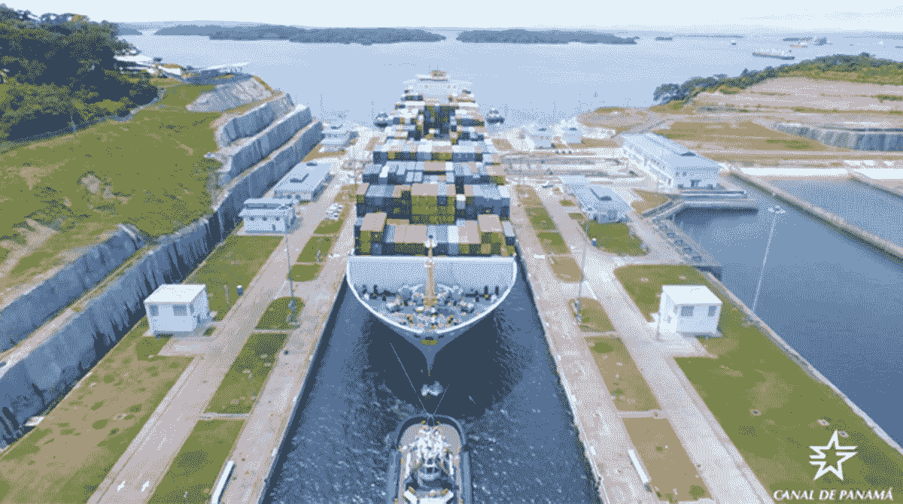

# 颠覆:对巴拿马的威胁

> 原文：<https://medium.datadriveninvestor.com/disruption-the-threat-to-countries-53c68f3271fe?source=collection_archive---------13----------------------->

## 供应链技术如何破坏巴拿马运河及其 20 亿美元的摇钱树

The Panama Canal: Cash Cow or Albatross?

入侵不仅仅是对大公司的威胁。这也是对整个国家的挑战。

以巴拿马为例。

表面上看，巴拿马拥有世界上最有价值的供应链资产之一。巴拿马运河于 1914 年竣工，成为大西洋和太平洋之间的战略纽带。经过西班牙和法国近 100 年的努力，一个 400 年前的想法(可以追溯到 1513 年巴尔博亚的发现)成为了可能。在罗斯福总统的领导下，经过美国 10 年的建设，它成为了现实。在第二次世界大战期间，当它帮助美国补充其太平洋舰队的航空母舰时，它成为了一项至关重要的资产。

 [## 技术颠覆和就业的未来|数据驱动的投资者

### 随着技术颠覆和自动化与日俱增，关于……问题的争论也越来越激烈

www.datadriveninvestor.com](https://www.datadriveninvestor.com/2018/10/23/technological-disruption-and-the-future-of-jobs/) 

今天，巴拿马运河不仅是一个技术奇迹，也是一个商业突破。一条 48 英里长的人造水道，它在从纽约到旧金山的海上旅行中节省了近 8000 英里。它代表了东西方商业的支点。它是巴拿马皇冠上的宝石，每年产生 20 亿美元的费用，并为本世纪初以来巴拿马 7%的增长率推波助澜(几乎是美国的三倍)。

另一方面，没有人能免受干扰。巴拿马运河似乎是全球航运的垄断者，向所有通过的人收取通行费。但它也面临威胁。

一个威胁是保护主义的抬头。如果爆发贸易战会怎样？或者关税和贸易壁垒的增加是否会导致全球化的衰落？

第二个相应的威胁是离岸外包的增长。美国公司会减少在亚洲的生产，转移到美国、加拿大和墨西哥吗？如果是这样，我们会看到全球航运减少吗？

第三个风险是三维打印的出现。3d 打印机会减少从远处制造和运输商品的需求吗？

第四个风险是由新技术推动的最后一英里物流解决方案的兴起。随着无人机的适应，我们会看到最后一英里的低成本运输解决方案吗？3d 打印机和最后一英里物流技术的结合会彻底改变全球供应链吗？

智能运输和物流公司正在投资这些和其他颠覆性趋势。参见[这篇文章](http://fortune.com/2017/02/15/disruption-corporations-venture-capital-investing/)，从一个角度了解 UPS 和其他公司如何扩大他们的企业风险投资，以防范风险并从机遇中获益。

如果你现在掌管巴拿马，你会做些什么来投资未来并保护自己免受这些破坏风险？

或许你可以看看沙特阿拉伯。面对有限的石油和天然气资源，沙特政权已经开始加快技术投资。2017 年 5 月，沙特阿拉伯公共投资基金(PIF)与软银合作，推出了一只[1000 亿美元的基金](http://www.reuters.com/article/us-softbank-visionfund-launch-idUSKCN18G0NP)。它的目标？投资将使沙特经济多元化的新技术，获得强大的新技术业务，并为经济的长期增长开启新篇章。

巴拿马会进行大胆的投资来保护他们的供应链优势，还是新技术会扰乱他们的整个国家？

有关巴拿马物流、技术和中断以及供应链相关趋势的更多信息，请参见我的 [LinkedIn 文章](https://www.linkedin.com/pulse/supply-chain-disruption-panama-ben-gordon/)。