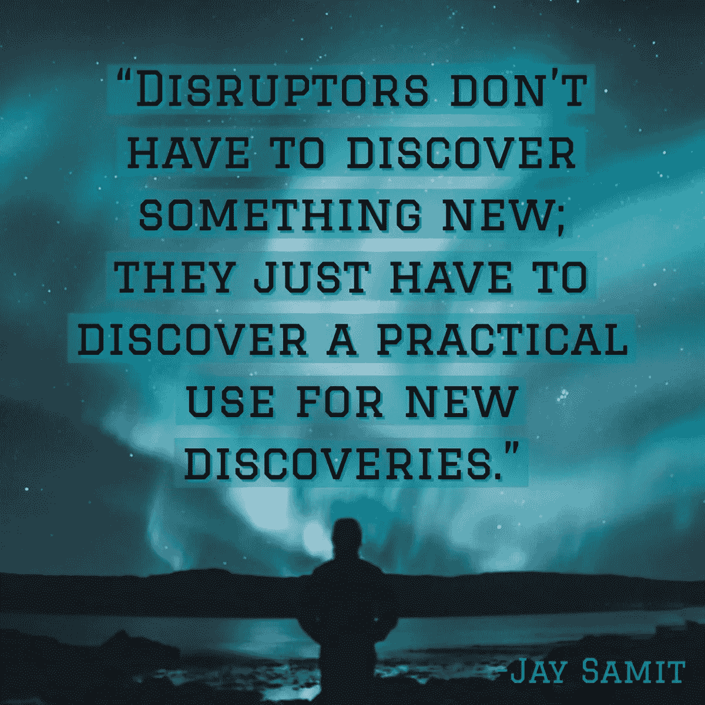
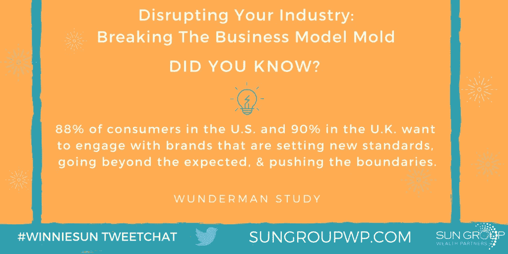
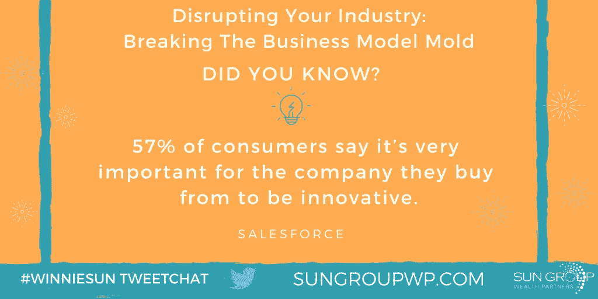
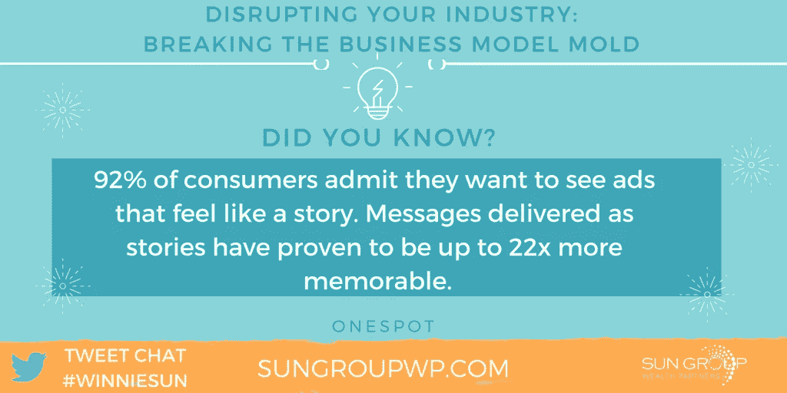
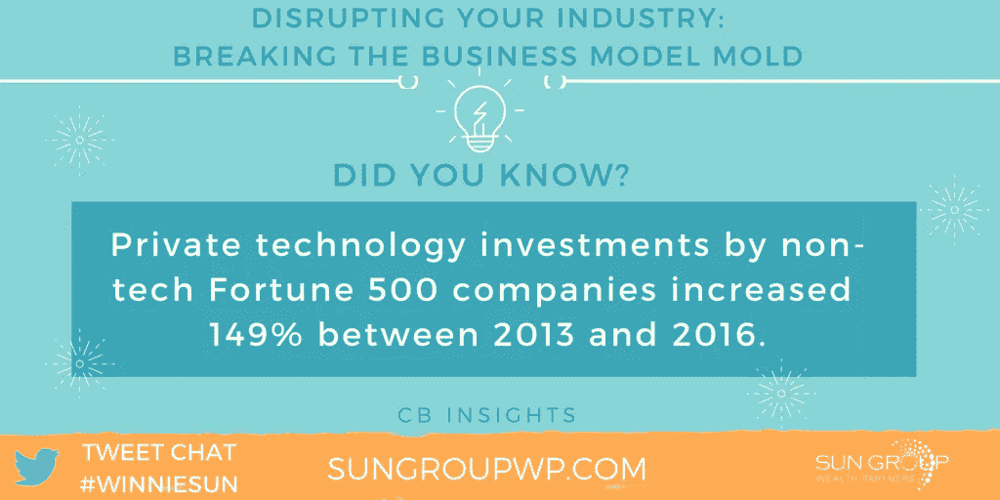
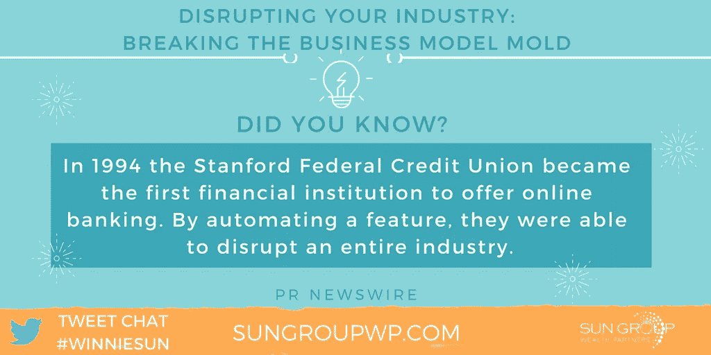
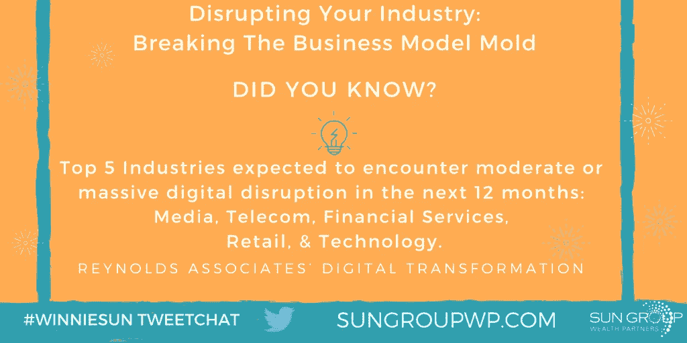
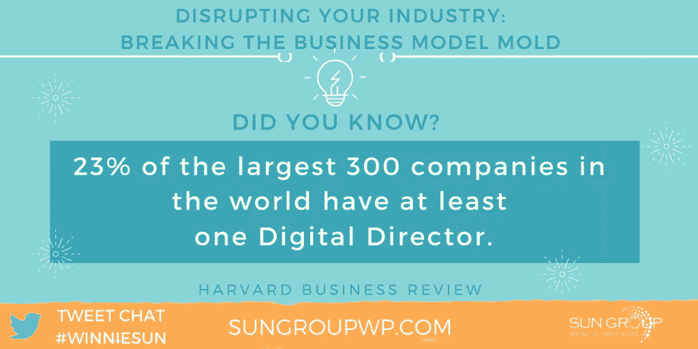

# 颠覆者为商业洗涤模具提供动力

> 原文：<https://medium.datadriveninvestor.com/disruptors-power-wash-mold-from-business-255e585e9a49?source=collection_archive---------24----------------------->

## 仅仅有一个伟大的想法就是创造力，而不是颠覆

竞争是商业最大的敌人。“这是我们一贯的做法”诅咒创新和动力。

[贾斯汀·西蒙](https://twitter.com/justinsimon)、[歌迪·陈](https://twitter.com/GoldieChan)和[温妮·孙](http://winniesun.com/about/)将没有这些。他们一起想要颠覆现状，打破模式，颠覆行业。

Simon 是初创企业和中型企业的营销和内容顾问。他还是体育博彩应用协议 FansUnite 的区块链团队的营销主管。

Chan 通过在 LinkedIn 上为她的顶级频道 Daily Goldie 创建视频来实践“有目的的社交媒体”，并为企业对企业和企业对消费者客户运营社交媒体策略。

孙是金融行业最受欢迎的专业人士之一。

 [## 不管是好是坏，做好数字革命的准备吧

### 无论您在线还是离线，业务过程都是脆弱的

medium.datadriveninvestor.com](/for-better-or-worse-brace-for-digital-disruption-34cd82b4fc20) 

颠覆是一种其他人没有想到的不同的做生意方式。幸运的话，当这个行业的其他人试图追赶时，你将站在最前沿。

“行业颠覆是指你改变了通常或传统的商业运作方式，”孙说。“这个词用得太随意了，但由于技术进步，肯定有令人兴奋的颠覆正在发生。”

西蒙也想收回缰绳。

“颠覆被应用得太自由了——而且经常是不正确的，”他说。“仅仅有一个伟大的想法并不是颠覆。是创造力。

西蒙说:“显著改变任何特定行业的商业运作方式——无论是人们的购物方式、消费方式还是长期参与方式——都是颠覆性的。”。

不要忽视这些区别。

西蒙说:“在你所做的事情上做到最好和真正的颠覆有着巨大的区别。”。“显著改善是一回事，而且是一件了不起的事情。但是实际的破坏并没有大多数人想象的那么频繁。这是很棒的营销术语，但并不总是真的发生。”

颠覆带来了不同的视角。

“要颠覆一个行业，你必须做一些让业内其他人都有点侧目的事情，”陈说。

# 好建议的好处

中断的机会因行业而异。

“在我的行业中，最大的颠覆机会是时间和良好建议的杠杆作用，”孙说。“人们需要投资，并将永远受益于好的建议。然而，由于技术进步和效率要求，这种建议的媒介和形式将会改变。

她表示:“现在和未来的投资者都希望增加透明度，并根据需求提供好的建议。”。

突破性技术本身就是颠覆性的。

“区块链技术还处于起步阶段，”西蒙说。“它有潜力成为真正的颠覆者。它可以改变政府互动的方式，改变我们跟踪和处理食品供应的方式，改变我们处理货币、数据、科学和数百个其他行业的交换方式。

“在我的区块链世界的小角落里，FansUnite 准备通过智能合约、透明度和分散数据来彻底改革体育博彩，”他说。

 [## 社会公共关系:称之为因果报应

### 网络和社交技术构建了商业社区

medium.datadriveninvestor.com](/social-public-relations-call-it-karma-1f21101ddfe5) 

公共关系也是时候进行重大变革了。

“公关需要大量的破坏，”西蒙说。"随着经销店的减少和编辑人员的减少，公共关系需要找到一种新的方法."

成龙致力于在线颠覆。

“我生活在 LinkedIn 和其他社交媒体平台上，”她说。“总是有机会成为早期采用者。我在 LinkedIn 上发布测试版视频时看到了这一点。拥有新功能的旧平台总是一个很好的组合。”

颠覆是有挑战的，比如让客户和公众接受你的想法。这是人们天生抗拒的改变。你可能会被视为傻瓜或专家。

“作为一个颠覆者，最大的挑战是改变的速度和成本，”孙说。“当你第一次尝试新事物时，你需要花更长的时间来理解挑战。

“很难说服其他人，他们需要尝试一些新的东西，直到它不再那么新了，”她说。“然而，这也为我们提供了一个机会，让我们能够尽早创建一个更好的、不同于以往的新平台、系统、体验或服务。”

# 制作案例

如果分裂是可联系的，那就更容易理解。

西蒙说:“作为一名颠覆者，最大的挑战是让人们相信你的想法是有价值的，是可以实现的。”“真正的颠覆者通常会在如此宏大的层面上思考，以至于大多数人很难看到可行性。”

也有意想不到的反应。

“在 LinkedIn 这样一个非常传统的平台上成为颠覆者是一件疯狂的事情，有时还很搞笑，”Chan 说。“我的客户通常都在寻找能给教育等古老行业注入新鲜空气的人。”

服务成本是一种干扰，尤其是对干扰者而言。他们必须计算出他们所提供的东西的价格。

“当客户或顾客看不到结果或投资回报时，他们很难对服务或顾问进行估价，”孙说。

“作为颠覆者，你可能需要在第一时间放弃你的业务，”她说。“展示你的能力，让下一个客户更容易定价。你能传递价值，价格自然就上去了。”

 [## 如何知道你的价格是正确的

### 当你是一家计算价值的企业时，挑战会成倍增加

medium.datadriveninvestor.com](/how-to-know-your-price-is-right-78ee160a8a32) 

金钱进入敏感领域。

“定价总是敏感的，”Chan 说。“我的持续预聘率远远高于单个研讨会或一揽子交易。我喜欢估算一桶时间，然后收取统一费率。我一直在用 fiverr Pro 做实验。

客户支持是颠覆者的关键。

西蒙说:“在定价之前，你通常必须帮助新客户理解现实的工作范围和时间表。”“你不能在第二天就改变他们公司的整个轨迹。

“那么问题就变成了:最终目标是什么？这是传统的投资回报率吗？是品牌吗？新客户群？不同的事物有不同的价值，”他说。"首先了解这一点，然后你就可以设定你的利率."

# 吹牛还是不吹牛

当扰乱你的行业时，不要炫耀你的成功。专业点。你以前去过那里——一直到银行。

“有时你需要炫耀你的成功来获得更多的关注，以吸引更多的投资者，”西蒙说。“并不是每种情况都是一样的。

"这将是一场艰苦的战斗。"他说。“你正在改变一个行业。你在打破常规。人们会联合起来反对你，因为你没有用“正确的方式”做事。但几年后，他们会成为你的顾客。"

颠覆者也必须付出努力。

“当改变传统的商业经验时，要意识到你需要比简单地采用现有模式更努力地工作，花更多的时间在研发上，”孙说。

“看看你所在的行业以外，看看什么在起作用，”她说。“看看你能否将其应用于你的行业。这可以为您节省时间和金钱。”

 [## 在混乱的时代保持业务的相关性

### 大多数高管不知道他们不了解的是什么

medium.datadriveninvestor.com](/keep-your-business-relevant-in-an-era-of-disruption-bde2fa2aa091) 

培养整个社区的支持。

“传统商业本质上是保守的，”陈说。“谦逊并享受作为颠覆者的创造性和社区建设的一面为我赢得了客户，而不是在社交媒体上不断吹嘘。”

孙说，新技术正在创造一种“现在”的文化。

“这意味着消费者的注意力持续时间更短，耐心窗口更短，需求更直接，”她说。“这意味着像我们这样的企业需要跟上时代的步伐。我们需要更聪明地工作，以满足客户的期望。"

# 颠覆的潜流

中断可能会蔓延到许多行业。

“你将看到金融技术的巨大变化，尤其是在抵押贷款和购房过程中，”西蒙说。“这包括建筑、卡车运输、货物和服务交付以及其他行业。

“在关于颠覆的对话中，大约有 3%的对话发生了真正的颠覆，”他说。"其余的都是空洞的主张和时髦的词语."

 [## 说出为什么你是人们可以信任的人

### 你的网上商业文化揭示了不加掩饰的真相

medium.datadriveninvestor.com](/tell-why-youre-the-one-who-people-can-trust-95397df40f14) 

政治也有明显的破坏性。

西蒙说:“当前的政治气候将导致真相颠覆的转变。”“某处有人正在研究一种方法，将事实与虚构分开。这将在整个经济中发挥巨大作用。

“通常，在技术对你产生影响之前，很难预见它会对你产生怎样的影响，”他说。“你可能听说过一些公司推出了令人惊叹的新产品和服务，但在你能够利用它们之前，你无法总是了解其影响。”

有趣的是，颠覆可以让旧的东西变新。

Chan 说:“新技术总是会破坏旧的业务——能够发送电报而不是纸质邮件。“能够适应并灵活处理你的商业想法总是有帮助的。

“我总是在尝试新的、有趣的技术，”她说。“谁会想到简短的垂直内容会以 Instagram 故事的形式缓慢回归？”

了解客户对于创造改进至关重要。这又回到了[在线和离线的主动监听](https://medium.com/@JKatzaman/strategic-social-listening-is-real-life-90c8a07b7c3f)。一旦你了解你的受众，并能解决他们的痛点，你就是黄金。

“我非常相信专注地倾听你的客户，调查你的社区，并跟踪你所在行业的其他人在做什么，”孙说。"最重要的是成为你所在行业和互补业务的终生学生."

# 该注意了

西蒙也是倾听的信徒。

“在社交媒体时代，每个人都在说话，”他说。“他们在说什么？他们的评论有多可信？你的客户也是其他公司的客户。他们想要什么？什么惹恼了他们？他们在给你答案。你只需要收听。”

Chan 主张始终倾听客户的心声。

“它们是你生意的基石，应该认真对待，”她说。"问他们正确的问题，给他们空间，让他们聪明地回答."

尽管看起来令人生畏，但[有可能与拥有巨额预算的大型企业](https://blog.markgrowth.com/get-your-2-cents-worth-marketing-on-a-budget-801786370414)竞争。

“由于社交媒体，小企业可以与大企业竞争，”孙说。“人们希望与真实的人做生意。通常，当你小的时候比大的时候更容易真实。

“当然，我们的预算更少——这将带来挑战——但我们总是更灵活，”她说。

# 用聪明的方式冒险

屈服于令人畏惧的困难是自我实现的。

“你必须有创造力，”西蒙说。“承担风险。如果你尝试做大企业做的事情，他们会花更多的钱来压垮你。你的目标必须是以最小的预算获得最大的响应。FansUnite 的口头禅:聪明地冒险。

“这意味着你需要尝试一些普通公司会嗤之以鼻的事情，”他说。“滑稽一点。离开墙壁。引人注目。你会疏远一些人，但通过关注和拥有自己的声音，你会收获更多。”

 [## 获得你的 2 美分价值:预算营销

### 以很少甚至免费的方式宣传你的业务

blog.markgrowth.com](https://blog.markgrowth.com/get-your-2-cents-worth-marketing-on-a-budget-801786370414) 

Chan 比较了预算规模:

*   大预算的优势:庞大的团队，付费营销活动。
*   大预算的缺点:团队内部膨胀，没有敏捷和前瞻性思维。

“预算较少的小公司通常必须更加努力，在预算支出上更具创造性，”Chan 说。"这导致更有新闻价值的营销和品牌."

中断不同于传统方法，但也有相似之处。

“我们的工作方式与传统的商业模式非常不同，”孙说。“我们一天的大部分时间都花在尝试新事物、调查我们的社区以及跟上技术和媒体的发展上。然而，金融业在很大程度上是一个传统的、受到高度监管的行业。”

传统企业赢得了自己的绰号。

“他们不怎么赌博，”西蒙说。“他们更喜欢稳扎稳打。我有一个客户想‘尝试所有的新事物’，但不会改变他们在任何社交帖子上的措辞、颜色、外观或感觉。”

# 屈从于现实

陈将新旧方式融合在一起。

“我还是老样子:我还是做传统的报告，”她说。“我试图在披露结果时保持一致性，即使是在全新的产品或平台上。

“我的工作方式与众不同:我更加灵活，思维更具前瞻性，反应更快，给出的解决方案也更具创新性，”她说。“我会想出一个解决方案来解决一个不一定是传统规定的问题。”

 [## 以颠覆对抗颠覆

### 当你为一个非常不同的未来做准备时，理解变化

becominghuman.ai](https://becominghuman.ai/be-the-disruption-to-fight-disruption-df7fe3c3f69f) 

营销也可能是破坏性的，必须证明自己的观点。

“颠覆性营销等于‘哇，这是从哪里来的？我不确定我喜欢这样。你从以前的例子中吸取了什么？“你会得到不相信，直到你开始得到结果，”陈说。然后你就有粉丝了。"

西蒙说破坏应该有一个计划。

“你想如何颠覆性？”他说。“你想成为耐克的科林·卡佩尼克活动吗——顺便说一下，它带来了 4300 万美元的免费宣传?”？你想通过疯狂来获得关注吗？破坏性可以是很多东西。

西蒙说:“通过成为先锋来打破常规。”。“成为第一个使用新技术的人，并承担它们可能不起作用的风险。但如果他们这样做了，回报可能是巨大的。”

破坏性的结果不会在一夜之间出现。

“你最初的破坏性营销活动可能不会击中你想要的所有受众，”西蒙说。“然而，关于这场运动的奖项、荣誉和文章的点击率可能比你想象的要高很多倍。中断可能需要时间，即使是在营销活动中。

“那些凌晨 1 点的想法会让你觉得，‘哦，我永远也不会提出那样的建议。’“提出这些想法，”他说把他们带到外面去。他们可能会变得伟大。"

# 收线

颠覆需要吸引消费者。

“在今天的营销世界里，体验很重要，”西蒙说。“你怎么能扰乱别人的日常生活，让他们与你的产品或服务互动？”

颠覆性领导者必须对自己的能力充满信心，并对自己的领域了如指掌。

 [## 如何管理优秀的团队和你自己

### 将合适的人放在合适的岗位上才能成功

medium.datadriveninvestor.com](/how-to-manage-great-teams-and-yourself-8e00bd56abb6) 

“成功颠覆的领导素质是渴望更好的东西、热情、乐观、忍耐、纪律和谦逊，”孙说。"他们必须比目前管理你所在行业的人更努力、更聪明、更专注地工作."

成功的颠覆者是持久的。

“真正的颠覆者需要是赌徒，”西蒙说。“他们需要脸皮厚、有骨气，并且愿意在每次听到‘是’的时候听到一千次‘不’"

很少有人会认为颠覆者是正常的——不管是新的还是旧的。

“颠覆者必须接受批评，习惯于接受成千上万的问题——坦率地说——非常奇怪，”陈说。“他们是有远见的领导者，在以前不存在的地方创造新的空间。他们带来了新的社区。”

**关于作者**

吉姆·卡扎曼是[拉戈金融服务公司](http://largofinancialservices.com)的经理，曾在空军和联邦政府的公共事务部门工作。你可以在[推特](https://twitter.com/JKatzaman)、[脸书](https://www.facebook.com/jim.katzaman)和 [LinkedIn](https://www.linkedin.com/in/jim-katzaman-33641b21/) 上和他联系。