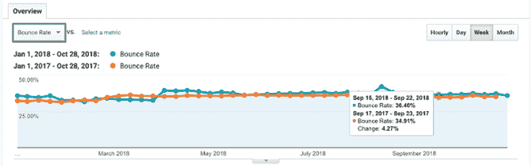

# 剖析电子商务跳出率

> 原文：<https://medium.datadriveninvestor.com/dissecting-ecommerce-bounce-rates-93225257cc78?source=collection_archive---------44----------------------->

我们经常听到这样的问题:“我的跳出率是好是坏？”总的来说，众所周知，低跳出率是好的，高跳出率是坏的，但实际情况远不止如此。让我们仔细看看电子商务网站的跳出率，但这里提到的许多东西适用于任何网站。让我们从头开始。

# 定义反弹

Google Analytics 将反弹定义为网站上的单页会话。这意味着用户在访问另一个页面之前进入并离开站点的会话，没有交互事件。*

# 定义跳出率

谷歌分析将网站的跳出率定义为没有互动事件的单页会话的百分比。单页会话除以所有会话会给你跳出率。

特定网页的跳出率是进入该页面的单页会话的百分比，即该页面的总跳出率除以该页面的入口数。

# 什么是好的跳出率？

这就是事情变得棘手的地方。你应该做的第一件事是看看你在很长一段时间内的反弹率。符合吗？在过去的一年里，它是逐渐(或急剧)增加还是减少了？当你逐年比较时会发生什么？

这个练习是为了检查你的反弹率的整体健康状况。如果您看到任何大幅下降或上升，那很可能是由实现问题引起的，稍后我将对此进行更多的讨论。感觉一下你的“通常”跳出率是个好主意。这样你就可以知道它是如何随时间变化的。大多数人希望看到他们的跳出率在接下来的一年里逐渐下降，这表明网站上的参与度越来越高。你会想知道 *x* %对于*你的*网站来说是不是一个好的跳出率。

*This year’s bounce rate, compared to the same time period last year, in the Audience Overview Report.*

除了比较一段时间内你的跳出率，你还可以与谷歌分析中的基准报告(受众>基准)进行比较。这里有一个很大的警告。你相信每个选择基准测试的人准确地代表了他们归类为**和**的行业，他们的实现是正确的(或者至少没有大的问题)。如果只是为了满足你的好奇心，这些报告仍然值得一看。

# 跳出率:数字

我知道你在想:“告诉我什么是好的反弹率。”对此不能全信，但这里有一些平均值是基于我们的团队在一系列电子商务网站上看到的。即使有一个大的样本集，网站也有不同的大小，驱动不同的流量，等等。使用这个尺度作为一个通用的标准，开始确定你的网站的跳出率。

**可疑:**
如果你的跳出率在 0-20%之间，或者 85-100%，我会持怀疑态度。可能有什么东西坏了。如果您在 0–5%的范围内，请检查以确保在页面加载时(或紧随其后)没有发送交互事件。这可能是自动播放的视频或照片转盘，或者页面上的滚动。或者你可能是双击浏览量，你会想立即修复。

如果你的跳出率太高(85-100%)，检查一下你的页面浏览量跟踪是否在你网站的很大一部分中丢失了。也请查看您的渠道报告，看看流量来自哪里。例如，你可能会发送大量的付费流量，而这些流量并不关心你的网站/业务。或者你的网站可能存在一些 UX 问题。如果你的跳出率对你的网站来说太高或太低(超出了正常范围)，调查一下以确认你的数据的准确性。这意味着如果你的网站一直有 60%的跳出率，突然下降到 40%，尤其是如果你没有做任何调整，检查数据。

**不好:** 70–85%的跳出率不好。它们不会立即表明某个东西坏了，但是某个东西可能坏了。如果你很擅长给你的网站增加流量，并且看到了会话的增加，但是跳出率更高，这是一个很好的机会来检查你的策略并做出改变。一会儿我会介绍提高你反弹率的方法。对于其他类型的网站来说，这可能是一个“还行”的跳出率，但对于电子商务来说，这不是一个好消息，因为在电子商务中，几乎任何 KPI 都需要比单次浏览量更多的互动。

**需要改进:** 许多网站的跳出率在 60-70%之间。我更愿意称之为“需要改进”这不是一个不寻常的跳出率。对你的网站来说，这甚至可能是“正常”的，这取决于你的网站做什么，以及你希望转化多少用户。如果你的跳出率在这个范围内，考虑积极尝试提高你的跳出率。(稍后将详细介绍这一点。)大多数电子商务网站都希望努力达到平均或高于平均的跳出率，不会满足于 60-70%的跳出率。

40–60%似乎是电子商务网站的平均跳出率，尤其是那些做了最少额外工作来维持用户进入网站时良好的 UX 并带来合格流量的网站。

**非常好:** 30–40%是很好的反弹率。这意味着*大多数*用户正在转向第二次浏览量或互动活动。大多数电子商务网站的目标是转换(购买)，购买可能需要一个以上的浏览量。一些产品也需要很长的准备时间，所以你可能期望为初次访问收集信息，这可能(希望)仍然包括每个会话的多个页面视图，以查看产品、产品描述、购物车等。你知道你的网站和它应该如何运作。但是，一般来说，电子商务公司通常寻求强有力的参与。

**非常好:** 如果你的跳出率在 20-30%的范围内，你可能已经采取了额外的措施来为你的网站带来合格的或目标明确的流量。您已经创建了一个易于使用的界面，具有清晰的导航和强大的搜索算法，可以为您的用户提供相关的结果和相关的内容。如果你以前没有做过任何事情来提高你的跳出率，我会有点担心你的跳出率是否在这个范围内。你可能会做一些分析，以确保它是准确的，没有任何损坏。但如果它是准确的，这是一个伟大的地方。

# 影响跳出率的因素

大多数跳出率在 20-80%之间。如果你在这个范围之外，可能有东西坏了。如果你在这个范围内，有很多原因可以让你处于顶端、底端或中间。这里有一些可能影响你跳出率的其他事情需要考虑。

**移动与桌面:**你的大部分流量是来自移动还是桌面？总体而言，移动业务的跳出率往往更高。

**外部链接:**如果登录页面的主要目的似乎是驱使用户点击你的外部链接(到你没有设置跨域跟踪的其他域，到你的社交媒体平台，到你的分支机构)，仍然“参与”你的品牌的用户可能会出现反弹。

**加载时间:**如果你的登陆页面加载时间过长，用户更有可能反弹。

**糟糕的 UX:** 流媒体音乐、流媒体视频、弹出窗口、门户页面、调查或糟糕的设计可能会导致更高的跳出率。用户不喜欢妨碍他们尝试的事情——他们不想在试图购买你的产品或服务时看到调查。

**某些页面/频道:**如果您将最差的跳出率缩小到特定页面或一组页面，您可能只需要对这些页面进行调整。或者你可能意识到最差的跳出率来自于一个特定的流量通道。如果你把流量导向一个登陆页面，但不区分合格和不合格的流量，这可能会导致高跳出率。

# 如何提高你的跳出率

你的跳出率基线现在可能是 60%或 45%。如果你的网站如何运作，用户通常如何与它互动，他们使用哪些设备等不切实际，那么追求 30%就不一定有意义。但是不管你今天的跳出率如何，你都可以采取一些简单的措施来提高它。(除非你已经有了 30%的跳出率。在这种情况下，为自己鼓掌，并考虑阅读[这篇有趣的博文](https://blog.metricstory.com/blog/future-of-ecommerce-5-ways-technology-is-changing-the-industry?utm_medium=ref&utm_source=medium.com&utm_campaign=bounce+rate+blog)！)

**AdWords:** 继续磨练你的网站的最佳关键词(品牌和非品牌)。为你的网站付费并带来大量的流量是很容易的，但是如果他们真的不想去那里也没关系。驱动*正确的*流量到你的网站会导致更低的跳出率和更高的转化率。

**改善你的登陆页面:**如果你在付费搜索中用不同的关键词为你的页面做广告，或者和网络上的其他广告一起做广告，一定要定制登陆页面，使它们与所展示的关键词/广告相关。如果你的元信息或文案表明了一个特定的产品或服务，确保你的用户到达他们期望的地方。

提高你的搜索引擎优化排名:看看你的搜索引擎优化策略——有时基础知识会被忽略。考虑在你的网站上创建相关内容(如果你还没有的话)来帮助你的 SEO 排名。更新关键词描述和元描述，在你的网站上使用内部链接，以更好地从谷歌索引。查找更多提高你的搜索引擎优化策略的快速技巧，或者向专家咨询。

**UX:** 糟糕的 UX 肯定会增加你的跳出率。一些主要的罪魁祸首包括网关页面(在进入之前需要一个电子邮件地址)或弹出窗口，流媒体视频和/或音乐，缓慢的页面加载，不合逻辑的网站设计(用户很难找到基本的导航，搜索等。).用户倾向于从 UX 差的网站快速跳转。

缩短页面加载时间，确保你的搜索栏易于定位(在手机和桌面上)，避免自动播放音乐和视频，抵制包含门户页面、调查或其他类型的弹出窗口的冲动。这些[网站优化](https://blog.metricstory.com/blog/5-best-practices-for-optimizing-your-ecommerce-site?utm_medium=ref&utm_source=medium.com&utm_campaign=bounce+rate+blog)将有助于降低你的跳出率，增加你的收入。

# 这个故事的寓意

我们关注的基准 KPI 之一是跳出率。如果它在任何时候上涨或下跌，它可能已经坏了。如果它很高(70-85%)，努力改善它。如果很低(30–40%)，确保数据准确。

随着时间的推移，记录你的跳出率，特别是如果你正在做细微的调整来提高它。要知道你的跳出率对你来说是好是坏，把它和以前的时间段进行比较。许多网站在很长一段时间内都停留在同一个范围内(除非他们对自己的网站、登陆页面、加载时间、广告策略、搜索引擎优化等做出改变)。).如果你知道你的跳出率通常是 62-63%，而这个月下降到 55%，这应该会促使你分析你的数据，试图找出原因。使用您的数据(像 [Metricstory](https://metricstory.com?utm_medium=ref&utm_source=medium.com&utm_campaign=bounce+rate+blog) 这样的解决方案会有所帮助！)不断做出明智的渐进式改变，以降低跳出率并吸引客户。

记住，你真正关心的不是跳出率，而是参与度。你希望你的客户参与你的品牌和产品，最终转化为收入。你的网站把你和你的客户联系起来，让他们和你联系。

******* *如果你的站点上实现了事件，并且将它们设置为“非交互=假”，那么带有交互事件的单页访问不会被认为是退回，因为你的用户在那里的时候参与了站点。如果他们访问了页面，但实际上没有做任何其他事情(或者如果他们访问了，或者如果任何触发的事件都被设置为 non-interactive=true，则您没有跟踪)，则该会话将被视为退回。弹跳将有一个单一的浏览量，会话持续时间为零，没有互动事件。*

*最初发表于*[*blog.metricstory.com*](https://blog.metricstory.com/blog/dissecting-ecommerce-bounce-rates)*。*