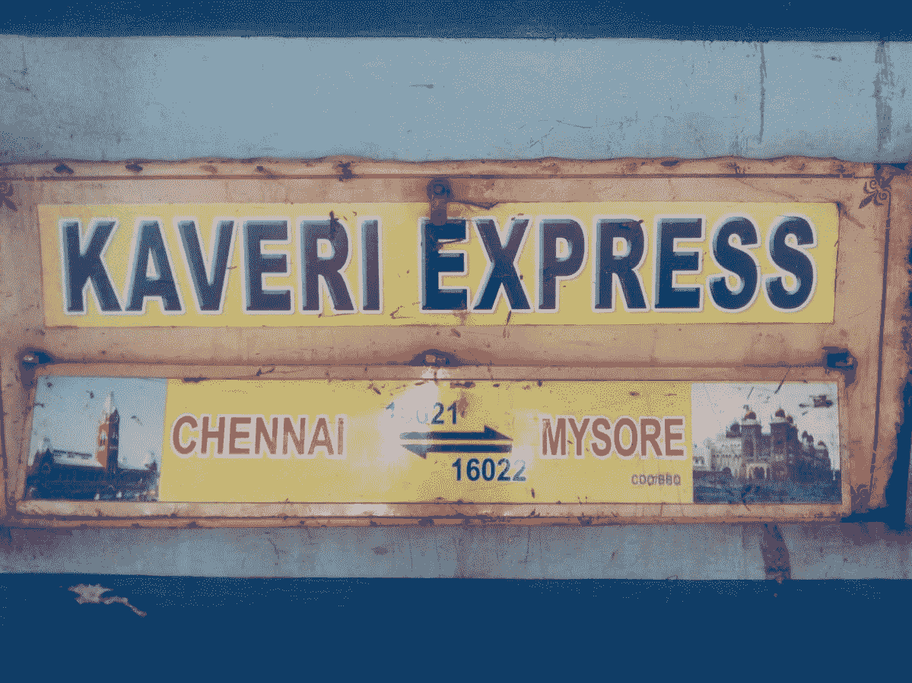
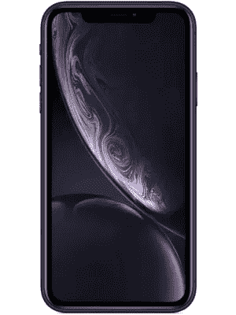
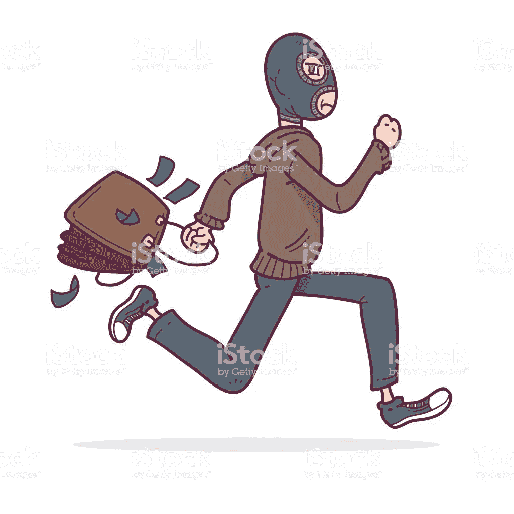
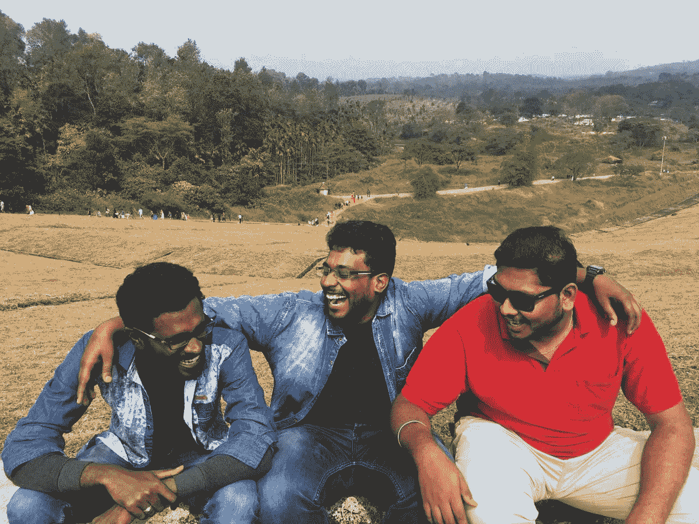
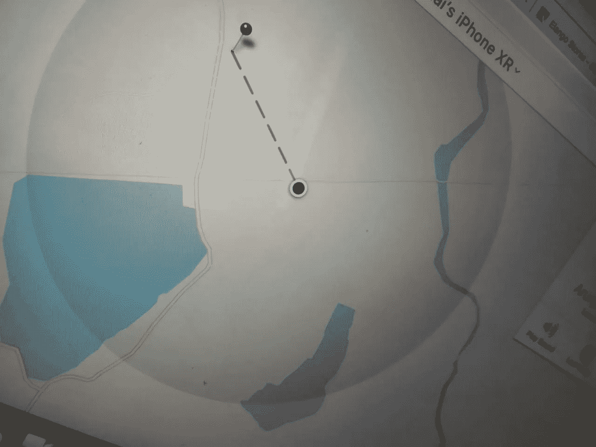
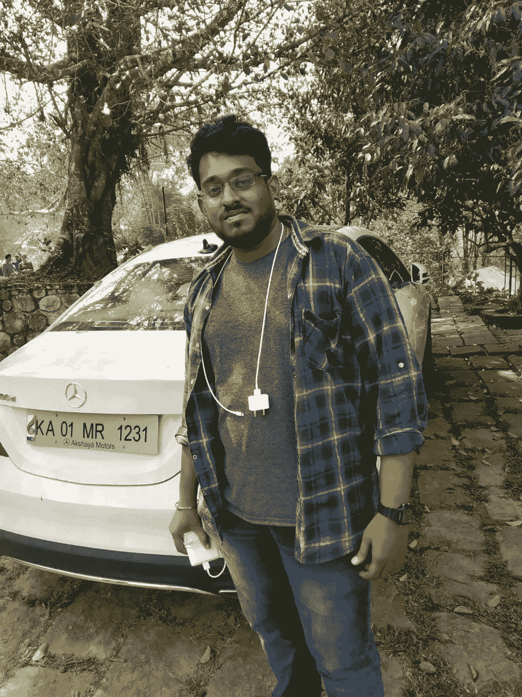

# 扭曲的梦

> 原文：<https://medium.datadriveninvestor.com/distorted-dreams-3ac9b6129538?source=collection_archive---------7----------------------->

十二月记得我们关于一个长周末，朋友聚会，旅行。我们不是这方面的特例。我们计划乘坐 tempo traveler 从班加罗尔前往喀拉拉邦的 Wayanad。这次旅行持续了 3 天。

自 2014 年以来，我们经常在这种旅行中与朋友一起庆祝年底和年初。

在旅行开始前，我打电话给司机，告诉他接车时间是 12 月 29 日凌晨 4 点。我的一些朋友将参加这次旅行，他们来自钦奈。

最艰难的道路总会有一个美丽的结局。在接下来的三天里，同样的事情发生在我的朋友 Arunjunai 身上。

Arunjunai 和其他人于 12 月 28 日晚上 9 点从钦奈中央火车站乘坐 Kaveri Express 开始了前往班加罗尔的旅程。

kaveri express train

两周前，Arunjunai 一次性购买了价值 7.9 万英镑的新 iPhone XR。他花了自己 6 个月的积蓄买了这部手机。

Apple iPhone XR

每个人都对这次旅行感到兴奋。

因为每个人都要分享他们的感受，好事，坏事都发生在 2018 年。我对以下事情感到兴奋

> 我要告诉你我过去 6 个月的健身经历。
> 
> ‌:我将在 whatsapp 上更改我的 DP，这将从 Arunjunai iPhone XR 中捕获

回到火车上，他们对这次旅行非常兴奋，他们喜欢互相拖拽，arunjunai 坐在 s6 车厢的靠窗座位上，他正在用他的 iPhone XR 给其他人拍有趣的照片。

Funny photo of my friend when he was on sleep captured by arunjunai

现在火车正穿过阿拉康南站。，韦洛尔。下一站是 anvarthikanpettai。它的小站列车将停止 2 分钟。

火车停在 anvarthikanpettai，Arunjunai 坐在靠窗的座位上。火车开始慢慢移动。

突然，有人从窗外抢走了他的手机，他跑开了。

Visualizing the thief running after the snatch

一秒 Arunjunai 惊呆了，他想不出该怎么办。火车已经开始高速行驶，阿鲁纳伊下不来了。

朋友和 arunjunai 拨打 180 向铁路警察通报了盗窃事件。

他们在火车上通知了铁路警察，他们说你可以投诉，并把他们的电话号码给了 arunjunai。

Arunjunai 暴露了自己的感受。

Arunjunai 的朋友开始搜索如何追踪 iPhone。不知何故，他们知道如何追踪 iPhone。

有一个名为 **find my iPhone** 的应用程序，可以在丢失或被盗的情况下帮助搜索我们的 iPhone 手机。

下面的[链接](https://www.icloud.com/#find)会有用

但是 iPhone 应该处于以下状态

1.它应该与互联网连接

2.手机应该至少有 2 %的电量

3.手机不应该关机

4.苹果账户应该与你丢失的账户相匹配

Arunjunai 开始使用这个应用程序，但他的坏时光小偷没有打开 iPhone。Arunjunai 失去了希望。

他通知了他的父母，他们感到很难过

Arunjunai 担心他们父母的感受。他非常内疚。

列车于 12 月 29 日凌晨 4 点到达班加罗尔 KR PURAM 车站。他们通知了班加罗尔的 RPS，他们说要去 majestic 车站提出投诉。为了做到合规，他们需要 IMEI 号码。但是 arunjunai 把所有的文件都留在了他在钦奈的公寓里。然后他们决定在网上注册 compliant，继续我们的旅行。他们使用下面的[链接](http://www.coms.indianrailways.gov.in)来提高在线合规性。

他们打电话给我。那个为这次旅行预定电话号码的时间旅行者司机关机了。所以我去车站骑车接我的朋友到我的公寓。当我回到公寓时，我的朋友向我解释了这件事。我大吃一惊，开始骂 arunjunai。

我们在早上 5:45 到达我的公寓，开始讨论这件事。为了在线投诉，我们需要 IMEI 号码。我们通知了在钦奈的其他朋友，他们把详细资料发给我们，我们进行了登记

我为这次旅行预订的旅行者遇到了意外。他们说我们不能来一趟。不好意思！我们正要放弃这个计划，但是我们仍然在讨论这个事件。

> 这一连串糟糕的事情折磨着我的心灵，同样，每个人都以自己的方式感到不安。

同时，他丢失手机的地方位于我的家乡。我告诉阿鲁纳伊我们会努力的。我们开始在网上探索。

Arunjunai 再次在我的 Mac 笔记本电脑上打开了“查找我的 iPhone”应用程序。

Arunjunai 已经做了设置，如果他丢失了他的手机，它会自动锁定，并弹出紧急号码呼叫。小偷在上午 8:30 打开了电话

小偷误按了弹出的紧急号码。我的一个朋友 kalaiyarasan 的号码。我们立即查看了追踪应用程序，它开始显示小偷目前所在的位置。

同时，我们有一个朋友 hanish 他的父亲是**司(副巡视员)**我们通报了这次跟踪的细节。哈尼什决定去那里。所以他将在上午 9:30 从钦奈出发。

一个小时后，小偷再次关掉了开关。我们无法追踪它是否关闭。

来到我公寓的所有朋友都在讨论 ***现在做什么*** ？

我们很快计划了一些事情，以便我们可以从第二天 12 月 30 日起继续我们的旅行，我和 arunjunai 将去 KATPADI 火车站登记投诉。

有趣的是，我将这次行动命名为**任务 ARUNJUNAI:**

我订了一张火车票。

我和 arunjunai 开始向 KATPADI 行进。乘公共汽车从 katpadi 到 anvarthikanpettai。在火车上旅行时，RPF·阿拉康那姆的巡官打电话给 arunjunai，询问这一事件。阿鲁纳伊认不出小偷的脸、衣服颜色、身高体重等等。他对小偷简直是视而不见。RPF 检查员说你会在火车上拉**链条**。但是 arunjunai 没有。最后，一名检查员说先在 katpadi 站登记投诉。

现在，哈尼什来到了 anvarthikanpettai 警察局。警察告诉控制这个地区的 katpadi 站你应该去那里，他说要拿回你的 iPhone 不容易。所以试着忘记它。Arunjunai 失去了希望。火车于下午 1 点 50 分到达 katpadi 站。

我们去了 Katpadi 政府铁路警察局(GRPS ),他们询问了这一事件。

我们告诉 katpadi **SI ezhil** 关于这个追踪细节和位置。但是他们不准备去那里。他说我们无法追踪你的位置。他说我们会通知 Vellore 的网络安全团队，他们会通过 IMEI 号码找到。所以你应该解除丢失模式锁定。

我问警察局长，如果我们再次收到警报，我们该怎么办？

他回答说如果装置开启会通知我们。我们会小心的。我们会派人去各自的地点。阿鲁纳伊有一些外部影响。他们极力争取得到 FIR(第一信息报告)。因此，卡特帕迪·GRPS 的**检查员**变得紧张起来，他说你需要 FIR 还是电话？你为什么推我们？我们将提交一份初步调查报告，并将您的案件 ***搁置，这样可以吗？*** 审查员的行为对我们来说是**恶劣**。我们只是站着听。最后，检查员告诉解锁您的手机，直到我们无法获得。Arunjunai 也是这么做的。

我们预订了从卡特帕迪到班加罗尔的火车，在 12 月 30 日凌晨 12 点 30 分到达我的公寓，两手空空。

我们和 arunjunai 开始了旅行。凌晨 2 点 30 分从班加罗尔出发，我们在上午 9 点到达 Wayanad。早上 arunjunai 拿到了他案子的第一份报告。阿鲁纳伊带着他的假笑开始享受旅行。他内心有一种无法解释的感觉。

Fake laugh of arunjunai( Center person is arunjunai)

在 wayanad，我们已经游览了以下地方 *kuruva 群岛、Basura sagar 大坝、Meenmutty 瀑布、Pookada 湖、Soochipara 瀑布。*

在涵盖了所有这些地方之后，我确认了 ***喀拉拉邦是神自己的国家***

日落之后，我们前往酒店。现在时间是晚上 7 点 30 分。

又有一个来自 iPhone 的未接来电打给了那个紧急号码。Arunjunai 打开 find my iPhone 应用程序，开始跟踪号码。同样，该设备位于相同的位置。他马上通知了**日芝**和**日芝**说我们会派**捕头**去那个地方。

警察的名字是 **munisamy** 。他住在跟踪地点附近。

我们被 4 个人围住，看着小偷的动静。Arunjunai 得到了那名警员的联系电话。Arunjunai 开始解释设备的位置和移动。警察说我会在 10 分钟内到达目的地。现在时间是晚上 8 点 10 分。接下来的一个小时将会是一场惊悚片。

康斯特布尔到达了那个地方。Arunjunai 解释了如何通过 WhatsApp 分享他的直播位置。康斯特布尔积极地倾听并遵循阿鲁朱奈的指示，阿鲁朱奈准备重新定位。

> 当印度和巴基斯坦板球比赛时，印度需要 6 个球 10 分。多尼在罢工。我们都寄希望于多尼。
> 
> Arunjunai 的情况也是如此。他希望那个小偷会被抓住。
> 
> 但最糟糕的是，如果多尼跑了，我们会失去希望。同样，小偷又关掉了。iPhone 进入了不可追踪模式。

所有人都处于****lub tub lub***的情况。*

*阿鲁纳伊告诉了警员手机的最后位置，他说小偷确实关机了。阿鲁纳伊说你离那个地方很近。直走，然后右转。但是治安官说我住在这个地区。如果我进去就不好了。所以他又安排了一个值得信任的家伙。*

*警员 **munisamy** 和 **karthik** 站在设备失去最后连接的街道上。*

**

*Distance between police and thief*

*Karthik 进入那条街，arunjunai 正在告诉路线。Karthik 正站在小偷的确切位置，我们从寻找我的 Iphone 应用程序。卡希克向警员穆尼萨米报告了那个小偷回家的事。然后警员**穆尼萨米**说**卡提**回来了。*

*警员 **munisamy** 说我们有**嫌疑**小偷 **X** 人在 **70%** 。但是没有确认我们不能采取任何行动。警官说要跟踪这个设备，如果它已经连接上了，就立刻通知我。警员 **munisamy** 说我会将**嫌疑人**X 人的情况通报给**斯娥芝**。将根据他的建议采取行动。*

*康斯特布尔**穆尼萨米**在唱歌。*

*阿鲁纳伊感觉自己拿不到手机了。我和其他人开始享受酒店里的派对。我们点了营火，棒极了。*

*Arunjunai 意识到他应该为那部 iPhone 买保险。当他从展厅购买 iPhone XR 时，他没有购买保险。如果早就拿走了他可以索赔。时间差不多是 12 月 31 日凌晨 1 点——午夜。我们所有人都感到昏昏欲睡。所以我们去了一个房间睡觉。*

*早上我们接到司鄂志的电话，他说我们抓到了 T2 的罪犯。**怀疑 X** 人就是小偷。我们拿到了你的手机。我们会把你手机的照片发给你。*

*那一次 arunjunai 在深度睡眠中。阿鲁纳伊从床上爬起来，通知我们找到了你的手机。阿鲁纳伊现在很幸福。他在幸福中飞翔。*

*为了确认您的电话，我们需要 IMEI 和账单文件。Arunjunai 说我可以解锁我的手机，我可以触发闹钟声音。阿鲁纳伊做到了，警方确认这是阿鲁纳伊的电话。*

***斯埃日勒**说今天(12 月 31 日)来见 GRPS。但是 arunjunai 说我在 Wayanad。我明天(1 月 1 日)来。SI ezhil 说 1 月 2 日来吧，我们会在 Katpad Railwat 站**法庭**前交出你的手机。*

*Arunjunai 非常感谢他们。*

*找到他的手机后，我能看到他的幸福。他将在 1 月 2 日去 katpadi 拿回他的手机。*

> *在前面我提到过最艰难的路线会在一个好的目的地结束。阿鲁纳伊就是这样。*

**

*Arunjunai*

*Arunjunai 将带着他性感的 iPhone XR 开始新的一年*

****技术永远是福音。我们尝过了。****

*希望这可能对某个人有帮助。*

*感谢阅读。*

*新年快乐。*