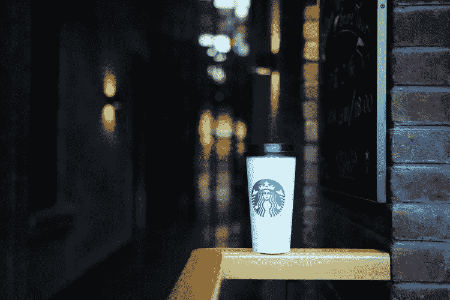
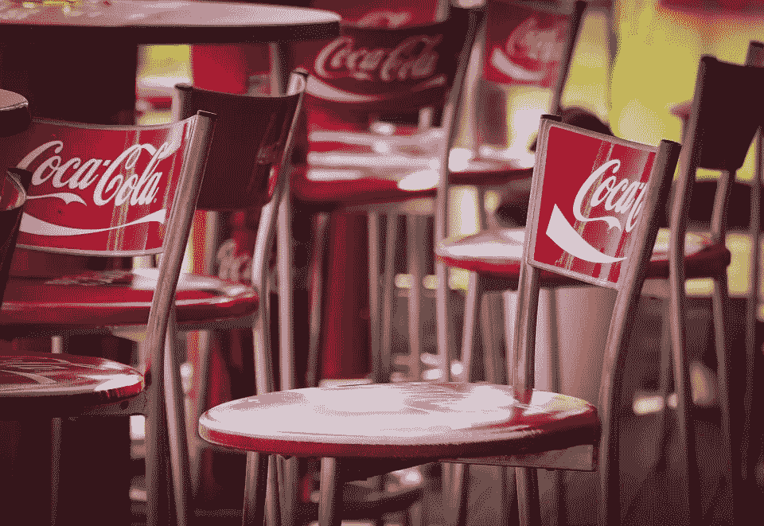

# 2019 年抛弃品牌忠诚度

> 原文：<https://medium.datadriveninvestor.com/ditching-brand-loyalty-in-2019-d7c0a9f268a8?source=collection_archive---------3----------------------->

## 我们是真的忠于流行品牌，还是只是懒得去寻找替代品？

Image credit: @kennyluoping on Unsplash

*Bzzzzt。*

我喜欢被来自威瑞森的短信叫醒。

是的，我知道是时候付钱了。我喜欢每月花 140 美元买一部手机，每次用几分钟，一天用几次。一部比电脑还贵的旧手机。我尤其喜欢一天中有 3 到 4 次我没有信号的时候——尽管如此，在纽约市，那里应该不缺乏手机服务。但是，嘿，威瑞森是最好的，对不对？上帝禁止我切换到竞争对手，并经历服务问题，对不对？

在过去的几年里，我已经数十次考虑过更换运营商。许多其他运营商以半价提供无限数据和同等覆盖。

*为什么我还没换呢？*

是不是害怕错过好的服务，即使我实际上没有体验过好的服务？难道我就是懒得货比三家？也许我担心想象中的人在我手机左上角看到大都市而不是威瑞森时会说些什么？

# 我需要一个特定的品牌，以防万一。

以防万一什么？

我最近不得不买了一台电脑，[，在家里度过了一年没有互联网和技术的日子。](https://medium.com/@kerisavoca/what-happened-when-i-cancelled-my-home-internet-1bbf834f7c50)

我的思考过程:

> 我可以花 1300 美元买到 Macbook Pro，或者花 200 美元买到 Chromebook。我只需要访问一些网站，检查电子邮件，使用一些编码工具。我可以用 Chromebook 做到这一点。
> 
> 我是说，不。没有苹果电脑我可能做不到。所以我只要花 300 美元买一台二手苹果电脑。我用 Chromebook 做不到这一点。你说真的吗？CHROMEBOOK？太便宜了。肯定不行。我需要一台苹果电脑。

在这种情况下，我找到了一种绕过支付全价的方法，并以零头的价格得到了我想要的品牌，但为什么呢？为什么用 4 年的 Mac 比新的 Chromebook 更适合浏览互联网？

# 品牌忠诚度是个笑话。

看啊。2018 年了，各位。快 2019 年了。威瑞森绝不可能是唯一一家能够提供手机覆盖的公司。苹果绝对不可能是唯一一家能够制造正常运行的电脑的公司。无论你现在为[x]工作的是哪家公司，都不可能是唯一能做他们正在做的事情的公司。

## 有人先做了不代表他们做的最好。

你拿优步，因为，你知道，这是优步。这是默认的。但是有没有可能另一家拼车公司也在你所在的地区有司机呢？有没有可能其他拼车公司的司机会像优步的司机一样载你去目的地？

你买亨氏番茄酱是因为它是亨氏。你不想冒险买劣质番茄酱。但是有没有可能其他人也能混合西红柿、醋、盐和香料，做出更美味的东西呢？

有没有可能另一种品牌的外套比 North Face 更保暖？还是 North Face 是唯一知道如何制作保暖夹克的*公司？没有其他公司发现夹克制作的秘密吗？*

Image credit: birgl at Pixabay

是时候转移我们的视角了。

那些 300 美元的运动鞋仍然在雨中淋湿。

那个 100 美元的 iPhone 保护套在长时间使用后还是会变黄。

塔吉特百货的微波炉仍然可以加热你的食物。你的食物不会因为你用了名牌微波炉而变得更好吃。

离你不远的那家当地小银行提供免费的支票和储蓄账户，没有最低余额，没有费用，还可以报销自动取款机的费用——而且你可以在网上注册。他们昂贵的透支费和最低余额要求，你真的需要用大通吗？难道*没有其他银行*可以保护你的钱的安全，让你存款，支付账单，使用自动取款机吗？

一个非品牌的吸尘器仍然会吸走碎屑。你的脏东西不会从非戴森牌吸尘器上跑掉。

Stay away from me, you cheapskate! I only go into Dyson vacuums!

# 对一个品牌保持忠诚的唯一原因是他们给你(或你周围的社区)一些有价值的东西作为回报。

1.  品牌忠诚度对于奖励信用卡这样的东西来说是有意义的。如果 X 公司给你所有购买的 3%的现金返还，而 Y 公司什么都没给你，那就继续吧——忠于 X 公司，领取这些奖励。
2.  如果你的健康受到威胁，品牌忠诚度是有意义的。当然，如果你对某个品牌的药物过敏，不管是出于什么原因，都要忠于那个不会让你生病的品牌。
3.  如果客户服务如此令人难以置信，以至于不值得尝试另一个品牌，那么品牌忠诚度是有意义的，因为产品的任何缺陷或故障都将得到免费的紧急处理。
4.  如果公司支持慈善事业或与你心灵相近的道德观点，品牌忠诚度是有意义的。

但是那些不给你(或你周围的社区)任何回报的公司呢？

## 有时候是钱的问题…

威瑞森:140 美元一个月
MetroPCS:60 美元一个月同样的套餐
*你的手机还能用吗？你还有无限的数据吗？MetroPCS 的费用似乎没有威瑞森高。*

优步上班:22 美元
Via 上班:10 美元
*你还准时上班吗？顺便说一下，Via 的等待时间比优步池短。*

名牌钢笔:$5
一元店钢笔:$1
*你是否经常使用钢笔以至于需要专业钢笔？你会认真地使用你的钢笔直到没有墨水了吗，或者你会在几天后丢掉它们吗？顺便说一句，有些便宜的笔可以永久书写。*

电镀:每餐 12 美元
家庭厨师:每餐 6.99 美元
*它还是美味的送餐套装吗？他们还会把预先包装好的配料带到你家，让你马上就能做出好的食谱吗？*

大卫茶的蝴蝶茉莉绿茶:每磅 179 美元。
相同茶叶的仿制版本:价格减半。
*真是。的。一样。东西。从。的。一样。植物。从。的。一样。地点。*

## 但有时，它是关于偶然发现一个比你一直使用的更好的产品或服务。

我曾经做过音响工程师和设计师。我有各种各样的花哨设备，而且我非常忠于我最喜欢的品牌。我绝不会拿我的声誉冒险，选择那些在现场表演或在客户面前可能会出故障的非品牌设备。

我记得我价值 300 美元的森海塞尔耳机坏了，我需要快速更换。我在亚马逊上买了一副 V-MODA 耳机来度过周末。我没有再买一副森海塞尔耳机，而是买了 5、6 副 V-MODAs，用了好几年。

还有那个我以为永远不会出故障的花哨设备，因为它来自一个知名品牌——好吧，我相信你知道其余的。

# 在对一个品牌保持忠诚之前，问问自己为什么要这么做。

选择以下选项之一:

1.  这是唯一满足我需求的*品牌。我百分百确定。*
2.  我懒得去探索其他的选择。取消订阅或服务，换成新的，很烦。
3.  我担心如果人们看到我选择不同的品牌会怎么想。
4.  我已经知道这个品牌了，所以我不妨继续使用它。我不想得到一个劣质产品。而且，你知道…自动装运。

如果你选择了第二、第三或第四个选项，我建议你仔细看看你一直无缘无故使用的品牌，并寻找替代品。你永远不知道——你可能会找到更适合你的工作。如果你碰巧存了一些钱，就当是对你花时间做研究的回报。