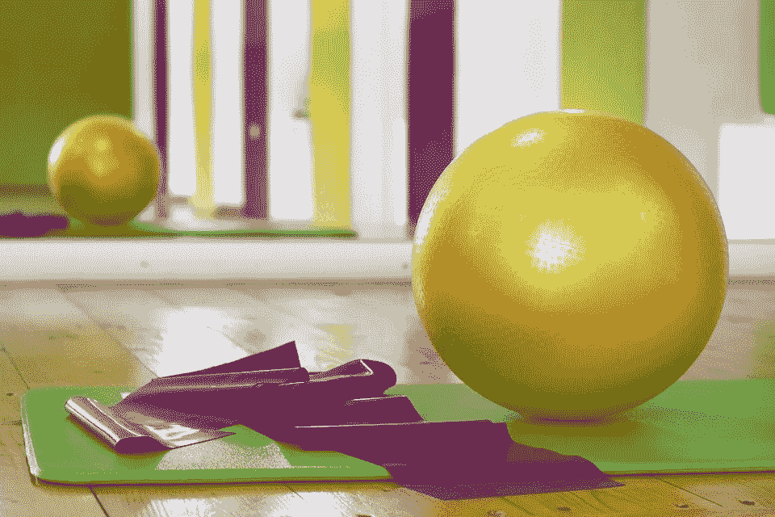

# 抛弃父母银行

> 原文：<https://medium.datadriveninvestor.com/ditching-the-bank-of-mom-dad-58ad17c2d9f5?source=collection_archive---------8----------------------->

就像我说的，财务自由对不同的人有不同的含义。考虑到这一点，我认为应该从底层开始，一步步往上走。

Ready to earn your own money?

所以，你刚刚离开学校过暑假，你想为那次棒极了的旅行付钱，或者你只是想能够自己出去？就业世界看起来似乎势不可挡——尤其是当你考虑到有那么多人在争夺*同样的*工作时。那么，你在应聘时需要特别注意哪些技能或要求，哪些工作会给你最高的投资回报呢？

首先，在让应用程序流动之前，看看你需要考虑什么是很重要的。

让我们来看看。

# 位置

需要爸爸妈妈载你一程吗？太远不能准时上班？经济距离？

这些是你在递交申请前需要考虑的问题。从经验来说，在寻找受欢迎的工作时，这可能是一个数字游戏，所以如果你的热情很高，那是一件好事——但要小心，不要低估位置的重要性。能够轻松、无压力地去上班是至关重要的，不仅仅是因为你真的能去上班，还因为你工作的时候心情会更好，这是你表现的关键。

# 日程安排

不用动脑筋，对吧？不完全是。

虽然这看起来很容易，但却很容易被忽视。想想你的其他承诺(比如你忘了参加的暑期班)。这些会妨碍你在特定时间工作吗？在日程安排方面，你有多大的灵活性？大多数企业都会在应用程序上有可用性部分，但是在你在应用程序上触发 happy 之前就已经计划好了。如果你想同时出现在多个地方，你可以找到一条州界线，然后在那里闲逛，否则你将面临挑战。

# 个性

虽然这可能不是你需要考虑的最重要的特征，但它仍然很重要，我会告诉你为什么。

你是一个善于交际的人，一个真正的社会存在，在一个被人包围的环境中茁壮成长，你想被困在一把椅子上没有社交活动吗？虽然这没什么错，但重要的是要明白，你不必简单地接受*任何摆在你面前的*工作，你确实有一个选择。试着找一份与你的兴趣和喜欢很匹配的工作，你会表现得更好(在那里的时候也不会那么讨厌你的生活)。

# 经验

体验？那是什么？我是个学生，你指望我有什么经验？

你问过自己这些问题吗？

这种感觉并不罕见，不仅是在青少年时期，甚至在成年以后也是如此。不过不要担心——经验有不同的形式和大小。

如果这是你的第一份工作，与其纠结于你没有你可能认为你需要的经验，不如想想你 T2 有哪些与你申请的工作相关的经验。例如，如果你想从事零售业，你在学校里做过什么能帮助你发展技能的事情吗？可教性是一个人开始第一份工作时最重要的能力之一，如果你能以积极的态度倾听和学习，不管过去的经验如何，你都可以成为一名优秀的员工。

经验并不总是意味着你做过的工作，有时最好的员工是那些没有经验的人。

现在这个问题已经解决了，让我们来看看你能找到的 7 个最好的工作。记住——仔细阅读这份清单，想想什么最符合你的个性，你确实有选择，你不想每天早上醒来想到工作就恶心。

Let’s dive in!

# 1.咖啡师

Learn how to make a mean cup of coffee

没有什么比早上的咖啡味更好闻了！或者午餐时间，或者晚上，嗯，任何时候都没有咖啡的味道，对吗？所以你不想每天都被这些包围吗？

你当然会。

**如果**这样做

你喜欢喝咖啡，喜欢和咖啡馆里的常客说话，想学着倒一杯完美的咖啡。你有很好的机会成为一个咖啡势利者(如果你愿意的话)。或者，如果你想在服务行业积累一些经验，但年龄还不到调酒的年龄。

**如果**不要这样做

你不喜欢早班。情况并不总是这样，但是许多咖啡馆和咖啡店会要求你很早就去上班。如果你是一个早起的人，这可能是最适合你的，但如果像我一样，你在早上更像一个僵尸，一定要知道你在注册什么。

# 2.健身房或瑜伽馆前台助理

Gym and yoga studio’s will often offer perks with employment

吸气…呼气。热衷于照顾自己的身体，放松自己，或者寻找自己内心的“禅”？

嘣。你被录用了。

这可能没那么简单，但在健身房或瑜伽馆工作是获得一些办公室或管理经验的好方法，同时让自己沉浸在积极的环境中。我的妻子最近开始兼职工作，协助清理和维护一家瑜伽馆，该企业能够为她提供免费会员资格！如果你问我的话，我觉得这是很棒的福利。

**如果**这样做

你喜欢健身。无论是跆拳道、举重、有氧运动还是瑜伽，健身房和工作室通常会提供额外津贴，如免费会员或设备和课程的费用。不管怎样，能够在同一个地方工作和锻炼是非常酷的。

你喜欢舒适地工作。大多数健身房会要求统一着装，嗯，运动服。没错，你可以穿着运动裤去工作！谁不想要这份工作？！

你喜欢被友好的面孔包围。健身房里到处都是“享受生活”的人。没有什么比通过锻炼来释放压力或忙碌的工作更好的了。

**不要这样如果**

**你不想和人打交道**。如果你喜欢闭门造车，或者喜欢在安静的环境中与更小的群体打交道，那么这个可能不适合你。

想要灵活的工作时间。许多健身房或工作室可能会给你灵活的时间表，但统计数据显示，许多人喜欢在早上锻炼，显然下班后会更晚。如果你不想在这些高峰时间工作，更轻松的时间表可能更适合你。

# 3.女招待/服务员

Tips tips and more tips!

这是陈词滥调“还清我的学生贷款”的工作！嗯，虽然这可能是真的，但做一名女招待/服务员还有很多事情要做。我的妻子做了 5 年多的服务员和酒保，在此期间，她建立了一些最强的个人和职业关系，至今仍保持着。

**如果**这样做

你喜欢赚取额外现金的机会。小贴士！你的顾客会成为你最好的朋友(不仅仅是因为小费，而是它会让你更喜欢他们！).在服务或接待行业工作让你比其他职位更有优势。你的表现越好，你能赚的就越多。

你是一个善于交际的人。你很难找到一份比这个行业更能让你交流的工作。如果你喜欢认识新的人，建立新的联系，这对你很有好处。

想要一个(相当)灵活的时间表。某些酒吧/餐厅可能需要特定的时间，但根据我的经验，你可以经常换班，相对灵活地移动物品，以适应你繁忙的社交生活——当然还有其他事情。

**不要这样做，如果**

你不喜欢喧嚣。在拥挤的酒吧或餐馆工作通常不是你想要的放松方式。你会很忙，时不时会心慌。

不想长时间轮班站立。你将被要求长时间地来回走动。如果你不习惯这样，这可能是一个挑战。不要跳过腿日，或背日，或嗯…任何一天！

# 4.杂货店助理

Grocery stores are colorful places

在杂货店工作是有回报的。这份工作的节奏可能会慢一些，但至少你在工作的时候会有时间思考，对吗？

**如果**这样做

你喜欢慢节奏的工作。虽然情况可能并不总是如此，但取决于你轮班的时间和商店的位置，有时你会以音速恶意地扫描物品，有时事情会慢一点——通常是后者。

**你想要稳定一致的工作时间。大多数较大的杂货店都是 24 小时营业的(希望你不会上夜班)。这些无限的时间意味着你将有能力保持一个有规律的工作时间表，虽然你的时间可能会改变，但时间会一直在那里。**

**想获得多才多艺的经验。**杂货店工作的多才多艺经历？！

没错。

在这样的环境中工作会给你提供客户服务、库存、社交和解决问题的技能。这些都是企业界非常看重的技能，会给你一个很好的前进的垫脚石。

**如果**不要这样做

你不想工作更长时间。杂货店的轮班可能由 8 小时工作日组成。如果你正试图摆脱烦人的暑期班，或者想要时间兼顾其他任务，这可能会是一个绊脚石——除非你是一个能够一心多用的超人。

**不喜欢提一点重物。**存放货架可能需要提升一定重量，爬梯子从顶层货架上拿东西等。如果这让你完全失去兴趣，也许会有更好的选择等着你。

# 5.救生员

Being a lifeguard can be very rewarding

有没有想过拯救别人的生命是什么感觉？成为现实生活中的超级英雄？！无论是海滩还是当地的游泳池，当夏天来临，白天变长时，全国各地的救生员职位都会开放。尽管压力很大，但这可能是你做过的最有回报的工作。

**如果**这样做

你想在户外度过每一天。不总是像听起来那么美好，但是如果你喜欢在泳池边(除非你的泳池是室内的)或者沙滩上度过你的一天，这个姿势就能让你做到——确保你涂上了防晒霜！

想要一份有回报的工作。哦，等等，我在介绍中提到奖励了吗？

帮助有需要的人是一种回报。虽然我希望你不必真的拯救任何人的生命，但对人们的安全负责是一项值得的责任。

喜欢被快乐的人包围。谁没有，对不对？海滩和泳池边的人们通常都玩得很开心(除非他们的冰淇淋从蛋筒里掉了出来，否则这一天会很糟糕)。如果你喜欢每次工作都沉浸在这种氛围中，你会有一个很好的公司。

**不要这样做，如果**

**你游泳有困难。是的，我知道这很容易，但是你必须知道你在游泳池或海洋中的路线，才有资格成为救生员。如果这不是你的强项，你可能会被忽视。**

**不想主项的麻烦事。成为救生员需要 CPR 资格。虽然这很简单，但仍然会占用你的时间，如果你想要更简单的东西，还有其他选择。**

# 6.营地的辅导员

Summer camps are a lot of fun

现在这是一个我可以真正凭经验说话的职位！

我花了 5 个夏天作为营地顾问在这个国家的东西海岸工作。在此期间，我交了一些很棒的朋友，也有了一些迄今为止最好的经历。

谁说你不能把工作和娱乐混为一谈？

**如果**这样做

你想要一个充满活力的夏天。夏令营有各种各样的形状和大小，并有许多精彩的活动。射箭、露营、网球、棒球，应有尽有。如果你想要行动，你就来对地方了。

**喜欢和孩子一起工作。夏天到来时，全国各地不同背景、年龄和能力的孩子将会填满夏令营的花名册。如果你喜欢与这些微型人类一起工作，这将是一个你可以每天都这样做的位置。**

**不要这样做，如果**

你不喜欢承担责任。父母将签字把他们的孩子交给你。你有责任确保所有活动对每个人来说都是安全和愉快的。如果这让你害怕，这可能是个问题。

你正在寻找一个全年的职位。永久营地不是很棒吗？！营地通常会在夏季和冬季运行，所以如果你是长期的，这可能不适合。

# 7.代客司机

I’d let Mario valet my car any day

想整天开着牛逼的车，还能拿工资？看你对牛逼的理解了，但是我的一个堂兄曾经花了三个夏天在一个汽车拍卖会上做贴身男仆。在此期间，他提出了一些相当不错的建议，并开始驾驶一些令人印象深刻的游乐设施。

**这样做如果**

你喜欢开车。你喜欢坐在方向盘后面吗？开不同的车对你有吸引力吗？这份工作会给你报酬的。

喜欢独自工作。很有可能你不用拼车去叫车，所以如果你喜欢做自己的事，喜欢单飞，这可能很适合你。

**如果**不要这样做

你没有驾驶执照。等等，我需要执照？！是的。即使你大部分时间都不会超过 10 英里每小时，你仍然需要一个驾照。如果你不想花时间做这件事，或者年龄不够大，你将不得不去别处寻找。

**你在寻找多功能性。你拿着代客泊车的钱，这就是你要做的。如果你想要一份在经验方面更符合标准的工作，或者让你做不同的任务，这份工作可能对你来说有点局限。**

# 选择权在你

所以，你有了，一些最酷的工作。重要的是要明白，你总是有选择的，不一定要接受你遇到的第一件事。把上面的清单再看一遍，挑一份最适合自己的工作，你就离财务自由更近了一步，离爸妈银行更远了一步。

