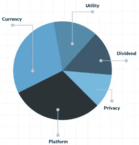

# 按行业多样化加密产品组合

> 原文：<https://medium.datadriveninvestor.com/diversify-crypto-portfolio-by-industry-b099f9e8535?source=collection_archive---------2----------------------->

subscribe-[iTunes](https://itunes.apple.com/us/podcast/bit-better-have-my-money/id1374764732)[Google Play](https://playmusic.app.goo.gl/?ibi=com.google.PlayMusic&isi=691797987&ius=googleplaymusic&apn=com.google.android.music&link=https://play.google.com/music/m/Ikoddu7nd3g5ijjnhnedvdpgzo4?t%3DBit_Better_Have_My_Money!%26pcampaignid%3DMKT-na-all-co-pr-mu-pod-16)[Stitcher](http://www.stitcher.com/s?fid=183129&refid=stpr)[iHeartRadio](https://www.iheart.com/podcast/269-Bit-Better-Have-My-29238100)

我和我在上面的****的朋友们花了一些时间研究使加密投资组合多样化的方法。我们想出了一个简单的方法来做这件事。**你可以在这里** **加入他们的** [**群。**](https://discord.gg/fxkyJRJ)****

****我们没有只看硬币，而是看了硬币所在的行业。比如支付行业如果只投资硬币，就不是真正的多元化。通过观察硬币和行业，它给你最多样化的投资组合。****

****我们把事情分成了 5 个不同的行业，以及每个行业我们喜欢的硬币。一些密码将在一个以上的行业，这是好的。这让你可以在不同的领域内细分你的投资和交易。以下是如何多样化的加密组合。****

********

1.  ******支付**——这些硬币可以用作支付商品和服务的货币。****

*   ****比特币(BTC)****
*   ****莱特币****
*   ****纳米(纳米)****
*   ****恒星(XLM)****

****2.红利 -红利加密货币意味着在拥有一定数量的硬币后，你可以获得该硬币作为支付。例如，任何类型的主节点都可以是红利硬币。****

*   ****近地天体****
*   ****奥米塞戈(OMG)****
*   ****ZCoin (XZC) —主节点****
*   ****沃尔顿链(WTC)——主节点****
*   ****Syscoin (SYS) —主节点****
*   ****币安硬币(BNB)****
*   ****Phore (PHR) —主节点****
*   ****ZenCash(禅****

****3.**隐私**——这些加密货币以稳健和分散的方式为用户提供了一定程度的匿名性。并非所有的密码都隐藏了从发送者到接收者的路径。****

*   ****零币****
*   ****莫内罗(XMR)****
*   ****破折号****
*   ****禅卡什****
*   ****PHR****

****4.**效用** -这些硬币被用作最终消费者可以购买的服务或服务单位。****

*   ****沃尔顿·钱恩(WTC)****
*   ****VenChain****
*   ****奥米塞戈(OMG)****
*   ****币安硬币(BNB)****
*   ****瓦比(瓦比)****
*   ****电力分类帐(POWR)****
*   ****系统硬币(系统)****
*   ****基本注意力标志****
*   ****工厂(FCT)****

****5.**平台** -这些硬币支持可用于构建其他加密货币的数字平台。这通常集中在区块链的网络上，这些网络允许软件开发人员编写智能合同。****

*   ****以太坊****
*   ****近地天体****
*   ****EOS (EOS)****
*   ****图标(ICX)****
*   ****利斯克(LSK)****
*   ****斯特拉提斯****
*   ****恒星(XLM)****
*   ****波浪(波浪)****
*   ****方舟(方舟)****
*   ****韦钱(文)****
*   ****导航币****
*   ****系统硬币(系统)****

****看看你的投资组合，把你的每一枚硬币归为一个行业。如果你在一个领域有太多，开始投资其他领域。当研究一个新的硬币检查，看看它在哪里，如何适合你的投资组合。****

******投资时，每个人都在寻找优势。**这就是如何使加密产品组合多样化，并获得其他人可能没有的优势。****

********