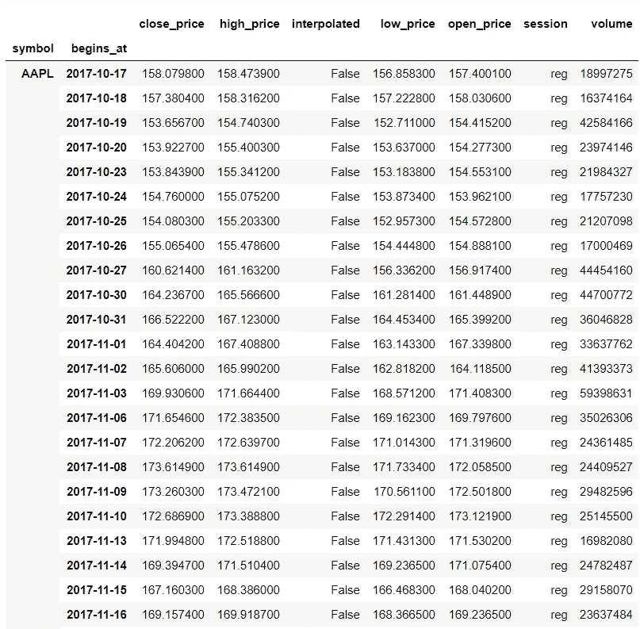
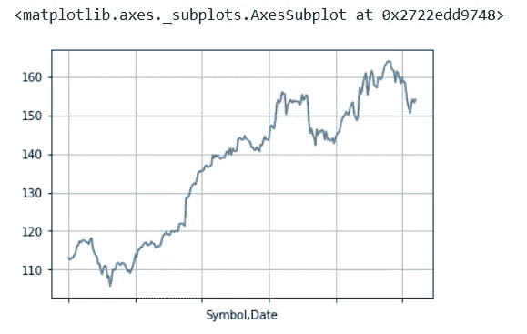
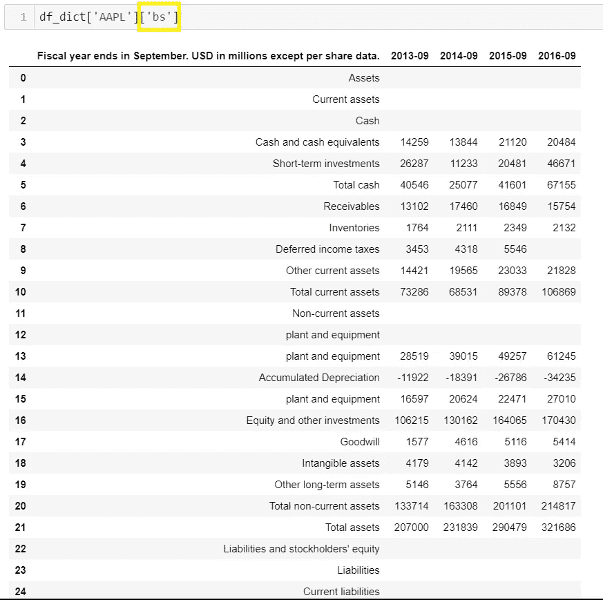

# 脱离 Excel——为什么我用 Python 做分析

> 原文：<https://medium.datadriveninvestor.com/divorcing-excel-why-i-do-my-analysis-in-python-6438e261f7f6?source=collection_archive---------9----------------------->


作为一名年轻的财务分析师，我是在 Excel 环境中长大的。和我一起工作并向我学习的每个人都在 Excel 中做了所有的事情。我有很多问题，“为什么这不能自动化？”，“为什么这个是这样工作的？”“我们能加快速度吗？”。在很大程度上，Excel 完成了这项工作。这是一个每个人都能接受的标准。但是当我开始处理越来越多的数据时，我注意到 Excel 变慢了。在弄乱工作簿和等待纺车数小时后，我不得不寻找另一种方式。*输入 Python*。

对于所有的 Excel 爱好者，我想说的是 Excel 和 Python 并不相互排斥。Excel 的某些方面是有用的，但 python 可以根据您的技能和经验降低效率。新手可以很容易地进入 excel 单元格并更改值，而在熊猫中他们可能很难做到。也就是说，Python 在处理能力上大大超过了 excel，并且有一个指数级更大的工具包。

## 让我们从简单的事情开始:

```
import pandas_datareader.data as web
start_date = '2016-9-30'
end_date = '2017-09-30'prices = web.DataReader('AAPL', 'robinhood', start_date, end_date)
```



在一行代码中，我们很快获得了 AAPL 所有的历史价格数据。这大约花了 15 秒钟，我们已经准备好进行分析。这为您的历史价格分析提供了特定的定制，并允许您过滤任何特定日期的数据框。如果您需要脱机工作，也可以轻松下载这些信息。

## 轻松可视化:

```
prices[‘Close’].plot(grid=True)
```



With one line of code you can quickly make a time-series graph.

## 我们有价格，金融方面呢

这稍微有点复杂，但是仍然可以通过一些代码来实现。我为我个人投资组合中的一些公司的分析写了这段代码。它很灵活，但也不是没有问题和缺陷。

```
empty_list = ['','','','','']
df_dict = {}
temp = {}ticker_list=['AAPL']
financial_statements = ['bs','cf','is']for ticker in ticker_list:
    splittext_final = []
    for fs in financial_statements:
        new_url = '[http://financials.morningstar.com/ajax/ReportProcess4CSV.html?t='+str(ticker)+'&reportType='+str(fs)+'&period=12&dataType=A&order=asc&columnYear=10&number=3'](http://financials.morningstar.com/ajax/ReportProcess4CSV.html?t='+str(ticker)+'&reportType='+str(fs)+'&period=12&dataType=A&order=asc&columnYear=10&number=3')
        res = requests.get(new_url)

        soup = BeautifulSoup(res.content, 'lxml')
        text = soup.text
        line = re.sub('"\w[^"]*(,)','', text)
        line = line.replace('"','')
        splittext = line.split('\n')
        splittext.remove('')tempdf =pd.DataFrame({})
        splittext_final = []

        for each in range(len(splittext[2:])):
            headers = splittext[1].split(',')
            splittext_final.append(splittext[2:][each].split(','))
        #print(splittext_final)
        for row in range(len(splittext_final)):
            if len(splittext_final[row]) <= 5:
                splittext_final[row].extend(empty_list)
                headers = splittext[1].split(',')
        for number in range(len(headers)-1):templist_3= []for i in range(len(splittext_final)):
                templist_3.append(splittext_final[i][number])tempdf[headers[number]] = templist_3temp[str(fs)] = tempdfdf_dict[str(ticker)] = temp
```

该函数接收一个 ticker 并返回过去 5 年的资产负债表、财务报表和现金流量表。这可以在 URL 的周期部分更改为季度。



Example output

这是上述示例的输出示例。通过更改 BS>IS>FS，您可以快速查看和分析任何给定公司的信息。和上面的价格一样，您可以简单地将数据框导出为 CSV 格式，并在 Excel 中打开。

这是对 python 的介绍，也是对 Excel 与 Python 的利用的个人看法。为了简洁起见，我故意没有包括任何分析。这些是我用来帮助我可视化和分析财务信息的一些基本技巧，但还远远不够详尽。后来包括:添加移动平均线，适当的时间序列分析 ARMA，ARIMA 等。

感谢阅读。