# DIY 智能家居——实惠的方式

> 原文：<https://medium.datadriveninvestor.com/diy-smart-home-the-affordable-way-e80fe56a7043?source=collection_archive---------3----------------------->

今天，由于智能手机在我们日常生活中的日益增加，我们生活在一个一切都只需一键操作的世界。我们的智能手机帮助我们自动化多余的任务，并使我们能够控制我们的电视、灯、厨房电器等，以便我们有更多的时间做生活中重要的事情。

在这篇文章中，我将向你展示如何以一种非常实惠的方式自动化你的卧室灯或任何家用电器，并通过谷歌助手或亚马逊 Alexa 远程控制它们——例如，下次当你躺在床上时，你可以方便地关闭或打开你的灯，而不用离开你舒适的床。

如果你更喜欢看如何做到这一点的视频教程，你可以在我的 YouTube 频道上查看。

*小免责声明:我不属于任何提到的电子商务网站或本 DIY 教程中使用的设备本身。我用自己的钱买了这个设备。*

# 所需设备

如前所述，我将向您展示如何以便宜的方式做到这一点，以及如何升级您当前的照明系统，而无需购买昂贵的 WiFi 连接智能灯泡。为此，您需要购买以下硬件:

## SONOFF 基本 WiFi 智能开关

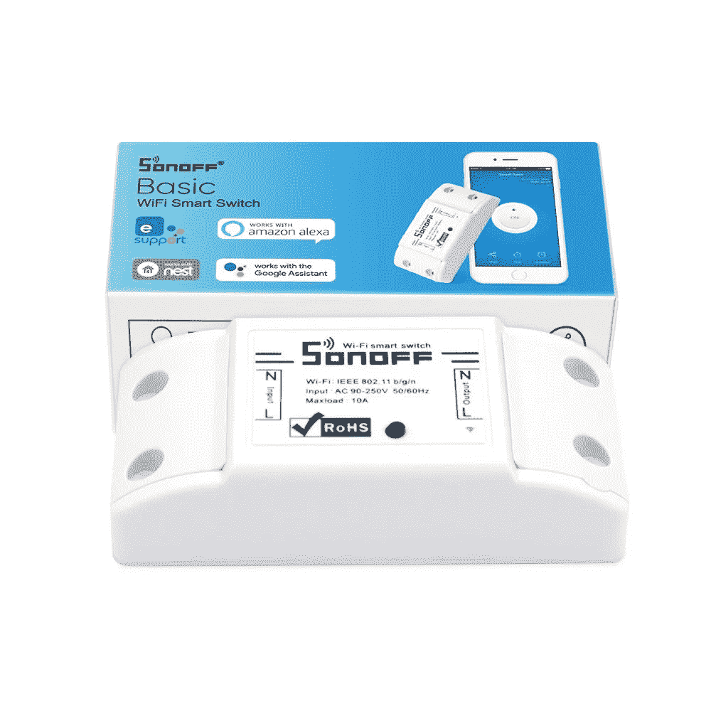

Sonoff WiFi Smart Switch. Picture from [GearBest](https://www.gearbest.com/access-control/pp_1592718.html?wid=1433363&currency=EUR&vip=4495640&gclid=CjwKCAjwio3dBRAqEiwAHWsNVRYjtj5jvyCgryQrOKKnepHWk4nadi6tzg_5wJFNnrBJD3NYgGh1CxoCbuoQAvD_BwE).

这个设备可以让你自动化和远程控制你现有的灯和家用电器。你可以在不同的网站上购买 Sonoff，如[【全球速卖通】](https://www.aliexpress.com/item/Itead-Sonoff-Smart-Wifi-Switch-DIY-Smart-Wireless-Remote-Switch-Domotica-Wifi-Light-Switch-Smart-Home/32831445550.html?spm=2114.search0104.3.1.5f62363aW4mhN1&ws_ab_test=searchweb0_0,searchweb201602_5_10065_10068_10843_10059_10884_10887_10696_100031_10084_10083_10103_10618_10304_10307_10820_10821_10302,searchweb201603_60,ppcSwitch_5&algo_expid=45bc6078-d84f-44a9-b383-cebd99fdd6b2-0&algo_pvid=45bc6078-d84f-44a9-b383-cebd99fdd6b2&transAbTest=ae803_2&priceBeautifyAB=0)， [GearBest](https://www.gearbest.com/access-control/pp_1592718.html?wid=1433363&currency=EUR&vip=4495640&gclid=CjwKCAjwio3dBRAqEiwAHWsNVRYjtj5jvyCgryQrOKKnepHWk4nadi6tzg_5wJFNnrBJD3NYgGh1CxoCbuoQAvD_BwE) 等。我在 GearBest 上花了大约 5 美元买了我的，包括运费。

就工具而言，你需要两把螺丝刀(一字螺丝刀和十字螺丝刀)和钢丝钳。就是这样！

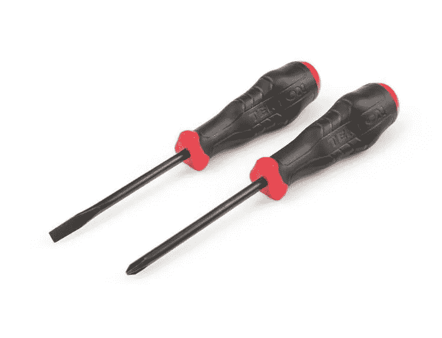

Tekton Phillips/Slotted screwdriver set. Photo by [Tekton](https://www.tekton.com/phillips-slotted-screwdriver-set-26752).

但是，在我们开始我们的小型 DIY 项目之前，让我先向您展示什么是 Sonoff 智能开关，以及它能够做什么。在包装盒中，您将获得:

*   Sonoff 智能开关
*   电线盖和螺丝
*   中英文教学手册

设备本身由塑料制成，尺寸为:

*   3 英寸(8 厘米)长
*   1 英寸(3 厘米)宽
*   0.8 英寸(2 厘米)高

如果你打算在没有太多空间的地方安装智能开关，请记住尺寸

它可以连接以下服务:

*   亚马逊 Alexa
*   谷歌助手
*   IFTTT
*   筑巢

就功能而言，它使您能够:

*   灯/电器的远程控制
*   设定具体的时间表
*   创造场景
*   与其他用户共享控件

## 它在 90–250V 电压下工作，最大电流为 10A。

*免责声明:在尝试将 Sonoff 智能开关连接到更强的家用电器时，请考虑到这一点，因为这可能会损坏它们，甚至可能导致火灾。*

# 安装智能开关

为了演示安装过程，我将使用便宜的宜家落地灯。在它们身上安装智能开关非常容易，因为它们有一根易于使用的电线。如前所述，你也可以在天花板或侧墙上安装智能开关，但要确保有足够的空间来安装智能开关。

首先，确保所有的东西都插上电源并关掉。

现在你需要把你想变“智能”的设备的线缆剪成两半，剥掉橡胶套。

接下来，你需要从相线和地线上剥下橡胶套。如果你没有合适的工具，你也可以用一把手术刀。

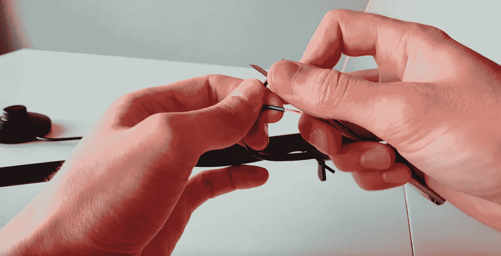

Peeling off rubber covers. Picture by me.

在智能开关上，首先移除电缆盖并注意输入和输出连接器。

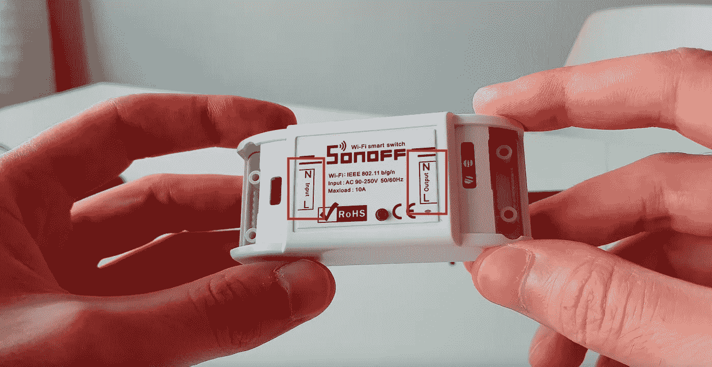

Removing cable covers. Picture by me.

之后，松开连接器螺丝，这样你就可以插上电线了。

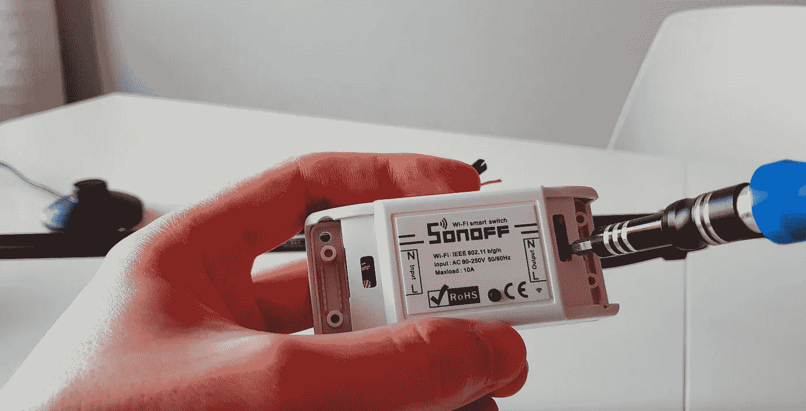

Loosening connector screws. Picture by me.

我将从输入端开始，再次确保您连接的是智能开关右侧的电线。在我的例子中，棕色线是相位线，蓝色线是地线。稍微拧一下线端，这样在连接时就不会散开。

将相线连接到标示为(L)的输入连接器，并拧入连接器以将电缆和标示为(N)的接地连接器固定到位。

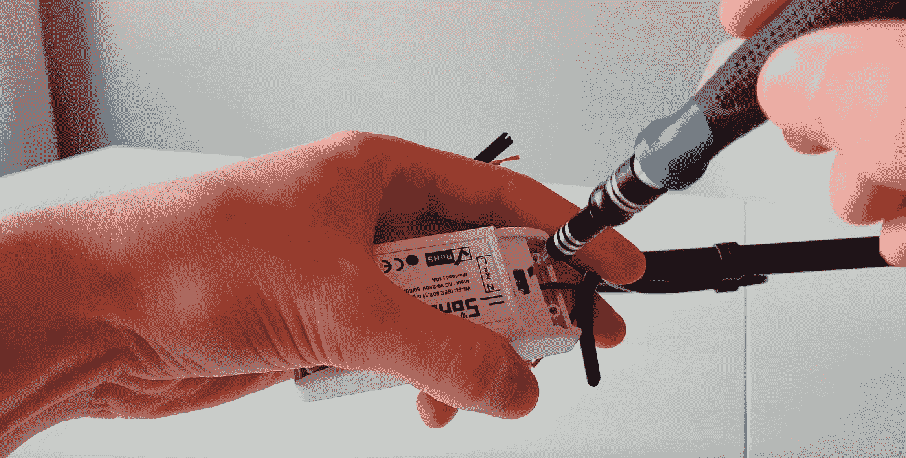

Connecting the cables. Picture by me.

轻轻晃动线缆，以确保它们被正确拧入。

对输出端重复同样的操作。

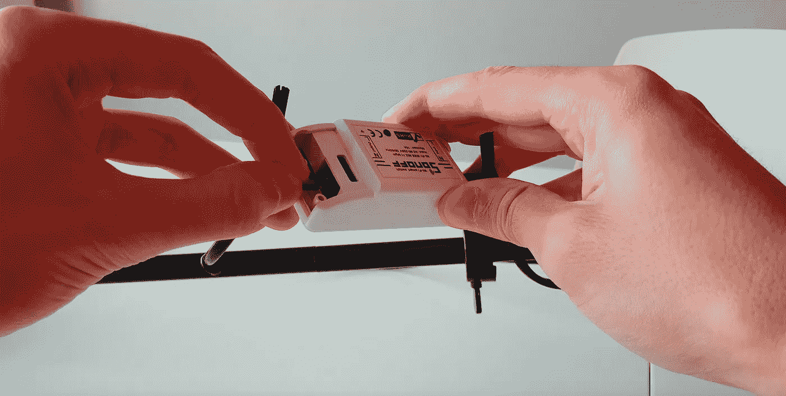

Connecting the cables. Picture by me.

现在，拧上电缆盖，为电线提供额外的支撑。

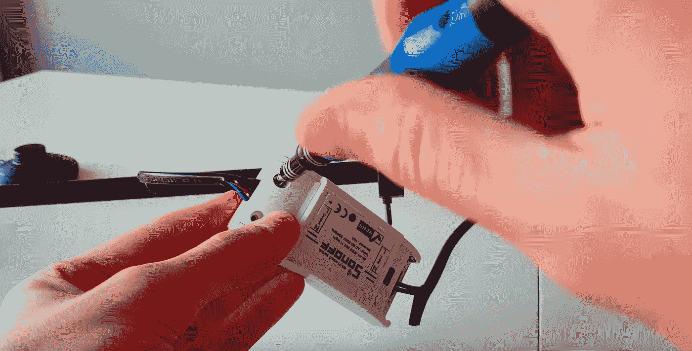

Screwing in the cover. Picture by me.

连接好所有东西后，将电源线插入电源插座并按下开关来测试所有东西。如果一切正常，绿色 LED 指示灯应该开始闪烁。

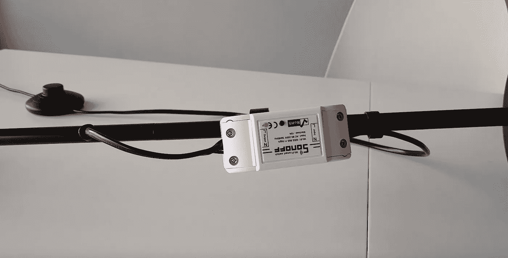

Green status light blinking. Picture by me.

现在，您可以将所有东西放回原位，隐藏智能开关。

# 设置应用程序

好了，现在让我们将智能开关连接到您的智能手机。为此，请采取以下步骤:

从 GooglePlay 商店或苹果应用商店下载并安装“eWe Link”应用程序。

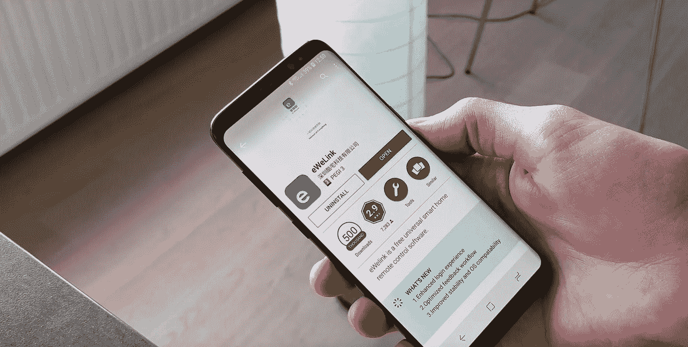

Downloading the eWeLink application. Picture by me.

之后你需要注册并登录。在主屏幕上，您将看到所有支持智能开关的设备。但为了配对我们的新灯，你必须点击应用程序主屏幕上的+按钮，应用程序将选择默认的 WiFi 配对模式。

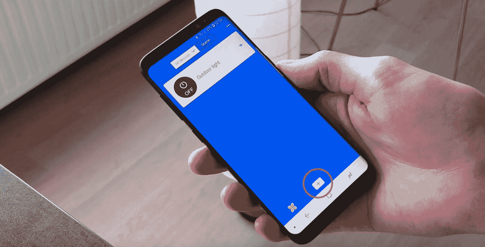

Adding a new device. Picture by me.

要触发智能开关上的配对模式，请按住配对按钮，直到它开始闪烁。

Starting the pairing mode on the smart switch. Picture by me.

然后在应用程序中按下一步，选择您的 WiFi 并输入您的 WiFi 密码。请注意，为了将智能开关与应用程序配对，您的无线网络必须设置为 2.4 G。配对完成后，您可以将网络切换回 5 G，它将不会出现任何问题。只是在设置阶段，你需要将网络设置为 2.4G。

之后，按下一步，等待设备被识别。

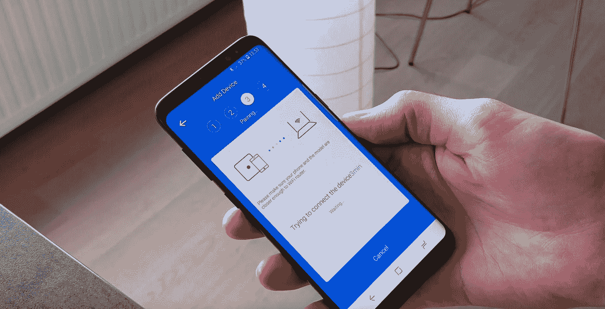

Pairing process of the smart switch. Picture by me.

现在给设备命名。我把我的灯命名为“卧室灯”,但是你可以随意命名你的灯。

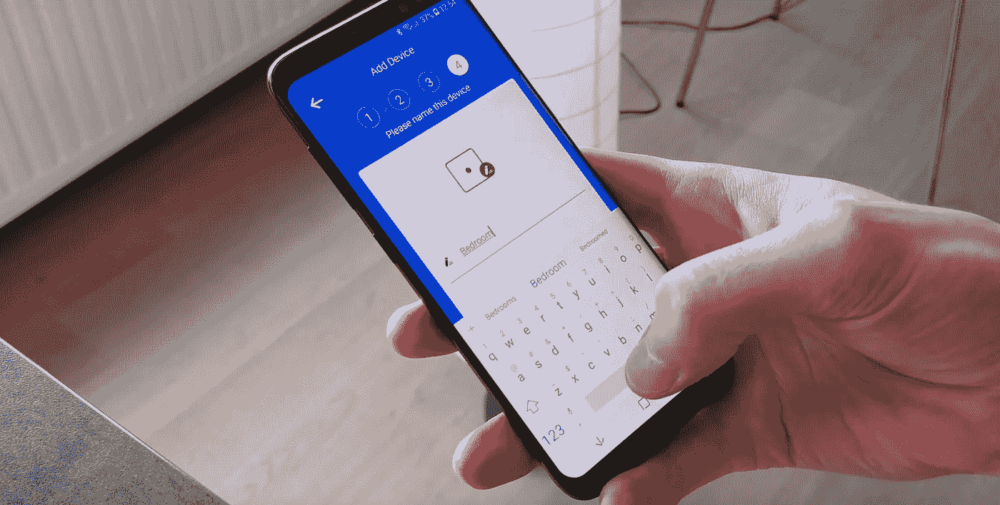

Renaming the smart switch. Picture by me.

现在你知道了。你的灯配对了。我还建议您对智能交换机进行 OTA 固件更新。

Updating smart switch firmware. Picture by me.

# 设置谷歌助手

现在，让我们将这款灯与谷歌助手配对，让它变得真正智能和方便，为此，您必须执行以下操作:

转到你的谷歌助手设置，进入“家庭控制”选项，寻找“智能我们链接”应用程序，并与谷歌助手链接。为此，只需登录应用程序并授权即可。

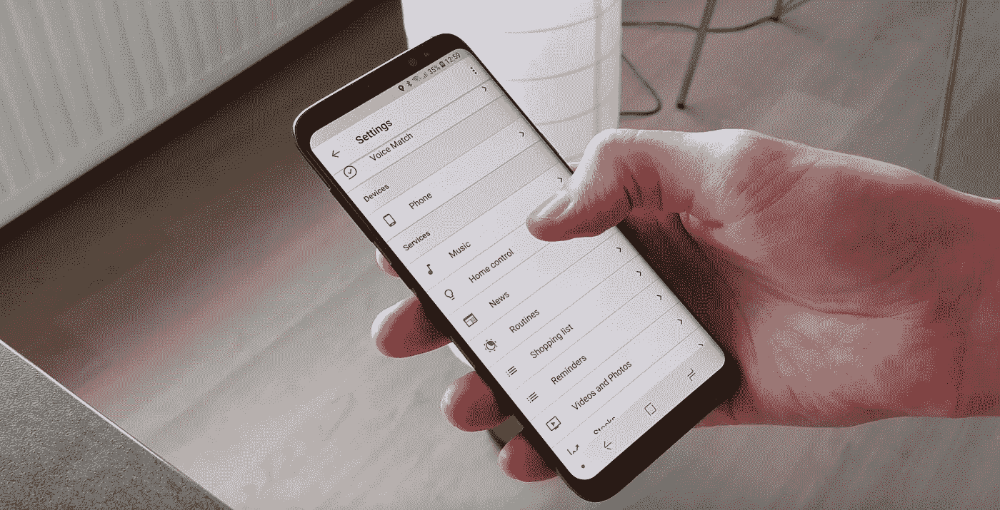

Selecting “Home control” options in the Google Assistant settings. Picture by me.

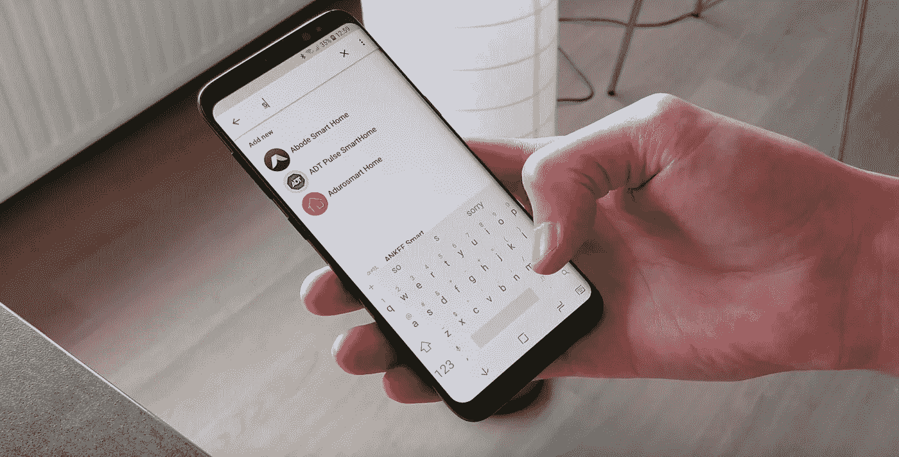

Searching for the eWeLink device in the “Add new device” menu. Picture by me.

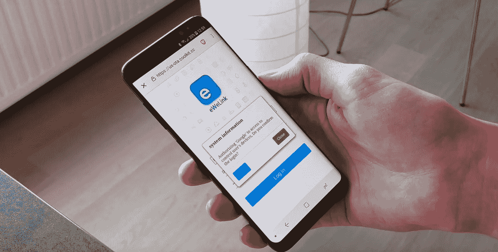

Authorising Google Assistant by logging into the eWeLink app. Picture by me.

现在我们的“卧室灯”应该会出现在列表中。确保将灯光指定给它所在的特定房间。如果你有更多的灯在同一个房间里，对所有的灯都这样做，因为这样你就能同时控制所有的灯。

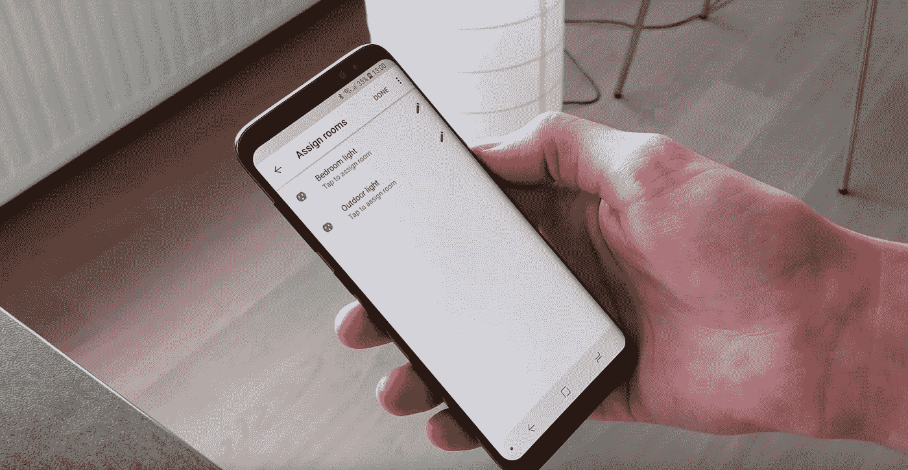

Assigning a room to the smart switch. Picture by me.

就这样，我们的灯现在连接到谷歌助理(对于亚马逊 Alexa，这将是一个非常相似的设置程序)。现在去测试一下吧！

## 可选:谷歌助手例程

在谷歌助手设置中，你还可以为一天中的某些部分设置“例行程序”，并设置一系列动作，当你说出一个特定的关键词时，例如“早上好”、“晚安”或“我在家”等，就会触发这些动作。

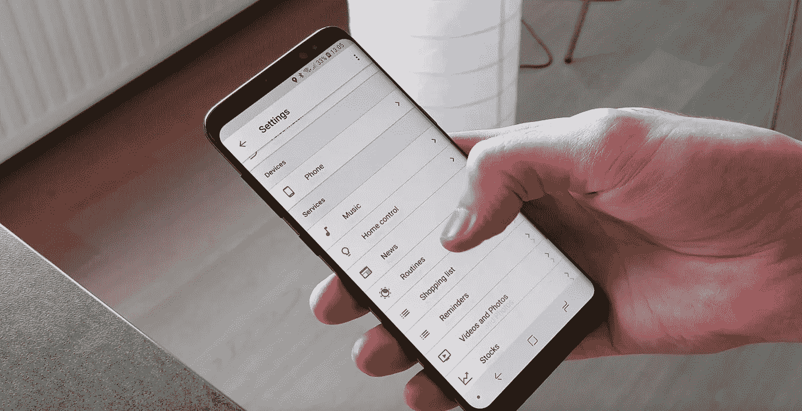

Accessing the “routines” menu in the Google Assistant settings. Picture by me.

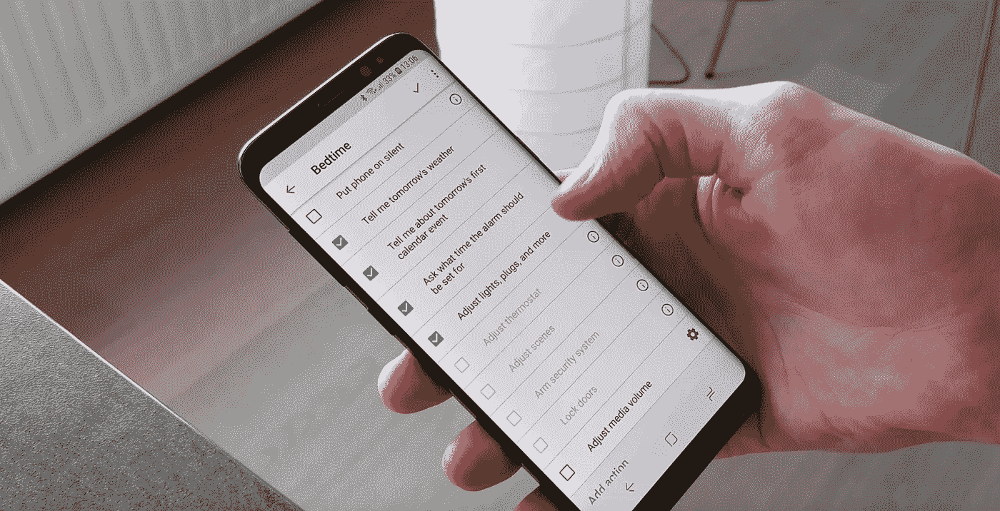

Selecting the routine options that get triggered when saying “Hey Google, goodnight.” Picture by me.

例如，当你去睡觉，说好谷歌晚安，谷歌会告诉你明天的天气预报，你的日历事件，它会要求你设置闹钟等。

如果你想以视频教程的形式看到整个过程，你可以在我的 YouTube 频道上找到它。

*我也有一个 YouTube 频道，叫做* [*【数字脉冲】*](http://www.youtube.com/digitalpulse) *，在那里我以评论和教程的形式分享我对最新科技和数字趋势的看法、经验和建议。*