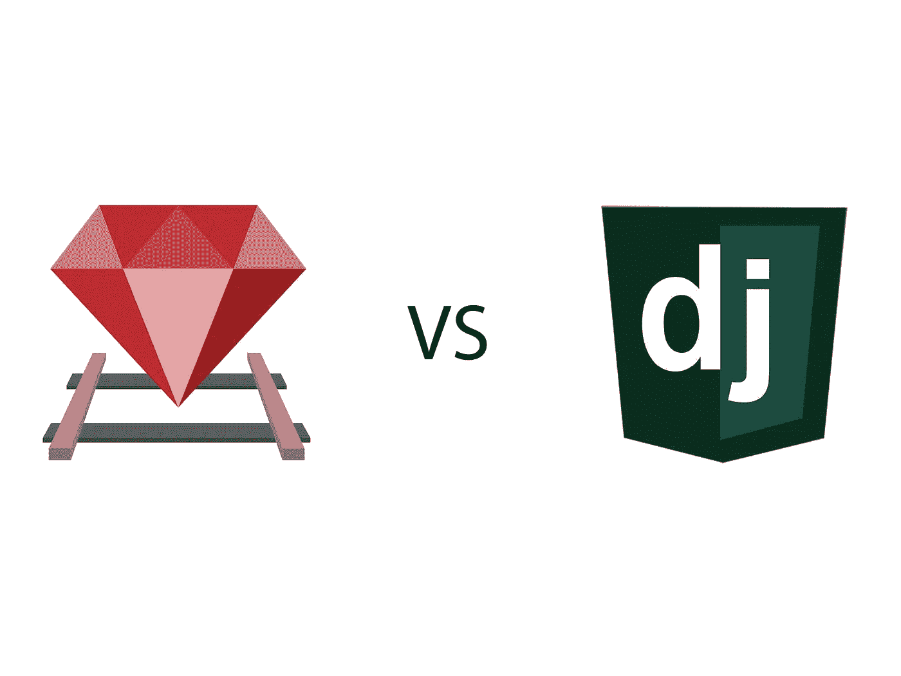

# Django 与 Rails: Web 框架的性能和受欢迎程度

> 原文：<https://medium.datadriveninvestor.com/django-vs-rails-web-frameworks-performance-and-popularity-26f585e4f6c5?source=collection_archive---------6----------------------->

uby on Rails (RoR)和 Django 是两个经常用于 web 开发的框架。虽然这两种语言有许多共同之处，但正如我们将在后面看到的，它们也有不同之处。尽管您对框架的选择将取决于您的需求、偏好和环境，但我们将为您提供 RoR 和 Django 的概述，以便您可以决定哪一个工作得最好。

# 什么是 Ruby on Rails？

Ruby on Rails 是一个用 Ruby for web 开发的开源框架。与其他框架相比，它的主要优势在于它提供的开发速度和简易性。开发人员可以立即对应用程序进行更改，而不必经历 web 开发周期中所有耗时的步骤。RoR 经常被用来创建和你每天使用的网站一样的网站。它包括许多组件，允许用户留下评论、购买或简单地登录。如果你访问过 Github、Shopify 或 Kickstarter 等热门网站，它们都是用 Ruby on Rails 构建的。既然我们已经简单介绍了 RoR，让我们来看看姜戈。

 [## 2019 年最值得学习的编码语言|数据驱动的投资者

### 在我读大学的那几年，我跳过了很多次夜游去学习 Java，希望有一天它能帮助我在…

www.datadriveninvestor.com](https://www.datadriveninvestor.com/2019/02/21/best-coding-languages-to-learn-in-2019/) 

# 姜戈是什么？

Django 也是一个开源框架，但它是用 Python 构建的。就像 RoR 一样，它提供了许多模块来帮助开发人员节省时间，避免一遍又一遍地重复某个过程。开发人员喜欢使用它，因为它促进快速开发和实用、干净的设计。当 RoR 在 2004 年崭露头角时，Python 需要一个他们自己的产品来对抗它，他们用 Django 创造了一样好的东西。所以，用 Django 构建的流行网站包括 Mozilla、Udemy 和 NASA。考虑到这些，让我们比较一下这两个框架，这样你就知道选择哪一个来[开发一个网站](https://skywell.software/web-development/)。

# Django 与 Rails:性能

在选择开发框架时，性能是必须考虑的首要因素之一。Ruby on Rails 会给你带来更好的性能。然而，除了编程语言和框架之外，还有许多因素影响网站的整体性能。因此，您必须对开发的每个阶段进行彻底的分析，以确定您所使用的工具的实际影响。事实上，在常规的 CRUD 应用程序中，不同级别的性能并不明显。

# Ruby on Rails 与 Django:差异

如果 Ruby on Rails 和 Django 的性能几乎相同，那么让我们来看看其中的一些差异:

*   语言——RoR 是用 Ruby 构建的，而 Django 是用 Python 创建的。然而，这两个框架都是面向对象的动态类型语言。
*   语法——Ruby 在这方面更加灵活。您可以通过多种不同的方式创建特征。然而，为了避免混淆，这应该小心地进行，因为将项目传递给其他团队成员会更困难。另一方面，Django 有一个基本原则，那就是用一种方式做事。这使得 Python 代码更容易调试和阅读。标准化也可以作为一种优势，因为它允许你加快开发的速度。
*   受欢迎程度——这对 Django 来说是一个明显的胜利。Python 非常受欢迎，根据 StackOverflow 的说法，这种受欢迎程度每年都在增加。在这方面，Ruby on Rails 的受欢迎程度根本无法与 Python 竞争，因为后者提供了如此多样化的生态系统，对于各种各样的项目类型都很有用。

# Python Django 与 Ruby on Rails:什么时候应该使用它？

如果必须使用特定于 Python 的库，应该使用 Django。如果您正在创建一个机器学习应用程序，或者如果您的团队只是喜欢使用 Python，这是相对常见的。鉴于 Python 的流行，您的团队成员很可能有使用 Python 的经验，并且他们知道它提供的好处。

只有当你有一个经验丰富的团队时，才应该使用 RoR。使用 Ruby on Rails 进行开发需要更高的技能水平，如果时间紧迫，这可能更具挑战性。你可以使用 RoR 快速创建一个应用程序，但不要指望你的开发者在工作中很快学会。

一般来说，你应该选择你熟悉的语言框架。这将让您对工具本身的工作有更多的了解。大多数项目经理对框架都有一定的期望和要求。这可能是像快速迭代、快速反馈循环和许多其他事情。因此，在一个框架中创建一个你绝对需要的东西的列表，并选择一个最符合你需求的。

你会听到很多关于 RoR 提供的“魔力”,事实上，它确实给了你很大的灵活性，加速了发展。然而，这可能会使创建易于维护的应用程序变得复杂。因此，你的团队必须有使用 RoR 的经验，因为事情可能会变得混乱。Django 具有很强的可伸缩性，甚至可以由新的团队成员快速传递和维护。因此，在选择框架时，一定要评估每个框架的所有好处，考虑您的团队的经验和您的需求。

*最初发布于*[*https://sky well . software*](https://skywell.software/blog/django-vs-rails-web-frameworks-performance-and-popularity/)*。*