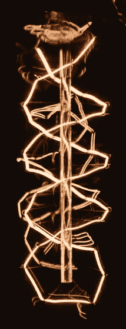

# DNA 是新的数据

> 原文：<https://medium.datadriveninvestor.com/dna-is-the-new-data-b9860a79383b?source=collection_archive---------0----------------------->

## 担心你的 SSN？等到有人拥有你的遗传密码。

Photo by [Arif Wahid](https://unsplash.com/@arifrw?utm_source=medium&utm_medium=referral) on [Unsplash](https://unsplash.com?utm_source=medium&utm_medium=referral)

数据泄露几乎是每天都会发生的事情。我们对它们已经麻木了。有多少阅读这篇文章的人认为他们的数据没有被泄露是明显不可能的？一个都没有。也许你的没有，但它有机会是非常真实的。这并不意味着一个人不应该小心自己的个人信息，这只是意味着我们生活在一个数据和身份盗窃真实存在的世界，即使我们保护自己。

 [## 数据驱动的投资者

### 事实上，在各行各业，数据的大规模激增正在改变我们感知世界的方式。而且只有…

www.youtube.com](https://www.youtube.com/channel/UCdKDq7Tu9f8xtooSLZ92AEw/featured) 

这让我想到了 DNA，这是最个人化的数据，而且越来越多地被记录和存储在在线数据库中，特别是像 23andme 或 Ancestry.com 这样的网站。这些网站提供合法的(也许是有价值的)服务。它们不是骗局(据我所知)，它们可以揭示家族史的有趣元素，甚至可能提供对潜在医疗问题的有用分析。像其他种类的数据一样，分享你的 DNA 确实有好处——尽管是潜在的，但尚未被认识到。

当然，当你愿意把你的数据让给谷歌、脸书、苹果等公司时，这些潜在的好处也是存在的。同样的风险也存在。有人可以很容易地从这些公司中的一家或许多其他公司窃取您的数据，这些公司是您提供数据的对象，或者可能是从您提供数据的公司接收数据的人。

最近，一些 DNA 测试公司因其关于 DNA 所有权的政策而受到抨击，这个问题的影响甚至比适用于其他形式数据的所有权更严重。像 Ancestry.com 和 23andme 这样的公司的政策已经被彻底地剖析了，批评家声称这些政策赋予了这些公司对你的 DNA 的所有权。这个解释既不[完全正确也不完全错误](https://www.snopes.com/fact-check/ancestry-dna-steal-own/)；这些公司中的许多明确表示，他们并不拥有传统意义上的你的数据，同时也明确表示，你正在将你的 DNA 许可给他们，让他们在他们认为合适的时候分享。

从表面上看，这些政策是有道理的。但这其中存在风险。在不假设上述基因公司有任何邪恶意图的情况下——我在这里很慷慨，因为我们对脸书在 2016 年大选中如何被利用了解得越多，我们就越看到脸书确实在欺骗和操纵——滥用数据的可能性是显而易见的。

第一个问题是:Ancestry.com 等人会和谁分享你的 DNA？假设没有恶意，仍然很容易想象 Ancestry.com 与一个他们认为合法的组织分享你的 DNA，但这个组织本身就是一个邪恶的行为者(想想剑桥分析)。合法的和不合法的医疗机构都在寻求获取 DNA 数据，用于各种有益或有害的目的。在你把你的 DNA 给像 Ancestry.com 这样的公司之前，问问你自己，你是否信任他们做出正确的决定，告诉他们应该和谁分享这些个人信息。

为了便于讨论，假设基因公司在与哪些组织分享你的 DNA 方面做出了正确的决定。那么，你在基因公司服务器上的数据的安全性如何呢？你相信没有坏人会试图窃取你的 DNA 吗？如果黑客有能力闯入像索尼和 T2 万豪这样的老牌跨国组织的服务器，更不用说联邦政府在 T4 的人事管理办公室了，有人会相信 23andme 的防火墙能够保证你的基因密码安全吗？

最后，当然，你的 DNA 还有未知的，也许是想象不到的用途，这是一个值得深入分析的话题。毫无疑问，这些数据在医学上有着有益的应用。我们可能获得的知识，我们可能治愈的疾病，我们可能从未来抹去的痛苦，这些都是崇高的愿望，可能由能够访问大量 DNA 数据的医生和科学家来实现。硬币的另一面是:我们可能获得的知识，我们可能制造的疾病，我们可能学会以新的方式造成的痛苦，这些也是获得大量 DNA 数据可能解开的可能性。

这些风险是避开像 Ancestry.com 这样的网站及其提供的服务的理由吗？我不一定这么认为。风险也不能成为否认收集基因数据是推进医学科学的一种方式的理由。然而，放弃你最敏感的个人数据也不是一个可以轻易做出的决定。如果过去的十年是任何证据的话，那么一旦你选择与一家基因检测公司分享你的 DNA，就会有人在某个地方很快获得你的 DNA。人工智能系统已经建立在海量数据的基础上，机器可以利用这些数据进行自学。虽然我看到了巨大利益的可能性，但人工智能算法将我的 DNA 作为大型数据集的一部分进行处理并与(在此插入你选择的未知和可能邪恶的演员)分享的想法并不是一个令人愉快的想法。

当前的政治时机已经成熟，可以就保护我们的数据，包括我们的 DNA 展开对话。这最后一个数据是否会在更广泛的讨论中被考虑是 TBD，但似乎不太可能。如果没有关于收集和使用基因信息的法规很快获得通过，我的猜测是，未来这种法规的催化剂将确实是黑暗和丑陋的东西。