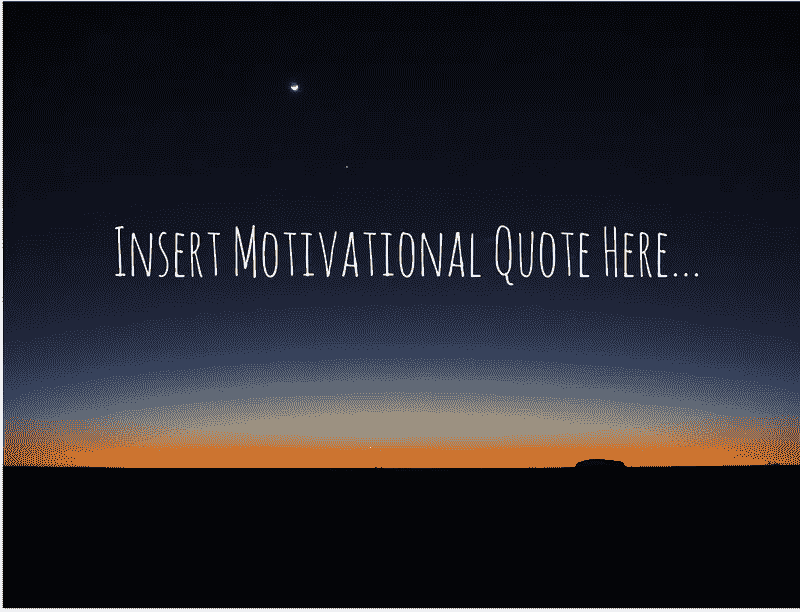
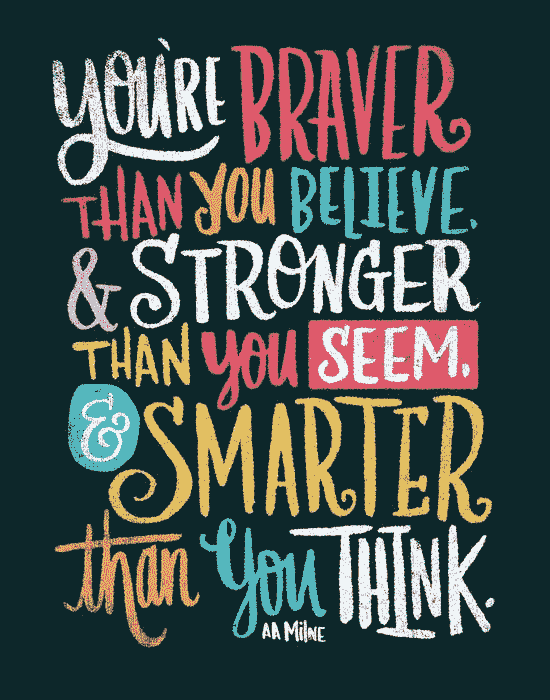
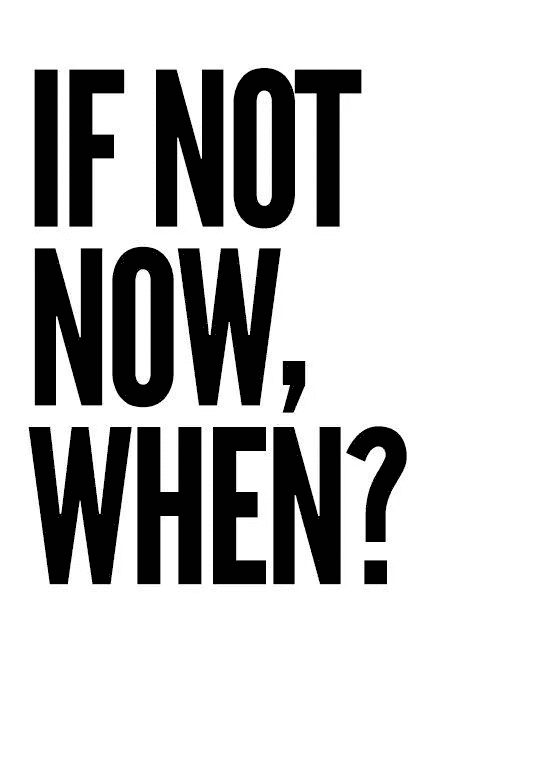
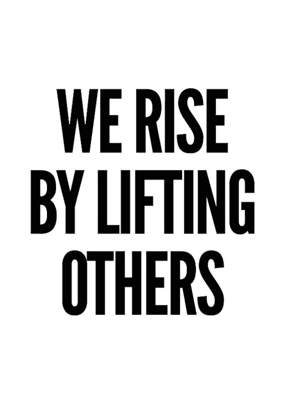

# 所有这些激励性的帖子都是在宣扬虚假的积极吗？

> 原文：<https://medium.datadriveninvestor.com/do-all-those-motivational-posts-promote-fake-positivity-2f3b914c77b8?source=collection_archive---------2----------------------->

几年前，一个朋友告诉我，她认为分享周一激励海报的人是假的，并且正在实施她所谓的“假积极”。

在她看来，一些振奋人心的名言背后的视觉形象不过是一个面具。

 [## Noobs 的数字身份——数据驱动的投资者

### 聪明人如何在增强现实中创造身份价值？我最近刚满 40 岁。作为一个生物…

www.datadriveninvestor.com](https://www.datadriveninvestor.com/2019/02/28/digital-identity-for-noobs/) 

“人们不是生活在他们分享的东西里，”她说。他们张贴这些照片是为了让自己看起来比他们的朋友更开明或更神圣。

她坚持认为，关起门来，他们的行为、言语和行动通常与鼓励、振奋或积极正好相反。

这都是表面现象。

自从她告诉我这件事，我注意到其他几个 [**作家联合署名**](https://medium.com/@rachelwayne/why-positivity-culture-is-a-problem-f55aac748461) ，抨击积极皮条客的价值，他们说这些皮条客在强迫人们快速解决糟糕的问题。

他们基本上是在鼓励人们忍受糟糕的情况，告诉他们简单地“看光明的一面”会增强他们生活中的任何错误。

**人体部位**媒体博客作者**凡妮莎·贝尔·班尼特**的[取下](https://humanparts.medium.com/the-danger-in-fake-positivity-and-spiritual-bypassing-c202040b8dd3)更进一步。她写道:

> 虚假的积极会使精神疾病的污名永久化。鼓励患有临床抑郁症的人关注积极的一面是没有帮助的，实际上可能会带来更多的伤害。这一建议可能会让他们觉得自己有错，因为他们不能简单地靠自己的力量振作起来。

诚然，生活中没有放之四海而皆准的情况，但曾经有过吗？

此外，动机的世界并不局限于这些简单的信息，受众也不仅仅是那些遭受深刻心理困扰的人。

那么，为什么要压制这一信息，因为它并不适合所有人？

依我拙见，那是适得其反的。

我承认。我是那些被我在社交媒体上看到的励志海报和励志名言所激励的人之一，并喜欢尽可能地与他人分享智慧。

有时，我甚至通过使用图形网站 [Canva](https://fave.co/2MBrQEk) 来转换或修改我认为视觉上不刺激或有语法错误或脏话的海报。

人们会被这些事情分散注意力，所以我更希望他们把注意力放在信息上。

作为普通的、易犯错误的人，我们总是不断地努力提高自己。

即使是我们当中令人难以忍受和痛苦的人，内心深处也知道他们不一定是最好的朋友、同事、亲戚或令人愉快的人……尽管他们可能很可怕，但他们也意识到自己应该改变。

正因为如此，我确实相信，人们在社交媒体和媒体提醒中过滤的微妙和公开的信息不断提醒他们应该努力实现的目标:成为更好、更善良的自己。

对于我们生活的新数字和更世俗的世界，它是完美的被动心理工具。

研究表明，许多人正在远离有组织的宗教。即使是不信教或不信教的人也意识到写日记、冥想或安静地思考有助于实现目标。

但是我们在早上或者睡觉前有没有花额外的时间去做这些事情呢？号码

如果我们不去实践这个意图，它就不会有效。

因此，代替有目的的反思时刻，我们有激励性的迷因来帮助我们度过一天。

没有一个星期我没有收到看到我分享的照片的人的回复，他们说，“这正是我今天需要看到的。”

现在你知道了！神的干预。

无论发生什么，都要抓住它！