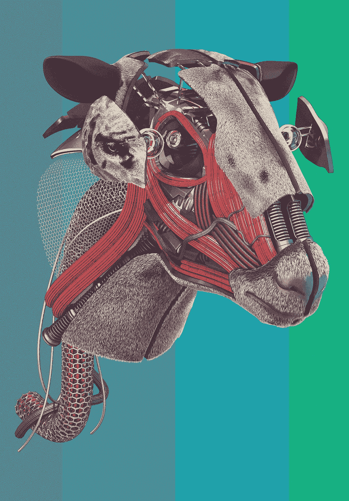
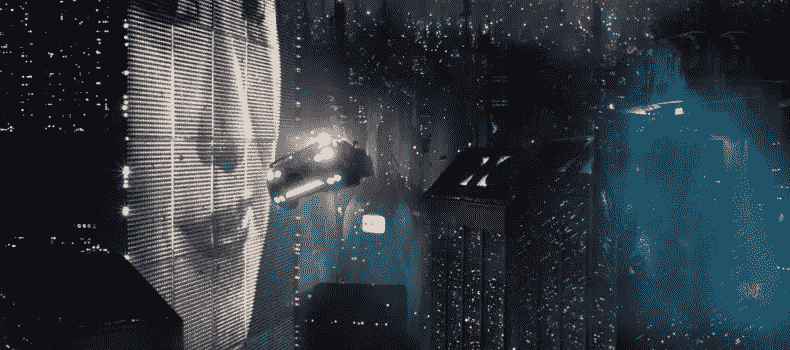

# 机器人会梦见银翼杀手吗？

> 原文：<https://medium.datadriveninvestor.com/do-android-dream-of-blade-runners-3e79d76ab6aa?source=collection_archive---------34----------------------->

## 经典科幻电影和启发这部电影的书之间的比较。

几年前，我想看我多年来错过的经典电影——所有我一直听说的电影，而且总是在那些“有史以来最好的”名单上，但我还没有找到时间去看。

其中一部电影是由传奇人物雷德利·斯科特执导的《银翼杀手》。这是一部多么伟大的电影——至少当时我是这么认为的。

随着《银翼杀手 2049》最近的发行，我想重温 1986 年的原版，但要等到我读完激发它的那本书之后。

那本书是菲利普·K·蒂克的经典*科幻*书*机器人会梦见电动绵羊吗*。

我立即被书中描述的世界以及菲利普·K·蒂克作品创造的节奏所困扰。读完这部电影后，我感觉就像是在一个小小的包裹中开始了一次巨大的旅程，我迫不及待地想重新投入到这部电影中去。

那时我非常失望。我不是纯粹主义者*本身*，所以我的抱怨不是来自从文学到视频改编的不同情节点。我对它的主要不满是这本书最重要的部分没有出现——对机器人意识的质疑。他们比人类本身更像人类吗？

在书中，我们甚至可以感受到迪卡尔的困境。当他不得不淘汰 Nexus '时，他有时不得不重新记住他实际上并没有杀死它们——他只是关闭了机器。或者至少，这是他被教导去做的，并且毫无疑问地做了大半辈子。

他试图购买活的动物来让自己感觉更好，试图说服自己活的生物比电的生物重要得多。

甚至在这两部作品的标题中，我们也可以看到不同之处。在书中，我们被机器人意识的可能性——机器人做梦的概念——逗笑了，这个词有双重含义。但在电影中，银翼杀手成为突出的人物。

如果你忽略了美丽的艺术指导和摄影，以及范吉利斯的官方配乐，你得到的是一部缺乏意义的电影——至少与原始材料相比是这样。原本是一部诡异而令人不寒而栗的作品，可以真正让你盯着与人工智能的良知相关联的比以往任何时候都更流行的伦理，最终成为一部好警察与坏机器人的电影。

即使在电影的结尾，罗伊·巴蒂对里克·德卡德的拯救似乎是一种展示，表明 Nexus-6 能够像人类一样表现出同情心，但这并没有与他们在整个电影中的行为相一致——他们被毫无理由地描绘成疯狂的杀人机器。

总而言之，我不能说《银翼杀手》是一部烂片。老实说，我仍然认为这是有史以来最伟大的科幻电影之一，我推荐大家观看。我对这部电影的每一个批评都证明了这本书本身有多好。令人遗憾的是，我读过的最发人深省的书之一被改编成了一部更容易咀嚼的动作电影。而且我还得看《银翼杀手 2049》，不过那好像是原著电影创造的设定的延续。

但是，并不是所有的事情都是不好的。我们现在是在 2019 年，并不像菲利普·K·蒂克五十年前想象的那样生活在一个黑暗的世界里。