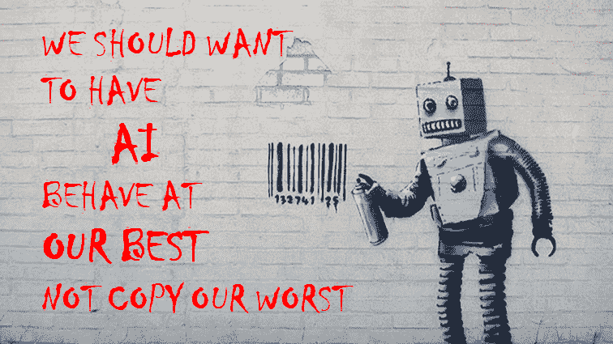
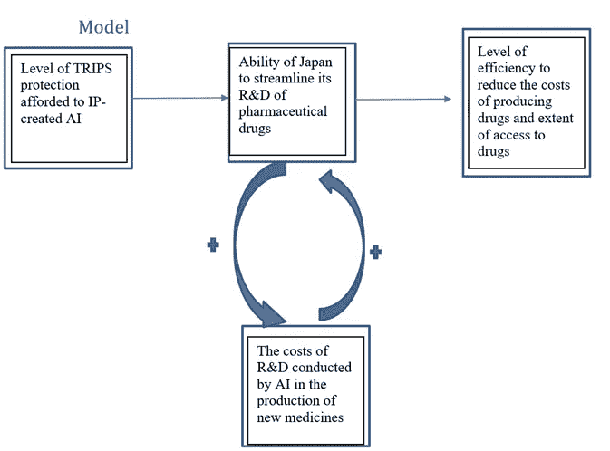
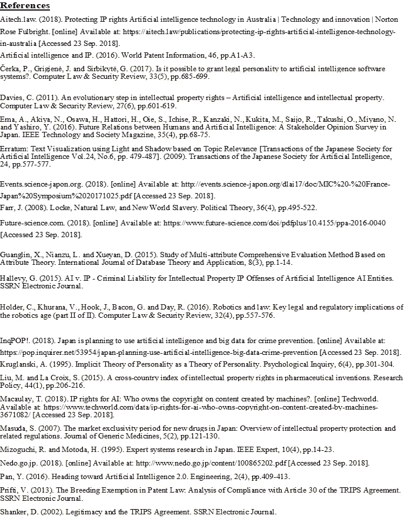

# 机器人梦想自动化医疗保健吗？:加强对人工智能产生的知识产权的法律保护会改善日本药品的可及性吗？

> 原文：<https://medium.datadriveninvestor.com/do-androids-dream-of-automated-healthcare-d24c2d4ffb6a?source=collection_archive---------40----------------------->

Courtesy of MindTitan.

> 日本首相安倍晋三(Shinzo Abe)备受争议地宣布了 2016 年知识产权促进计划，寻求保护人工智能(AI)产生的知识产权(IP)。人工智能产生的知识产权是否会无意中表现出一种新的寡头政治，在进行医学研究时，这种寡头政治会通过先行者的优势，赋予日本制药公司不对称的垄断权力？还是会迎来一个乌托邦，对人工智能生成的知识产权的法律保护使算法能够更有效地简化研发过程，并以超越人类能力的速度发现新的治疗方法？这篇文章旨在阐明加强对人工智能产生的知识产权的法律保护是否会改善日本药物的可获得性，并扩大知识产权的国际治理以促进创新。

# 文献评论

这篇文献综述将分析围绕(AI)“深度学习算法”对日本药品可及性产生的影响(IP)的学术辩论。它解释了围绕研究问题的学术方法的优点和缺点。洛克在自然权利理论中的工作提出了为智力劳动获得报酬的概念，但未能考虑技术中新颠覆者的观点。人格理论文献主要是从人文主义的角度讲述的，并没有解释为什么给予法人团体的法律地位可以或者应该同样给予人工智能系统。多属性理论主要关注国际知识产权保护立法框架的“反应性”法律方法，而没有考虑其对制药行业技术破坏者的现代“反应性”应用及其对制药公司进行研发能力的影响。效用理论主要关注新自由资本主义的“自利”理论如何证明日本制药公司采取的利润最大化政策的合理性，以及此类政策对药品可及性的影响。

Courtesy of intelligain pictures.

## **自然权利理论:劳动理论(洛克理论)**

洛克的理论奖励了高级智能实体将其“自然权利”强加于其创造的行为；因此，作为催化剂来证明保证人工智能实体合法地位的起源 **(Farr，2008)** 。单单这一理论并没有将赋予人类的产权扩展到人工智能实体，因为它主要关注跨国机构制药公司的镜头，而不是这些公司的技术产品——人工智能“深度学习”算法。由于全球北方制药公司的集中 **(Smith，Correa et Oh，2009)** 现实主义理论补充了 Locke 的理论，即法律实体不能被视为自然人，因为它们通过人类代理人间接行事，并客观地代表最终被人类个性化的真实实体 **(Cerka，Grigiene et Sirbikyte，2017)。**虽然《与贸易有关的知识产权协议》中写入了 20 年专利专有权期的法定权利和权利，以及保护提交用于药品营销的数据免遭“不公平商业使用”的理念，是人工智能学者创造的知识产权保护的第一步；他们没有考虑这种保护对药品可获得性的文化和社会经济影响的后果 **(Masuda，2007)。**

## **人格理论**

人文主义和虚构理论补充和加强了人格理论如何寻求人工智能系统的法律地位认可。然而，这些理论并不发达，因为现有的文献主要关注学者、工程师和科幻作家的观点，而没有咨询日本公众的观点 **(Akiya，Ema et Yashiro，2016)** Sonderholm 认为，知识产权对于创造个人自我主张至关重要。没有先例承认深度学习算法是人工智能系统的独特和独特的创造，因为人格理论是在人文主义者的视角下自然解释的 **(Sonderholm，2010)。**这一理论中的漏洞没有通过忽略自动化制药研发&的经济影响来解决人工智能系统的所有权问题 **(Kruglanski，1995)。**专利和版权的知识产权应同样适用于管理计算机辅助手术系统的机器人系统产品的建议 **(Khurana，Hook，Bacon et Day，2016)** 表明了现有学术文献的不足之处，因为它没有解决国际知识产权法是否应承认医学研究算法的程序员或算法本身的优点的问题。基于机器的学习系统的话语充满了负面内涵，这不可避免地导致了与“特许理论”的相似之处，该理论认为，除非被授予，否则公司人格不存在。这种观点随后通过“虚构理论”得到进一步发展，该理论认为法律实体仅仅是没有事实基础支持的社会构造 **(Cerka，Grigiene et Sirbikyte，2017)**

Courtesy of A.I Strategy & Policy

## **功利主义理论**

功利主义理论文献探讨了人工智能的起源及其在日本 80 年代后期的功能，如计算机辅助设计(CAD)、计算机辅助教学(CAI)和决策支持系统(DDS)机器翻译**(严，1990)。**日本大学在 20 世纪 50 年代后半期开始的研究主要集中在机器翻译和模式识别领域，这些研究都有助于人工智能的现代话语文献的同等表现，这些文献充当了整个日本社会人工智能技术的经济和文化推动力的进一步研究的基线，评估了先前人工智能研究的积极方面是否可以复制以提高药物的可及性。Feigenbaum 的 **(1977)** 提出了“知识工程”的概念，这一概念在 80 年代末和 90 年代初对日本的人工智能研究产生了积极的影响，并引起了新一代计算机技术研究所(ICOT)的注意；成立于 1982 年，任务是开发第五代计算机作为知识信息处理系统(KIPS)，可以通过知识库管理解决问题和推理，同时拥有智能界面**(严，1990)。**世界知识产权组织、1893 年《巴黎公约》和《伯尔尼条约》确立了智力劳动产品应得到补偿的原则，但也承认“现实主义”思想流派认为知识产权保护会因不同的司法管辖区而异 **(Prifti，2013)。**激励和博弈论表明，所有公司都是利润最大化的，这种自利的资本主义行为将转化为更廉价的药物生产方法，并随后通过实施保护人工智能产生的知识产权的法律环境，通过增强的研发过程增加药物的可获得性。发达国家的制药业已经展示了通过 TRIPS 灵活性巩固其作为药品“守门人”的垄断地位的经验证据 **(Ema 等人，2016)。**对《与贸易有关的知识产权协议》中法律定义的解释暗示，对于“计算机程序和数据汇编”是否作为与“所有者”相同条款下的保护对象，更加清晰**(人工智能和知识产权，2016)** 。经验研究进一步强调了这一观点，即手术机器人系统可以通过潜在减少患者恢复时间和进一步延长患者的移动性来扩大他们的服务范围，从而提供显著的优势 **(Khurana，Hook，Bacon et Day，2016)。**这种方法也承认需要监管可以从经验中学习的新技术 **(Cerka，Grigiene et Sirbikyte，2017)。**

## **多属性实用程序**

在为人工智能系统提供法律地位和认可的背景下，多属性效用理论主要关注制药行业在任何潜在选择结果的确定性条件下或不确定性条件下对选项多属性的偏好。因此，在其他条件相同的情况下，这一理论可以帮助学者在制药行业对人工智能使用的多种情况进行方法分类；确定人类和机器 R&D 可以共生共存的最佳社会经济条件，以促进医学研究的创新 **(Guanglin，Nianzu and Xueyan，2015)。**然后，这种方法通过标准化的分类过程量化了影响日本制药行业合法经营的知识产权的强度和相关性，该分类过程旨在确定与日本知识产权并列时跨国知识产权覆盖范围的差异 **(Liu et Croix，2014)。**以前在日本应用的人工智能专家系统案例研究仅仅提供了一个上下文相关的本体框架，并没有解决人工智能在医疗保健行业的应用。日本铁路株式会社的人工智能计算机系统下的铁路时刻表编制系统 **(Fukumori，1980)** 打破了只有受过训练的专家才能编制出铁路时刻表的神话**(严，1990)。**当凸版印刷有限公司的包装设计 CAD 系统 **(Kiryu，1985)** 使专业包装设计师成为多余，因为在 CAD 系统下构建的“知识库”使基于计算机的高质量包装自动设计成为可能 **(Yan，1990)。**不存在关于人工智能系统实施的 TRIPS 强制许可和常青化流程的文献，这在应用于自动化日本医疗保健部门的背景下只会增加更多的模糊性 **(Prifti，2013)。**这凸显了对知识产权治理的积极法律框架的需求。困扰日本制药系统人工智能治理的法律难题与英国专利法下的发展平行，可以作为进一步学术研究的起点 **(Davies，2011)。**

**结论**

极少的文献存在来解释研究问题的背景，并且先前存在的文献忽略了重要的认识论，这些认识论更好地解释了授予人工智能系统法律地位是否会阻碍或促进药物在日本的可及性。因此，在学术上对研究问题的理解上的这些差距应该通过一个全面的研究计划来进一步解决。

# 研究问题

旨在保护由(人工智能)“深度学习算法”创造的(知识产权)的 TRIPS 条款会阻碍或增加日本的药品可及性吗？

## 论文

对知识产权创造的人工智能的保护及其法律地位的明确将通过大数据分析的效率来促进健康安全，从而推进制药药物的 R&D，这将降低在日本生产这些药物的成本。

Theoretical framework

## 假设

如果给予 AI 创造的知识产权更大的 TRIPS 保护和法律地位的明确性能更好地使日本简化其药品的 R&D；然后，这些效率将向下流动，降低生产这些药物的成本，从而增加日本的药品可及性。这将通过生产新药的价格以及生产这种新药所需的时间和成本来检验。

## 关键变量的定义和操作

鉴于管理日本制药业知识产权基础设施的政治、文化和社会经济的复杂性，将我们的研究问题进一步分解为假设形式，可以让研究人员观察到无数可以作为潜在解释因素的因素。变量之间的这种相互补充和推测的共生关系构成了我们自变量和因变量的基础。

**自变量:**人工智能创造的知识产权的 TRIPS 保护和国内保护程度

**干预变量:**AI 进行研发的成本&。

**因变量:**日本药品的可及性。

为了简化关键变量因果机制的操作和过程追踪，我们将假设日本的国际贸易政策旨在无限期地遵守 TRIPS，并且日本制药业在进行研发时不会排除使用人工智能。因果机制过程将解释变量联系起来，表明了一种理论上的正反馈关系，即增加对人工智能创造的知识产权的 TRIPS 保护将提高日本简化其药品 R&D 的能力，这将提高制药业的效率，以降低生产药品的成本，从而增加药品的可及性。

药品生产成本将用于衡量日本药品的可及程度；成本增加意味着可获得性降低，反之亦然。人工智能创造的知识产权的法律保护水平将通过量化明确规定人工智能创造的知识产权保护的法律条款的数量以及量化日本目前利用这种保护的制药公司的数量来衡量。

我计划通过多元回归分析对独立变量进行实证统计分析，置信区间为+/- 3 %。为了强调特殊性，本研究设计将优先考虑样本人群，包括整个日本制药行业的员工、政府国际贸易政策制定者和国际贸易律师。为自变量；来自 WTO TRIPS 争端网站(WTO，2018)、日本总务省(MIC)、人工智能技术战略委员会的报告以及未来科学集团学术期刊的数据集将构成支持自变量的多个子自变量的基础。这些子独立变量包括以下一些:

(a)多国公司为新技术寻求进一步的《与贸易有关的知识产权协议》保护而发出的请愿书的数量

已经或正在提议促进符合《与贸易有关的知识产权协议》的知识产权基础设施的国内和国际法律的数量

政府对 R&D 制药业的补贴项目数量

日本双边自由贸易协定中明显的投资者与国家争端解决(ISDS)条款的数量，这些条款载有保护人工创造的知识产权的 TRIPS plus 条款

在开发 R 系数以测试回归分析的关联能力之前，量化这些子独立变量将在数字上汇总成功法律案例、政策和案例研究的数量，以评估子独立变量(a)、(b)和(e)的强度。对于(d ),将提出一系列关于日本知识产权保护的顺序问题，以操作和定义“文化亲和力”。然而，这种方法的一个弱点是，线性回归对异常值敏感，而且数据集被假定为独立的，鉴于许多知识产权立法框架经常被重复，这一点很难实现。

# 案例选择理由

案例研究将通过研究对人工智能产生的知识产权的更大保护是否会降低药品生产成本，来探索法律框架对药品可及性的影响。

一个糟糕的知识产权保护框架将阻止未来外国直接投资进入制药行业人工智能补充的再生 R&D。因此，从技术和法律角度来看，这一领域的高度专业化性质证明了一项小案例样本量研究的合理性，该研究旨在通过参考美国最高法院关于自然现象或机器驱动过程产生的抽象概念所产生的符合专利的主题的治理的裁决，进一步阐述干预变量的法律影响(USPTO，2014)。它的目的是研究人工智能创造的知识产权可以成功实施的平行方面，同时也承认它的关注。

## 数据识别和收集

为子独立变量系数收集的数据将沿着一条假想直线散点图，数学方程为 y = a + bx，穿过 x 轴(独立变量)和 y 轴(因变量)网格线，置信水平为 95%。除了对成功的法律案例、政策和案例研究的数据进行汇总之外，还要对次级独立变量(a)、(b)和(d)进行汇总；药品的价格和生产成本将用于对这些发现进行三角分析，以强调符合 TRIPS 的知识产权保护与日本药品可获得性增加之间的联系。为了确保数据的外部有效性，并确保其代表研究的样本人群，样本框架将透明地披露特定群体将成为目标的事实。此外，可以利用基于主体的建模工具来简化汇总过程，从而更有效地用特定的 TRIPS 兼容概念对案例和数据集进行编码，而不必费力地审查每个 TRIPS 或 WIPO 案例。

关于中间变量的数据识别和收集；时间、研究资助金额和劳动力成本将作为衡量标准，以确定人工智能产生的知识产权的稳定法律环境所带来的成本降低水平。

## 研究方法和论证(混合方法)

虽然有大量的学术文献探讨 TRIPS 保护对全球北方(R&D)研发效率的影响，但这种关系并没有扩展到包括 AI 创造的知识产权的知识产权保护。本研究设计将集中于多元回归形式的推断统计分析，该分析参与假设检验，以确定自变量和因变量之间的关系是否虚假。考虑到支撑日本人工智能基础设施的文献的不确定性和缺乏，将进行回归分析，以便在其他条件不变的情况下，准确地控制和评估自变量的变化；与因变量的变化相关。然而，这种对自变量和因变量之间相关性的分析不足以解释因果关系，这证明了一种混合方法的研究方法，当涉及到确定由日本人工智能技术的深度学习算法开发的知识产权的有效法律地位时，该方法还考虑了对日本国际知识产权法学者的定性采访。

这种混合模型方法不仅是互补的，而且可以弥补彼此固有的弱点。大型“n”研究中假设的变量之间的关系能够被仔细检查和进一步三角测量，以评估自变量和因变量之间的关系是否是虚假的。

