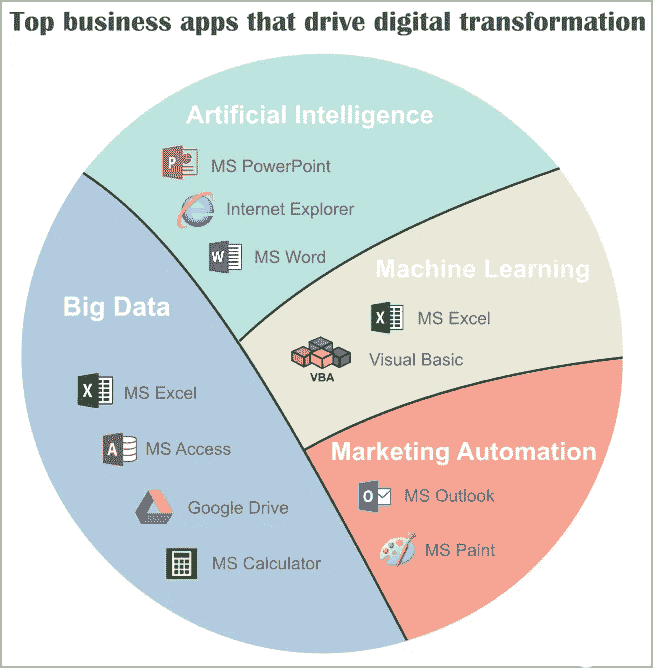

# 不要迟到，登上超级高铁！

> 原文：<https://medium.datadriveninvestor.com/do-not-be-late-get-on-the-hyperloop-train-31d340f80ca?source=collection_archive---------12----------------------->

现代商业平台具有支持构建和采用数字化商业模式的技术或数字核心。

这是对推动数字化转型(DX)时代的业务系统的整合分析。每个类别中主要领先的 IT 系统代表的 2019 年数字化转型趋势。

不要迟到，登上超级高铁！

# 人工智能

无论在哪里，从最初概念的产生到最终实现的时间特别重要，一个系统就能特别好地工作。MS PowerPoint 不同于其他系统，它允许你根据敏捷方法“做一个演示，系统准备好”来构建最复杂的人工智能平台，而没有任何限制。

Power Point 特别适合将您的旧解决方案转换为新的现实；输入之前使用的系统的名称，加上“AI”这个词——ready！MS PowerPoint 作为一个稳定的人工智能平台的优势已经得到了当今商业世界大多数公司的赞赏。他们的经验将帮助你迅速加入领导者的行列，而不会有昂贵的投资和延误的风险。模仿最好！

# 机器学习

主题可能是这里列出的最复杂的。这个话题仍然是一个实验领域，没有适当的准备，你可以看到墙壁。我理解你的恐惧，那是你从未涉足的土地。但真的从来没有？如果你曾经在 Excel 中写过一个宏，你就是在使用机器学习。如果您的 Excel 文件包含多个工作簿，那么您就已经加入了实践中使用机器学习的公司精英俱乐部。这都要归功于你对 MS Excel 的广博知识。现代科技不是很棒吗？
或者你曾经用 Visual Basic 写过一行代码？什么事？好吧，让你惊讶的是，你可以夸耀复杂的机器学习算法在商业中的应用。恭喜你！

# 大数据

由于 MS Excel，数百万公司一夜之间加入了使用大数据技术的精英公司群体。这个复杂的工具可以将大数据转换成小数据，反之亦然。
如果你有任何可以归类为“数据系统”的系统，加上复杂的 MS Excel 技术，你会得到一个“大数据”结果。通过将您的 Excel 文件称为“数据湖”，您可以实现更多。您可以通过添加 Google Drives 来扩展架构，这样您就可以使用现代系统架构的全套功能，如“云计算”。但是，如果由于某些原因，您的数据甚至比大数据还要大，也不要惊慌。MS Access 企业系统将有助于向更高层次平稳过渡。

# 营销自动化

好吧，这些年来你一直在给你的顾客发送广告信息。当他们开始称它们为垃圾邮件时，你改变了自己，你将它们转化为“电子邮件营销”。然而，客户想要更多。为了让您的客户体验到特殊的“客户体验”,营销的新水平——营销自动化的时候到了。这是一个非常冒险和敏感的步骤，但由于微软发布了支持业务的工具生态系统，其中包括 Outlok 女士，你不必担心你客户的神奇时刻会变成一个痛点。如果出于某种原因，你的基于 MS Outlook 的先进营销自动化机器不能提供足够吸引人的广告内容(有可能吗？)，是时候寻找一个可以解决这些问题的模块了——MS Paint 可以让每一条广告信息都充满吸引力。

# 下一步是什么？

上述技术为贵公司未来几年提供支持。请注意，这些工具由于其灵活性，将完美地适应市场上刚刚出现的趋势。然而，如果你没有耐心，不想将自己局限于人工智能、机器学习或营销自动化等主要趋势，你可以随时利用区块链或物联网等市场上已经出现的趋势跳到下一个级别。最好的:你所熟悉的工具，如 MS PowerPoint、MS Excel 或 MS Word，将会在这个转变过程中成功地支持你。