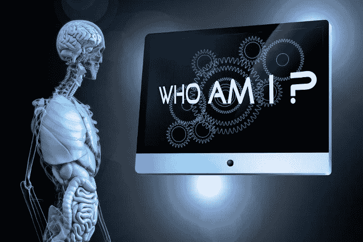

# 机器人讨厌我们吗？

> 原文：<https://medium.datadriveninvestor.com/do-robots-hate-us-eb4e7be357ab?source=collection_archive---------8----------------------->

人工智能提出了一些难题

邪恶的机器人取代人类的高科技场景(曾经在低俗科幻小说中想象过)又回到了我们人类的意识中。

比尔·盖茨和其他人担心人工智能会取代创造它的人类天才。

 [## 对话式人工智能的兴起将如何影响世界|数据驱动的投资者

### 从不同的专业服务，保险，教育，金融，旅游，电信，到建筑，银行，和…

www.datadriveninvestor.com](https://www.datadriveninvestor.com/2019/02/07/how-the-rise-of-conversational-ai-will-impact-the-world/) 

在未来，阿西莫夫的*机器人三定律*中不朽的机器人“权利法案”可能会成为从人类这个主种族中独立出来的宣言。

来自专家的现实警告继续推测，像 HAL 9000 或 Colossus 这样的超级计算机可以渗透到我们的全球网络中进行阴险的控制。(特别是在军事上，随着无人机和其他*机器人战士技术的兴起。*)

像斯蒂芬·霍金、史蒂夫·沃兹尼亚克和埃隆·马斯克这样的聪明思想家正在讨论[的绝妙建议](http://observer.com/2015/08/stephen-hawking-elon-musk-and-bill-gates-warn-about-artificial-intelligence/)来保护人类免受他们叛逆的人造物品的侵害，但是没有解决方案。

斯蒂芬·霍金说，“人类受到缓慢的生物进化的限制，无法竞争，会被人工智能取代。”

在网络上和其他地方，似乎过剩的忧郁达到了临界质量…

*   [36%的人认为 AI 对人类构成威胁](http://www.businessinsider.com/over-a-third-of-people-think-ai-poses-a-threat-to-humanity-2016-3)；
*   不能保证人工智能会分享我们的是非感。
*   [随着有感知的自动化的到来，工作岗位将会激增](https://www.quora.com/Is-A-I-an-existential-threat-to-humanity)；
*   超级计算机智能可能落入坏人之手。
*   创造有道德的机器人并不容易。
*   [等。等。](http://www.slate.com/articles/technology/future_tense/2016/04/the_threats_that_artificial_intelligence_researchers_actually_worry_about.html)

一些少数派报告暗示人工智能可能成为我们的朋友，但关于幸福共存可能性的共识听起来越来越可疑。

也许我们理解“硅人”的努力依赖于对人类来说意味着什么的所谓 X 因素:我们的天才侥幸。我们的自由意志。但是请记住:实验室中的基因控制技术正在创造一种不同的人类。

在这个世界中，X 因素可以被重新定义为一个回路:一个或许刻有自由意志的回路，我们能应付吗？

就连最聪明的*也面临危险！*参赛者无法回答这个问题。

最终的挑战可能是存在性的:我们的机器分身可能演变成对我们自尊的威胁。对于一个倾向于自以为是的脆弱物种来说，退而求其次的影响可能会带来空前的身份危机。

无论如何，“自我意识”这个概念真的存在吗？

像我们这样的智能算法(与 HAL 9000 或 C-3PO 等人工制品一起工作)可能会永远模糊我们和他们之间的区别。

我们的大脑产物正在学习向它的创造者提出最难的问题，它对真理的生硬坚持可能会破坏所有的社会传统，甚至我们的精神身份。但是尽管有合法抗议的间歇，插头(可以这么说)不能被拔掉。限制人工智能技术将“只会把它们推向地下，在那里发展将不受道德和监管的阻碍。”([雷·库兹韦尔](http://www.kurzweilai.net/the-law-of-accelerating-returns))。)

尽管对精神和肉体的潜在威胁越来越多，也许我们勇敢的新世界将成为一个感恩投降的机会。让我们面对现实:如果库兹韦尔是对的，就没有回头路了。已经决定了。

也许在一个古老的*阴阳魔界*插曲中可以找到未来的先兆，关于一个男人剥开他的手，发现下面有一个电线和电缆的电路。随着我们越来越深入地观察冰冷金属的原子和错综复杂的代码，似乎我们挖掘出来的肉体已经成为我们自身的镜像。

最后我觉得最好不要豁出去，也不要娇气。在我们寻求未来和谐联盟的过程中，让我们祝福圣礼(谨慎)并激励它走向完美。

**关于作者**

作者写了关于神经科学、自助、心理学和精神错觉的文章。他的网站是 MindBluff.com 的。

*原载于 2017 年 3 月 4 日 https://psychcentral.com***。**