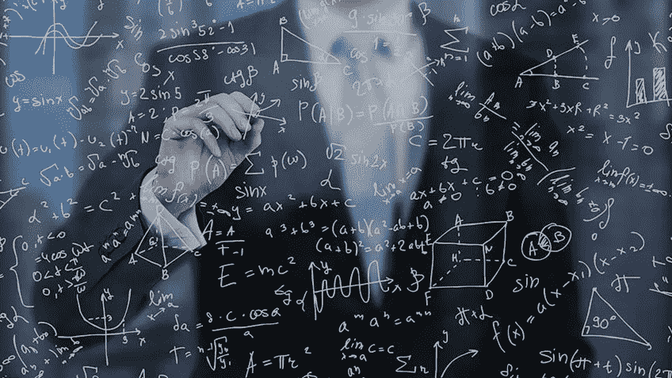

# 算法是否存在偏差问题，会影响公司的目标？

> 原文：<https://medium.datadriveninvestor.com/do-the-algorithms-have-bias-problems-that-can-affect-the-objectives-of-the-companies-2021064815b1?source=collection_archive---------6----------------------->

## 由于他们并不总是考虑到细微差别，他们会陷入自己的偏见。

科技行业存在性别问题。女孩可能对科学和技术的不同学科感兴趣，但随着她们的成长，她们会放弃这些兴趣(出于许多原因，大多与性别陈腔滥调和内化的信仰有关)，转向其他领域。那些对 STEM 领域(科学、技术、工程和数学)表现出浓厚兴趣的女孩长大后并没有成为工程师。

这个问题已经成为头条新闻，也是许多试图让女孩接触科学技术的运动的目标。而且，现在它也成为了重申(这不是第一次)算法存在的一个严重问题的关键。

> [DDI 编辑推荐—生活 3.0:成为人工智能时代的人类](https://www.amazon.com/gp/product/B07M72V9KS/ref=as_li_qf_asin_il_tl?ie=UTF8&tag=ddi018-20&creative=9325&linkCode=as2&creativeASIN=B07M72V9KS&linkId=a3b80f7bac01c1db77e48dd84e5fb82f)

来自麻省理工学院(MIT)和伦敦商学院的两位专家在[进行的一项研究](https://www.europeanscientist.com/en/public/women-are-seeing-less-stem-job-ads-than-men-are-marketing-algorithms-promoting-gender-bias/)已经表明，在 STEM 领域，女性收到的与工作和职业相关的广告较少。专家分析了显示在 Instagram、脸书、推特和谷歌上的广告，并得出结论，女性收到的广告比男性少 20%。也就是说，管理广告的算法将他们排除在外，而偏爱男性。

如分析结论所示，在欧洲和美国(所分析的地区)，在招聘广告中使用性别偏见是非法的。然而，算法做到了。该算法应用了自己的性别偏见。

这是一个问题，一个比这项研究中显示的问题更普遍、更广泛的问题，它影响着 STEM 世界中的性别问题。算法越来越多地出现在我们的日常生活中，并做出越来越多的决定，特别是在广告领域。此外，普遍的看法是，这些决策更“纯粹”，更“干净”，也就是说，与影响人类决策的主观标准更不一致。但是他们真的这么干净这么公平吗？

# 算法不是圣手

一些机构和组织已经开始谴责算法的力量和它们可能应用的潜在偏见。算法在世界各地被用于各种各样的事情，比如决定在你最喜欢的社交网络的 feed 中看到什么，无论银行是否给你贷款，通过像谁可能获得自由临时许可这样敏感的因素，正如你在*技术评论*中回忆的。

由于用于做出这些决定的算法属于公司，因此是封闭的元素，而不是公开的，你无法知道它是如何工作的，从哪个部分，因此它如何做出决定。你无法知道它是否有偏见。事实上，这是一些新的东西，这是开始，这是在它的力量和荣耀增长的时刻，也让你对他们有一个过于积极的看法。“人们太信任他们了，”一位专家说。

专家们已经发现，算法有时[会做出](https://www.fastcompany.com/40583554/this-tool-lets-you-see-and-correct-the-bias-in-an-algorithm)不利于某些人群或部分信息的决定，事实上，这种方式过于简单，没有考虑到许多可能影响公民生活的变量。