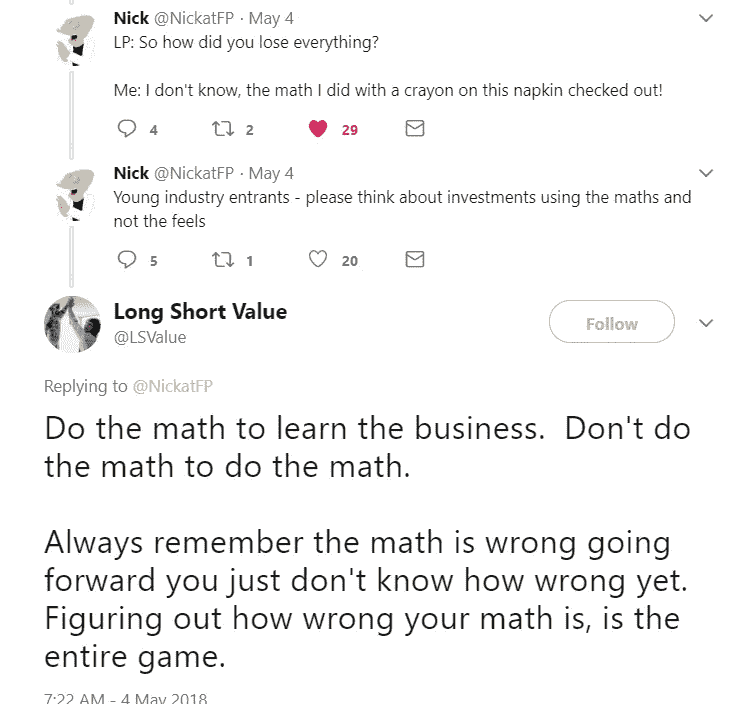

# 算算吧

> 原文：<https://medium.datadriveninvestor.com/do-the-math-c814d212f96c?source=collection_archive---------2----------------------->

伯克希尔·哈撒韦公司的年会在刚刚过去的这个周末举行，成群结队的投资者来到东北奥马哈，聆听传奇人物沃伦·巴菲特和查理·芒格传授投资智慧。会议让 FinTwit 议论纷纷，不断出现的一个项目与芒格反复引用的一句话有关，他说，如果一项交易不是那么明显，你需要进行复杂的计算来评估交易的价值，那么你就不应该这样做。

我以前在这里写过这个谬论:[https://medium . com/@ codename duchess/your-model-is-error-but-its-want-used-fa 766d 67 C3 be。](https://medium.com/@codenameduchess/your-model-is-wrong-but-its-still-useful-fa766d67c3be.)我相信金融建模在投资勤勉中有非常重要的地位，我在 twitter 上看到一段一针见血的对话:

第一点当然是开玩笑说的，但尽管语气轻率，这句话还是有道理的。虽然你在机构投资公司必须做的许多金融建模和投资备忘录准备工作令人眼花缭乱，但这样做是为了告诉你的投资者，你已经做了理解交易所需的工作，这确实是有目的的。建模和准备投资备忘录的平凡过程澄清了你的想法，帮助你理解你的回报对各种投入的变化有多敏感，并记住你的投资过程。如果交易失败了，或者即使进展顺利，你也可以参考你最初的模型和备忘录来了解你的过程中哪里对了哪里错了。即使交易非常明显，这项工作也很重要。

一位同事曾告诉我一个故事，他们在亚特兰大的经济衰退期间买下了一笔丧失抵押品赎回权的办公室交易。他们以每平方英尺的荒谬价格购买了一流的资产。我忘记了每磅的实际价格，但荒谬的低收购价提供了巨大的安全边际，使这笔交易几乎不可能赔钱。也就是说，我的同事仍然不得不经历所有各种敏感性案例的建模过程，他不得不整理出一份令人生厌的投资备忘录，尽管每个问题的答案都应该是“我们以每平方英尺愚蠢的低价购买的是亚特兰大的甲级办公楼！”。在这笔交易中，模型和备忘录并没有起到巨大的投资作用，因为这笔交易是如此显而易见，所以为什么要准备它们呢？原因是**说到底投资的钱不是他的——是投资者的钱**。**毕竟，你为你的投资者工作。**

如果你把你的一部分钱给了一个投资经理，而他们全部输光了，你会想了解他们是如何损失这笔钱的，以及他们选择投资的过程是怎样的。如果他们对这些问题的回答是“我用五分钟在一张餐巾纸的背面做了这道算术题，它成功了”，那么你肯定会暴跳如雷。twitter 上的第二条评论完全正确——关于一个模型(数学)的未来，你唯一能保证的是它是错的，但理解在哪个方向上，以及你可能错的程度，是你如何能获得超额回报。

我不打算低估信封背后的投资数学——当我在看一笔交易时，我就是这样做嗅觉测试的。如果你曾经和我一起参观过一个资产，你可以指望我说一些类似这样的话:“好的，有 20 套公寓的平均租金为 1.5 万美元，即每月 3 万美元，每年 36 万美元，假设 NOI 的利润率为 60%，在 NOI 为 21.6 万美元，按 7 英镑计算，价值约为 310 万美元。”这种类型的计算非常有用，但是在你决定投资之前，你必须做更认真的分析，以确保你完全了解你可能错了多少，在哪个方向上错了。