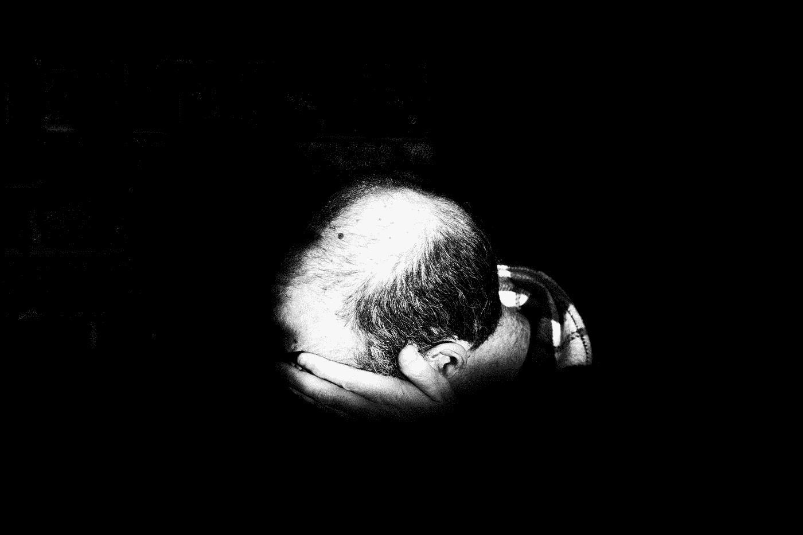

# 做工作

> 原文：<https://medium.datadriveninvestor.com/do-the-work-641417ec276e?source=collection_archive---------5----------------------->

Photo by [Alora Griffiths](https://unsplash.com/@aloragriffiths?utm_source=medium&utm_medium=referral) on [Unsplash](https://unsplash.com?utm_source=medium&utm_medium=referral)

## 不只是千禧一代。是我们所有人。

今天早上，我在埃塞俄比亚收拾一些东西，把大部分行李留在丹佛精品酒店，在这家酒店，有人公然剽窃了丹佛野马队的标志(这在世界各地都有发生，比为你设计一个更便宜)。他们也不想做这项工作。

今天早上我在看吉莉安·西斯莉的文章，因为这是我经常听到的一个主题，但她对此的看法很重要。在我去埃塞俄比亚的前一周，我写了一些抨击一代人的文章，也看到了其他人写的一些文章。我听到很多人抱怨千禧一代有多懒。吉莉安并不懒惰，她的数百万同龄人也不懒惰。令我困扰的是这种一刀切的方法，以及有数十亿不同年龄和背景的人，正如西斯利所描述的那样，想要不惜一切代价避免真正的工作。

 [## 成功人生的 25 种自我提升方式|数据驱动的投资者

### “我活得越久，学到的就越多。学的越多，体会的越多，知道的越少。”―米切尔·莱格兰德时间到…

www.datadriveninvestor.com](https://www.datadriveninvestor.com/2019/03/12/25-self-improvement-ways-for-a-successful-life/) 

她在还住在家里的时候就开始了艰苦的劳动(听起来很熟悉吧？)直到她能够推出自己的服装。你被困在哪里真的不重要，无论是在乌布的咖啡店还是在你父母的地下室。在我 30 多岁的时候，我也不得不住在家里。这太尴尬了。我父亲从不让我听到它的结尾。男孩非常有动力。

Photo by [Sholto Ramsay](https://unsplash.com/@sholto?utm_source=medium&utm_medium=referral) on [Unsplash](https://unsplash.com?utm_source=medium&utm_medium=referral)

# 你和我都在我们现在的位置，我们现在的位置对我们来说是完美的。

你我现在面临的情况正是他们应该面对的。如果他们现在不适合我们，我们会去别的地方。

如果你和我想在别的地方做些别的事情，关键是要确定那件事，然后开始工作。

这就是我们所遗漏的。我们目前的状况绝对是我们应该开始的地方。寻找一个漏洞，正如西斯利所描述的那样，避免了这样一个现实，即你和我处于那种情况下的原因是为了找到我们的出路。

这是一种普遍的冲动，几十年来我也有过这种冲动，想把艰苦的工作减到最少，轻松一下。不幸的是，我们付出的代价远远超过了简单地投入艰苦的劳动来确立自己的地位，无论是作为母亲、家庭主妇、勤杂工还是首席执行官。所有的生活都需要努力。所有的一切。没有后门。

Photo by [Pepi Stojanovski](https://unsplash.com/@timbatec?utm_source=medium&utm_medium=referral) on [Unsplash](https://unsplash.com?utm_source=medium&utm_medium=referral)

我是 ABBA 音乐的终身粉丝(请一般翻白眼)，不是因为歌词说得好听是傻，说得难听是傻，而是因为节拍很活泼，我喜欢给它加上重量。有一首歌，*钱钱钱，*歌词烦死我了。整个主题是，如果我有钱，我可以整天玩。生活会变得如此简单。

# 废话。

几个月前，一位非常聪明的女性在 Medium 上写了一篇文章，对超级富豪的生活进行了令人震惊的观察。她一边工作一边读大学，因此她可以接触到她富有客户的内心生活。当她的雇主要求她加班时，她四处看看。她所发现的令她震惊。药物滥用，婚姻不忠，严重抑郁的明显迹象。所有的一切都在极度富有的镀金世界里，那里的生活应该是如此他妈的豪华。

如果有一个完美的方法来消除我们对富人完美生活的幻想，这是一个很好的方法。她一点也不想要。我也不知道。她得出的结论是，有一份体面的工作，不管是什么工作，都比把一切都交给你，然后对此感到恶心要好得多。

当涉及到我们的内心状态时，金钱没有一点作用。听着，付得起账单是一回事。医疗账单或大学债务的焦虑是真实的。我曾经不得不申请医疗破产，所以我非常熟悉那种心碎的感觉。但是拥有无穷无尽的资金本身对于你我是否本质上快乐或者事实上我们是否感到满足没有什么区别。那是内部工作，需要努力。辛苦了。

我的前夫过去常常抱怨他的学生贷款。要是他能还清那笔钱，那就更好了。他真诚地相信。它得到了回报，他仍然在我的干墙上打孔。我的石膏板。我的房子。他花了我一大笔钱。

Photo by [TK Hammonds](https://unsplash.com/@tkristin?utm_source=medium&utm_medium=referral) on [Unsplash](https://unsplash.com?utm_source=medium&utm_medium=referral)

渴望更轻松的生活，逃避充实生活所需的真正工作，是一种流行病。唐小蓝·方丹写了一篇关于梦的文章，我昨天看了。我喜欢它，但有一句台词，它有效地承诺我们任何人都可以做任何事，这有点言过其实。这种夸张的承诺会让我们中的许多人直面现实。她这篇优秀文章的最大价值在于她为如何实现这些梦想所做的计划。这值得一读。

一个完美的错位雄心的例子是，任何看过一些明星制作节目的人都是在实时观看这种自欺欺人，这些节目的主角是绝对、肯定相信自己会唱歌的本地人才，以及绝对、肯定不会唱歌的本地人才。它们无法在高高的落基山脉中同时发出麋鹿交配的叫声。

这只是…..*痛苦的*。对我来说一点都不好笑。伤了我的心。令我震惊的是，成为明星的渴望，以及随之而来的所有可感知的好处，远远超过了他们所能提供的严酷现实。

如果你愿意搞清楚方丹所说的我们真正的北方，我所说的你胸中的那只鸟，然后投入到完成它的深层工作中，那很可能让我们更接近地狱。随着时间的推移，这些梦想可以也确实会发生变化。你有了孩子，梦就变了。加上离婚，梦就变了。这就是生活。

我们中没有多少人天生就过着某种生活，尽管我们中的一些人只是让自己被转移了很多年。在某些时候，这种呼声太强烈了。现年 54 岁的迈克·史密斯非常清楚，非常年轻的时候，他所关心的只是马。史密斯在 11 岁时开始参加赛马，并且从未放弃。这种决心让他进入了赛车名人堂和冠军圈(包括 Justify 的三冠王),比大多数骑师知道的都多。在我看来，史密斯一生中最精彩的部分是他极端感恩的态度。

然而，他的生活并不是没有报酬的。肩膀断了，背也断了。这是职业使然。为了完成他的工作，他必须冒很大的风险。对于史密斯来说，这是值得的。对我们所有实现梦想的人来说也是如此。

我们大多数人都没有那么专一。我们通常必须找到自己的路。然而，就这一点而言，寻找道路的过程为我们实现这些梦想做好了准备。我们只是不总是在那个时候看到它。

西斯利指的是，我喜欢她的措辞，这是关于付出自己的代价。这是一个我非常关心的话题。当我们站在字面或比喻的山顶时，你和我的感觉是难以置信的。如果我们作弊，找到漏洞，或者逃避真正的工作(比如假装你赢了波士顿马拉松)，你*作弊*。作弊就像癌症一样折磨着你。事实上，试图通过欺骗获得波士顿马拉松冠军的罗西·鲁伊斯确实死于癌症，尽管很难说是她的不诚实导致了癌症。以我的标准来看，这没什么帮助。

我们很多人都喜欢坐在冠军圈的冠军马上，向人群中扔康乃馨。但我敢打赌，你肯定不会想参加成千上万场失败的比赛，摔下来，摔坏身体，锻炼，忍受痛苦和康复，如果你以一个鼻子的优势输了，还要忍受愤怒的主人的辱骂，或者看着你受伤的动物在比赛场地上被安乐死。

Photo by [Pietro Mattia](https://unsplash.com/@pietromattia?utm_source=medium&utm_medium=referral) on [Unsplash](https://unsplash.com?utm_source=medium&utm_medium=referral)

生活不是迪斯尼电影。尽管我很喜欢电影*秘书处*，但我也很清楚佩妮·切内里和她的驯马师有一腿，这毁了她的婚姻，她花了很高的价钱买了一匹获胜的马，并为此吃了很多苦。不全是赢家圈和玫瑰。这部电影删掉了丑陋的东西，但这是迪士尼电影通常会做的。

这部电影中我最喜欢的场景是最后几分钟，秘书处经过了艰苦、漫长和令人难以置信的良好训练，在最后一个弯道疾驰，远远领先于 Sham，他与最接近的竞争对手之间的距离达到了 32 个长度，从而载入了纯种历史。他应得的。他为此努力工作。他的骑师赢得了它。为之努力。这就是为什么每次最后的冲刺都会让我流泪。他们应得的。

这就是为什么当“海洋饼干”击败“海军上将”时，每一次都是一匹更好的马，那个场景也让我哭了。该团队为此付出的代价是巨大的。我们忘记了那部分。当我们通过终点线时，我们只想举起胜利的手臂。那不是迪士尼。那是非常艰苦的工作。

等待仙女教母或小叮当来保佑你有一个完美的存在会让你过上漫长而孤独的生活。西斯利和方丹以及许多其他媒体作家写了很多关于如何在他们的世界里创造成功的文章。诀窍是停止想要他们的世界。他们的世界与你的世界无关。或者我的。那些为了我“得到”的生活而向我发射愤怒飞镖的人，并没有在背部骨折、肩袖手术的痛苦、受伤的持续疼痛和旅途的孤独之后，在康复中心度过数百个小时。

我很乐意支付这些费用。我很乐意支付会费。因为我胸中的小鸟每天都在嘹亮地歌唱。即使当我深感悲伤，即使当我极度孤独，即使有几次我从自己给自己的所有打击中清楚地感觉到自己的衰老。

我希望我们都有远大的梦想、努力的梦想和远大的梦想。但是做你的梦吧。做你的工作。因为这是你拥有结果的唯一方式。做不到这一点，就只是毫无意义，就像生活在一个冰冷的黄金大厦里，除了富人毫无价值的装饰品之外，什么都没有。

我们每个人都值得过好的生活，按照我们的方式，为我们所获得的快乐付出全部。

Photo by [Tobias Tullius](https://unsplash.com/@tobiastu?utm_source=medium&utm_medium=referral) on [Unsplash](https://unsplash.com?utm_source=medium&utm_medium=referral)