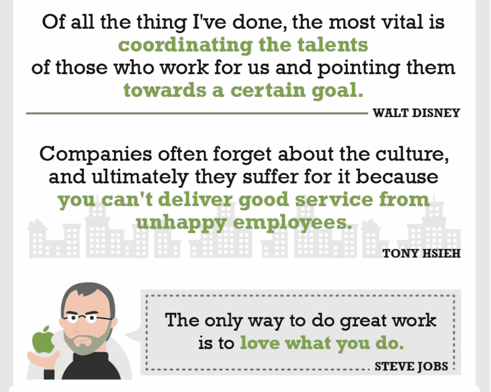

# 做这 5 个活动来完成一个复杂的项目！

> 原文：<https://medium.datadriveninvestor.com/do-these-5-activities-to-get-a-complex-project-done-e56aa056e51c?source=collection_archive---------5----------------------->

[https://www.wrike.com/blog/15-project-management-quotes-to-live-by-infographic/](https://www.wrike.com/blog/15-project-management-quotes-to-live-by-infographic/)

## 一个复杂的项目包括什么？

不久前，我负责一个客户项目，这个项目对团队和我来说都是全新的。我们以前从未做过这些。这将是新的学习！这类项目可能是复杂项目的一个例子。

但是也有其他的例子，项目看起来很简单，但是由于执行的方式，它变得很复杂。

因此，在我看来，在以下情况下，项目可能会变得复杂:

*   当客户或用户的需求没有被正确评估时。我们真的应该这样做还是真的可以这样做？
*   当顾客无法确定自己到底需要什么时，就会带来频繁的变化！这导致预期不明确。
*   团队刚刚看到但从未实施的新技术，可以作为参考。
*   不称职的新团队成员或团队成员经常不在，这导致团队不稳定，无法专注于目标。
*   最后，项目具有复杂的体系结构，包括各种相互依赖的组件(比如多个微服务)，所有这些组件都需要协同工作来满足客户的需求。

现在我们知道了一个复杂的项目意味着什么，让我们来理解完成这样的项目的五个关键活动。

## #1 活动—回答 ***“为什么这个项目存在”***

> "有“为什么”活着的人几乎可以忍受任何“如何”活着."~弗里德里希·尼采

在开始项目之前，项目负责人必须确定并理解各种关键利益相关者(包括团队成员)的期望

在我从事复杂项目的经验中，我曾经做的是花大量时间与客户一起真正理解 ***“为什么这个项目存在”。***

这对于项目领导理解这带来的商业价值是至关重要的，并且这一信息需要级联到所有团队成员以使他们充分意识到这一点。

## #2 活动-回答“所涉及的架构和不同组件是什么”

**其次**，项目负责人需要了解架构和所涉及的不同组件，并对所有相关团队设定期望，以了解他们何时需要交付他们的部分。

这对于理解项目的非功能范围也很重要。 ***安全性、可用性、性能和可用性方面可能存在挑战。*** 这需要与相关的利益相关方进行适当的讨论，并与计划达成一致。

跟进这个计划。

## #3 活动-回答“团队动力和快乐吗”

这是项目领导需要确保团队对这个项目感到兴奋的最重要的活动之一。他们明白这一点的重要性，并且非常积极。

虽然这很重要，但很难评估。你真的需要让每个人都参与到所有的沟通中来，让他们能够看到。

确保团队毫不犹豫地公开分享问题。 ***能够识别项目涉及的诸多风险的是核心团队。*** 他们必须能自由地与你交谈，分享任何顾虑。他们必须定期与所有其他相关团队进行互动。 ***他们具备成功交付该项目所需的一切吗？不要经常假设和谈论。***

> "交流中最重要的事情是听到没说出来的话."~彼得·德鲁克

***评估这种动机水平需要不断互动。***

## #4 活动—回答“是否有商定的操作流程”

所有的项目都需要一个框架，所有的利益相关者都可以在其中运作。 ***谁负责什么？这一点至关重要，因为这里发生的问题最多。***

一些事情是:

*   在[敏捷](https://medium.com/@sourabhpandey05/can-organizations-adopt-agile-methods-in-all-types-of-projects-yes-heres-why-a6bda96e4fab) (Scrum 或 XP)中运行两周或三周的 sprint 必须得到每个人的同意。
*   必须定义明确的角色。产品负责人、架构师、相关团队联系人、核心团队以及驱动每个人的项目经理。
*   必须有一个不断规划和沟通渠道的地方。每个人必须多久见一次面，这应该是大家都同意的。

> “如果你不知道你要去哪里。你怎么能指望到达那里？”~巴兹尔·沃尔什

*   一个持续获得项目反馈和向所有利益相关者现场演示项目的地方。
*   一个所有依赖团队和核心团队聚在一起并确保他们同步的地方。
*   为项目安排时间表，并确保每个人都同意该时间表。

## #5 活动—最终跟进、跟进和再跟进

为了能够完成一个复杂的项目，需要与各种利益相关者沟通。 ***一个项目的领导需要与所有的利益相关者建立一种令人惊异的关系。***

在危机时刻，关系是有帮助的，因此这一点必须小心。

项目负责人需要确保所有移动的部分始终被捆绑在一起，并且必须想象所有部分如何一起工作。最好的形象化方法是问这个问题 ***“我们应该如何测试这个，在哪个环境下测试”***

一旦你有了测试策略，这个测试策略将会在生产中发生，那么项目领导需要确保这个测试策略尽早发生，并且通常所有的集成都会发生。

***这也意味着，一个*** [***项目负责人***](https://medium.com/@sourabhpandey05/this-one-thing-will-make-project-manager-successful-5315ff8de4e3) ***必须创造出一种*** [***的紧迫感***](https://medium.com/@sourabhpandey05/do-these-5-things-to-build-sense-of-urgency-in-you-and-your-organization-d56be812db7b) ***与每个人一起，这种情况会有规律地发生在后续的事情上。与每个人保持联系，确保一切顺利。***

定期向每个人汇报项目进展，让每个人都知道这个项目的当前状态！

## **结论**

当构建一个产品时，尤其是在复杂的项目中，会出现许多问题，让我们接受这个事实。这些问题应该尽早出现，以确保在稳定构建的同时解决所有问题。

> "做最好的打算，做最坏的打算，做好大吃一惊的准备。"~丹尼斯·威特利

只要有耐心，继续和不同的人一起工作，创造一种协作文化。无论是正式的还是非正式的，不要犹豫接受帮助或建议。这是完成复杂项目的秘密！

是人们把事情做好，因此关注个人和互动。

> “团结就是力量……当团队协作时，美好的事情就能实现。”~马蒂·斯捷潘内克

## 参考

我从我以前的文章中吸取了一些观点- [这 6 件事让新产品开发变得困难！](https://medium.com/datadriveninvestor/these-6-things-make-the-new-product-development-difficult-1823c2ecaba0)

## 来自 DDI 的相关故事:

 [## 为什么数据会改变投资管理

### 有人称之为“新石油”虽然它与黑金没有什么相似之处，但它的不断商品化…

medium.com](https://medium.com/datadriveninvestor/why-data-will-transform-investment-management-4a60966c1c81)  [## 数据科学和软件工程哪个更有前途？

### 大约一个月前，当我坐在咖啡馆里为一个客户开发网站时，我发现了这个女人…

medium.com](https://medium.com/datadriveninvestor/which-is-more-promising-data-science-or-software-engineering-7e425e9ec4f4)