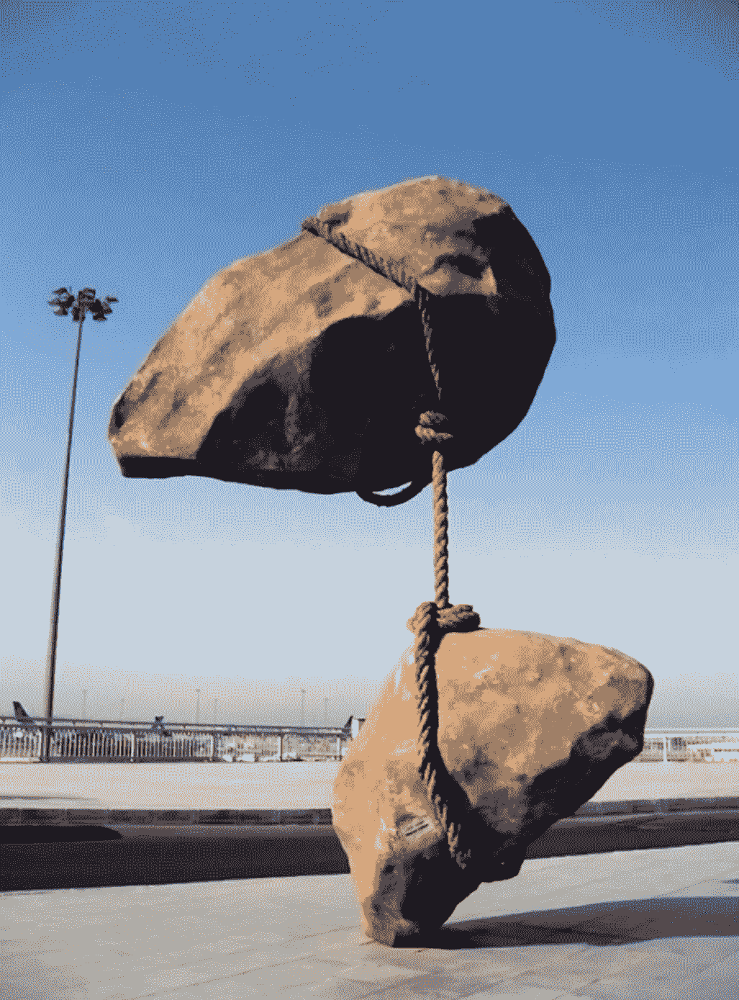

# 满足所有能源需求的清洁量子解决方案

> 原文：<https://medium.datadriveninvestor.com/do-we-dare-capture-potential-energy-b95236d9fa30?source=collection_archive---------6----------------------->

让我们从势能的定义开始。势能更好的名字应该是，*储存能量*。据推测，能量是通过对重力、磁场甚至简单的弹簧等力做功而储存在物体中的。

让我们快速回顾一下基础知识。一个沉重的杯子放在桌子上比放在地板上有更多的势能。当你把杯子从地板上拿到桌子上时，你已经做了功，而功现在储存在杯子里。你能看到杯子是如何变化的吗？对，外观没有变化。

你把杯子推离桌子，杯子获得动能，当杯子落地时，动能转化为热量和声音。好吧，这是一个简单明了的概念，在初中就教给我们了。势能储存在马克杯里。很简单。

但如果你真的仔细想想，我刚才描述的是缺少了一些东西。除了我们从常识中已经知道的以外，它没有解释任何东西。这些花哨的科学术语，比如势能，以及我们完美的方程，让我们相信我们知道的比我们做的多。所以，不要纠结于传统的定义和描述，尤其是当它们完全错误的时候。

现在，势能的关键不在于当你把它举到桌子上时，能量储存在杯子里，关键是要认识到当你把它推下桌子时，能量是如何转化为动能的。动能来自杯子和地球之间的重力。作为一个简单的观察者，问问你自己，如果杯子里的潜在能量被转移到一个储存能量的静态屏障中，在需要的时候不再存在，会发生什么？什么？

如果我们把杯子推离桌子而不释放它储存的能量，你认为会发生什么？

你想过吗？杯子会浮在空中。你可以轻松地上下移动它，但不能越过桌面。这时，它又变重了，需要努力才能把它举到桌子上方。那是因为我们捕获或窃取了它的一些势能。我应该指出一些物理学家不同意。所以让我们捕捉能量，找出答案。没有比真正的实验更好的了。

回到魔法杯。你的魔杯被抢后有变化吗？还是杯子外面的东西改变了它的行为？马克杯的行为是自己改变的还是被你的捕捉设备改变的？让我们称你的魔杖为“饮料”。它有点像一个电容器，但却是为了势能。

重要的问题是:这个杯子真的像我们所学的那样容纳了额外的势能吗？我不得不说这对一个简单的杯子来说要求太高了。如果你想一想，我们不知何故相信宇宙中的每一个物体本身都是一个饮料罐。能量还能在哪里？它一定在杯子里。

像牛顿这样的欧几里得给了我们一种精确的方法来测量事物，但是如果我们相信他们也给了我们对事物的理解，那我们就是在欺骗自己。天文学家对窃取能量了如指掌。如果你丢下一个篮球和一个网球，它们会正常反弹。但是如果你把网球放在篮球上面，然后把它们放在一起，网球就会像火箭一样发射出去。网球从篮球中窃取势能。不相信我？试试看。这是一个有趣的实验。

汲取势能是我们今天绕太阳系飞行的方式。我们从行星上窃取能量。如果我们这样想的话，牛顿的方程会简单得多，但事实并非如此。势能实际上不在杯子里，网球里，或者行星里。

让我们像爱因斯坦而不是牛顿一样思考势能。杯子是由能量构成的，但是无限的势能是相对于杯子自身的能量而言的，而不是附加的。这就是为什么马克杯看起来和摸起来都一样，不管它的势能是多少。

捕捉势能现在有点麻烦了。如果我们在布尔夏德的一个亚原子维度上设计一个静态防护罩会怎么样。这一理论能使我们建造一台电视机。我们的定义是，势能是质量之间的能量变化，一种独立于两者的变化。如果你愿意，这是重力表面的凹痕。电视就像是主体间的过滤器。它截取能量变化或增量。

等等，谁是布尔夏德？布尔夏德·海姆是一位鲜为人知的德国科学家，他可能做到了爱因斯坦未能做到的事情:弥合量子理论和相对论之间的差距。美国政府一直在研究基于他的理论的超空间引擎。他们的目标是将整个宇宙飞船，包括人和所有的东西，推进到我们想要用来保存势能的亚原子空间。他们会失败。人类现在没有工程或硬件来实现这一点。我们的问题更容易解决。谁想变成一只苍蝇。好吧，对不起，只是在想那部电影。无论如何，布尔夏德关于亚原子维度的观点可能是正确的。

但是我们为什么想要这个东西呢？当美国宇航局发射宇宙飞船时，他们必须以足够快的速度提升飞船，以摆脱地球的引力。否则，飞船将会把它的势能转换成动能，然后落回地球。他们的问题是，他们必须在标准的实时环境中对抗重力。可以说，他们必须把杯子举到桌子上。半途而废是行不通的，提升到太空最有效的方法是让飞船高速加速。

我们的方法会不同。我们逐渐给我们的飞船装载足够的能量来完全抵消地球本身，然后我们就飘入轨道。在某种程度上，一个电容器就像一个能够储存势能电荷的失重电池，一个 100%高效的电池。一旦进入太空，我们就将部分储存的能量用于驱动发动机。

如果飞机上有一个饮水器呢？如果他们的引擎有问题，他们可以简单地飘回地球。这种装置的用途是无穷无尽的。谁需要轮子？

感谢阅读。如果你想要更多奇怪的想法，就鼓掌吧。希望外面的某个年轻物理学家会说，“嘿！我可以造出来！”

如果有人发明了一种饮料，不要感到震惊。甚至[磁力](https://medium.com/datadriveninvestor/do-we-dare-capture-potential-energy-b95236d9fa30?source=linkShare-8474ee4618b4-1540571044)都是个谜。我们观察它们，但很少问如何观察？