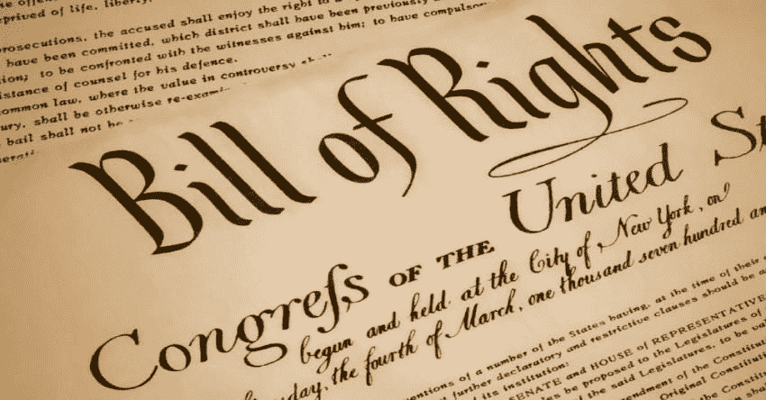

# 我们需要“数据权利法案”吗

> 原文：<https://medium.datadriveninvestor.com/do-we-need-a-data-bill-of-rights-d109bda55baa?source=collection_archive---------5----------------------->

《权利法案》是一份详述美国宪法前十项修正案的文件。许多人认为这前十项修正案是有争议的。宪法权利法案的要点是限制政府的权力，同时确保人民和个人的权力。不管你对美国宪法和权利法案有什么看法，我认为我们需要一个“数据权利法案”

 [## 数据驱动的投资者

### 事实上，在各行各业，数据的大规模激增正在改变我们感知世界的方式。而且只有…

go.datadriveninvestor.com](http://go.datadriveninvestor.com/youtube) 

为此，数据权利法案不仅可以保护个人免受政府的侵犯，还可以保护那些利用你的数据的大公司。这将包括:社交媒体数据、浏览数据、财务信息和各种其他远程信息处理数据。

***第一修正案:表达自己的自由:*** 通过使用数据自由表达自己、追求思想、表达观点、宗教信仰、追求幸福的权利。必须有责任。你无权诽谤或损害他人名誉。就像你可以跑进剧院大喊“着火了”一样，你没有权利错误地伤害他人。数据第一修正案使人们能够分享观点，即使这种观点不受欢迎。

***第二修正案:我的数据就是我！你的数据是你的一部分，是你自然状态的逻辑表现。无论数据位于何处，也无论由哪个组织管理和存储，数据都归您所有。数据属于你，就像财产或资产一样。***

***第三修正案:免于违约！*这包括免费和付费的在线服务和产品，这些服务和产品会收集您的数据。欧盟的 GDPR 标准已经很好地执行了这一政策。然而，我们需要包括诸如出售社交媒体活动的数据转储之类的东西，以及任何被跟踪的用户行为，例如:移动应用、网络点击流、通话详细记录、电视观看、车辆和其他关于你的远程信息处理数据。**

***第四修正案:数据正当程序和扣押！政府希望在刑事取证过程中使用的关于您的任何数据都需要搜查令和正当程序。这包括任何智能设备、手机和计算系统上的数据。所有关于你的数据都属于你。政府不能收集关于你的数据，也不能在追踪可能发生或可能没有发生的犯罪行为时找出犯罪行为。***

***第五修正案:加密权:*** 对关于你的数据以及你在社交网络和其他服务上自由提供的数据进行加密的权利。这包括静态数据或动态数据。此数据的范围包括存放您的数据的任何组织。您有权加密您的数据，只有您可以持有解密密钥或技术流程来解锁数据。这意味着我可以加密我所有的脸书数据，只有我有解密这些数据的密钥。

***第六修正案:匿名权:*** 就像医疗数据一样你也有隐私权。您也有权不将您的数据与其他可能重新识别您身份的数据一起使用。只要你不伤害他人，你有权匿名。

***第七修正案:不被分析的权利:*** 你有权保护你的数据不受那些想要影响你的组织的影响。你的数据是你的一部分。就像一个组织不能购买你的医疗记录，识别你的受保护的医疗保健信息，你有权利不参与行为分析。这包括您的所有数据:通话详细记录、汽车远程信息处理、网络点击、社交网络帖子、图片和相机、移动手势以及其他形式的个人信息。

***第八修正案:免受经济剥削:*** 如果一个组织的数据被黑客窃取，你的私人信息被窃取并被用来对付你，组织有责任补救任何伤害。这将迫使组织全面审视安全性。

***第九修正案:默认安全:*** 所有数据都是默认安全的，默认加密的，任何通过网络保存或传输数据的组织都将视其为安全数据。这意味着你的数据不会自动成为任何人或任何东西的财产。这些数据总是被加密，不用于分析，也不出售，除非拥有数据的人允许。数据的主人是个人！

***第十修正案:血统权:*** 你作为一个人有权知道你的数据是如何被一个组织更改或修改的。您有权知道您的数据是如何用于研究的。你有权知道那项研究的结果。这将保护你不被错误地识别和分割。

数据保护是对您的保护。数据是你存在的产物。数据证明了生命和活动的存在。就像你拥有你的内在自我一样，我认为你拥有不可剥夺的权利来获得关于你自己的信息。仅仅因为一个组织拥有服务器、网络和存储并不意味着关于你的数据不属于你。你有权使用这些数据并得到保护。您有权了解这些数据如何被使用、出售、分析和滥用。数据和信息是现代世界的货币。数据是组织拥有的最大资产，您有权使用它！

阅读有关此主题的更多信息:

 [## 为什么好的数字隐私立法如此难以实施

### 显然，我们迫切需要与我们的数据相关的更好的法律保护，但这说起来容易做起来难

onezero.medium.com](https://onezero.medium.com/why-good-digital-privacy-legislation-is-so-hard-to-get-right-4a8ff89191bc)